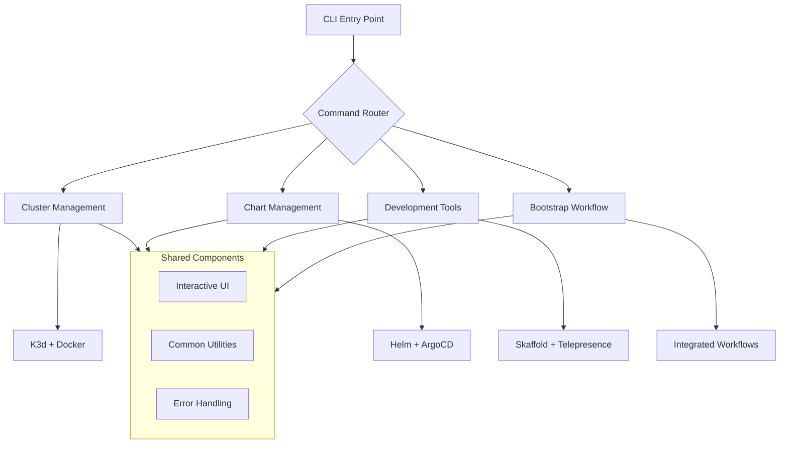

<div align="center">
  <picture>
    <source media="(prefers-color-scheme: dark)" srcset="https://raw.githubusercontent.com/flamingo-stack/openframe-oss-tenant/main/docs/assets/logo-openframe-full-dark-bg.png">
    <source media="(prefers-color-scheme: light)" srcset="https://raw.githubusercontent.com/flamingo-stack/openframe-oss-tenant/main/docs/assets/logo-openframe-full-light-bg.png">
    
  </picture>
</div>

<p align="center">
  <a href="LICENSE.md"></a>
</p>

# OpenFrame CLI

A modern, developer-friendly command-line tool for managing OpenFrame Kubernetes clusters and development workflows. OpenFrame CLI simplifies local development by providing automated cluster creation, chart deployment, and integrated development tools—all with an intuitive interface and smart automation.

## Features

- 🎯 **Interactive cluster creation** with guided wizard and smart configuration
- ⚡ **K3d cluster management** for lightning-fast local Kubernetes development  
- 📊 **Real-time cluster monitoring** with status checking and resource tracking
- 🔧 **Smart system detection** with automatic prerequisite validation
- 🛠 **Developer-friendly commands** with clear output and helpful error messages
- 📦 **Integrated chart management** with Helm and ArgoCD GitOps workflows
- 🚀 **Development workflow tools** including Skaffold live reloading and Telepresence traffic interception
- 🌟 **One-command bootstrap** for complete environment setup in minutes

## Quick Start

### Installation

Download the latest release for your platform:

```bash
# macOS (ARM64)
curl -L https://github.com/flamingo-stack/openframe-cli/releases/latest/download/openframe-cli_darwin_arm64.tar.gz | tar xz
sudo mv openframe /usr/local/bin/

# macOS (Intel)
curl -L https://github.com/flamingo-stack/openframe-cli/releases/latest/download/openframe-cli_darwin_amd64.tar.gz | tar xz
sudo mv openframe /usr/local/bin/

# Linux (AMD64)
curl -L https://github.com/flamingo-stack/openframe-cli/releases/latest/download/openframe-cli_linux_amd64.tar.gz | tar xz
sudo mv openframe /usr/local/bin/

# Windows (AMD64)
# Download from: https://github.com/flamingo-stack/openframe-cli/releases/latest
```

### From Source

```bash
git clone https://github.com/flamingo-stack/openframe-cli.git
cd openframe-cli
go build -o openframe .
```

### Get Started in 5 Minutes

```bash
# Bootstrap a complete OpenFrame environment
openframe bootstrap --deployment-mode=oss-tenant

# Or step by step:
# 1. Create a cluster
openframe cluster create

# 2. Install charts and ArgoCD
openframe chart install

# 3. Check cluster status
openframe cluster status

# 4. Start developing with live reload
openframe dev scaffold

# Get help anytime
openframe --help
```

## Core Commands

| Command | Description | Example |
|---------|-------------|---------|
| `bootstrap` | Complete environment setup (cluster + charts) | `openframe bootstrap --deployment-mode=oss-tenant` |
| `cluster create` | Create new K3d cluster with interactive setup | `openframe cluster create --nodes 3` |
| `cluster status` | Show detailed cluster information | `openframe cluster status` |
| `chart install` | Install Helm charts and ArgoCD | `openframe chart install` |
| `dev scaffold` | Run Skaffold for service development | `openframe dev scaffold` |
| `dev intercept` | Intercept service traffic locally | `openframe dev intercept myservice --port 8080` |

See the full command reference in our [documentation](./docs/README.md).

## Architecture

OpenFrame CLI follows a layered architecture with domain-specific modules:



## Use Cases

### For Developers
- **Local Development**: Quick Kubernetes environment setup with live reloading
- **Service Testing**: Traffic interception for debugging microservices
- **Rapid Prototyping**: One-command environment bootstrap for demos

### For DevOps Engineers  
- **Cluster Automation**: Standardized cluster provisioning and management
- **GitOps Workflows**: Automated ArgoCD deployment with app-of-apps pattern
- **CI/CD Integration**: Scriptable commands for automated testing pipelines

### For Platform Teams
- **Developer Experience**: Consistent tooling across development teams
- **Self-Service**: Enable developers to manage their own environments
- **Standardization**: Unified workflow patterns and best practices

## Deployment Modes

| Mode | Description | Best For |
|------|-------------|----------|
| **oss-tenant** | Open source tenant deployment | Individual developers, small teams |
| **saas-tenant** | SaaS tenant with dedicated resources | Enterprise customers, isolated environments |
| **saas-shared** | SaaS shared multi-tenant deployment | Cost-effective scaling, development environments |

## Documentation

📚 See the [Documentation](./docs/README.md) for comprehensive guides including:

- **[Getting Started](./docs/getting-started/introduction.md)** - Quick setup and introduction
- **[Development](./docs/development/README.md)** - Contributing and advanced usage  
- **[Architecture](./docs/reference/architecture/overview.md)** - Technical architecture details

## Contributing

We welcome contributions! Please see our [Contributing Guidelines](./CONTRIBUTING.md) for details on:

- Development environment setup
- Code style and testing requirements  
- Pull request process
- Issue reporting guidelines

## License

This project is licensed under the Flamingo AI Unified License v1.0. See the [LICENSE](./LICENSE.md) file for details.

---
<div align="center">
  Built with 💛 by the <a href="https://www.flamingo.run/about"><b>Flamingo</b></a> team
</div>