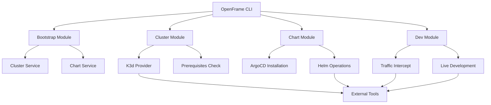

<div align="center">
  <picture>
    <source media="(prefers-color-scheme: dark)" srcset="https://raw.githubusercontent.com/flamingo-stack/openframe-oss-tenant/main/docs/assets/logo-openframe-full-dark-bg.png">
    <source media="(prefers-color-scheme: light)" srcset="https://raw.githubusercontent.com/flamingo-stack/openframe-oss-tenant/main/docs/assets/logo-openframe-full-light-bg.png">
    
  </picture>
</div>

<p align="center">
  <a href="LICENSE.md"></a>
</p>

# OpenFrame CLI

A comprehensive command-line interface for managing Kubernetes clusters and deploying OpenFrame environments. OpenFrame CLI provides streamlined workflows for cluster lifecycle management, ArgoCD chart installation, development tools, and complete environment bootstrapping.

## Features

- **🚀 One-Command Bootstrap** - Complete OpenFrame environment setup with `openframe bootstrap`
- **🐳 K3d Integration** - Lightweight Kubernetes clusters running in Docker containers
- **⎈ GitOps Ready** - Automated ArgoCD installation and configuration
- **🔧 Developer Tools** - Traffic interception with Telepresence and live reloading with Skaffold
- **📦 Helm Charts** - Seamless OpenFrame application deployment
- **🖥️ Interactive UI** - User-friendly prompts and configuration wizards
- **🔍 Prerequisites Checking** - Automatic validation of required dependencies
- **🌐 Multi-Cluster** - Manage multiple development, staging, and production environments

## Quick Start

Get OpenFrame running in 5 minutes:

```bash
# 1. Install OpenFrame CLI
# (Installation method will be added based on release strategy)

# 2. Bootstrap complete environment
openframe bootstrap my-cluster

# 3. Check cluster status
openframe cluster status

# 4. Access ArgoCD dashboard
kubectl port-forward svc/argocd-server -n argocd 8080:443
```

That's it! You now have a complete OpenFrame environment with:
- ✅ K3d Kubernetes cluster
- ✅ ArgoCD for GitOps workflows  
- ✅ OpenFrame applications deployed
- ✅ Development tools ready

## Command Overview

| Command | Description |
|---------|-------------|
| `openframe bootstrap [cluster-name]` | Create complete OpenFrame environment (cluster + charts) |
| `openframe cluster create [name]` | Create new Kubernetes cluster with interactive configuration |
| `openframe cluster delete [name]` | Delete cluster and cleanup all resources |
| `openframe cluster list` | Show all managed clusters with status |
| `openframe cluster status [name]` | Display detailed cluster information and health |
| `openframe cluster cleanup [name]` | Remove unused resources and free disk space |
| `openframe chart install [cluster-name]` | Install ArgoCD and OpenFrame charts |
| `openframe dev intercept [service-name]` | Intercept traffic for local development |
| `openframe dev skaffold [cluster-name]` | Start live development with hot reload |

### Interactive and Non-Interactive Modes

All commands support both interactive configuration and automated CI/CD workflows:

```bash
# Interactive mode with prompts
openframe cluster create

# Direct mode with parameters
openframe cluster create my-cluster --ports 8080:80 --registry-port 5555

# CI/CD automation
openframe bootstrap prod-cluster --deployment-mode=oss-tenant --non-interactive --verbose
```

## Architecture

OpenFrame CLI follows a modular architecture with clear separation between command interfaces, business logic, and external integrations:



## Prerequisites

Before using OpenFrame CLI, ensure you have:

- **Docker** - For K3d cluster containers
- **kubectl** - Kubernetes command-line tool
- **Helm** - Package manager for Kubernetes
- **Git** - Version control system

The CLI automatically checks for these dependencies and provides installation guidance.

## Use Cases

### Local Development
```bash
# Create development environment
openframe bootstrap dev-env

# Intercept service traffic for debugging  
openframe dev intercept my-service

# Live reload during development
openframe dev skaffold my-app
```

### Multi-Environment Management
```bash
# Development cluster
openframe bootstrap dev-cluster

# Staging environment  
openframe bootstrap staging-cluster

# Production setup (with specific configuration)
openframe bootstrap prod-cluster --deployment-mode=production
```

### CI/CD Integration
```bash
# Automated environment creation
openframe bootstrap test-env-${CI_COMMIT_SHA} --non-interactive

# Cleanup after tests
openframe cluster delete test-env-${CI_COMMIT_SHA} --force
```

## Documentation

📚 See the [Documentation](./docs/README.md) for comprehensive guides:

- **[Getting Started](./docs/getting-started/introduction.md)** - Introduction and quick setup
- **[Prerequisites](./docs/getting-started/prerequisites.md)** - Required tools and setup
- **[Development Guide](./docs/development/README.md)** - Contributing and development workflow
- **[Architecture Overview](./docs/reference/architecture/overview.md)** - Technical architecture details

## Contributing

We welcome contributions! Please see our [Contributing Guidelines](./CONTRIBUTING.md) for:

- Development environment setup
- Code style and testing requirements  
- Pull request process
- Community guidelines

## Support

- 📖 **Documentation**: [docs/](./docs/)
- 🐛 **Issues**: [GitHub Issues](https://github.com/flamingo-stack/openframe-cli/issues)
- 💬 **Discussions**: [GitHub Discussions](https://github.com/flamingo-stack/openframe-cli/discussions)

## License

This project is licensed under the Flamingo AI Unified License v1.0. See [LICENSE.md](LICENSE.md) for details.

---
<div align="center">
  Built with 💛 by the <a href="https://www.flamingo.run/about"><b>Flamingo</b></a> team
</div>