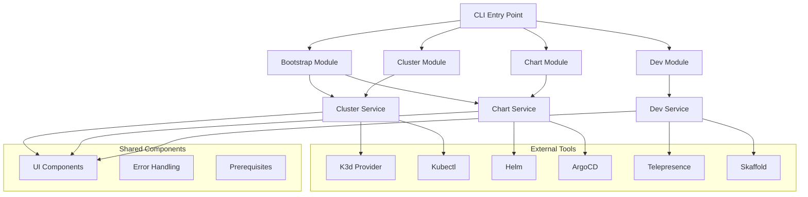

<div align="center">
  <picture>
    <source media="(prefers-color-scheme: dark)" srcset="https://raw.githubusercontent.com/flamingo-stack/openframe-oss-tenant/main/docs/assets/logo-openframe-full-dark-bg.png">
    <source media="(prefers-color-scheme: light)" srcset="https://raw.githubusercontent.com/flamingo-stack/openframe-oss-tenant/main/docs/assets/logo-openframe-full-light-bg.png">
    
  </picture>
</div>

<p align="center">
  <a href="LICENSE.md"></a>
</p>

# OpenFrame CLI

**One command to rule them all** - OpenFrame CLI is a comprehensive command-line interface for managing Kubernetes clusters and OpenFrame environments. Transform complex Kubernetes and OpenFrame setup from hours of manual configuration to minutes of automated deployment.

## 🚀 Features

- **🎯 One-Command Bootstrap** - Complete environment setup with cluster creation and chart installation
- **⚡ Cluster Lifecycle Management** - Full K3d cluster automation for local development
- **📦 ArgoCD Integration** - GitOps-ready deployments with app-of-apps pattern
- **🔄 Development Tools** - Traffic interception and hot reloading for live development
- **🎨 Interactive UI** - Guided setup with smart defaults and intuitive prompts
- **🏗️ Multiple Deployment Modes** - OSS-tenant, SaaS-tenant, and SaaS-shared configurations
- **🛠️ Prerequisites Management** - Automatic validation and installation of required tools

## ⚡ Quick Start

Get OpenFrame up and running in **5 minutes**:

```bash
# 1. Install OpenFrame CLI
curl -fsSL https://get.openframe.sh | bash

# 2. Bootstrap complete environment (one command!)
openframe bootstrap

# 3. Verify installation
openframe cluster status
```

**That's it!** 🎉 You now have a complete OpenFrame environment with Kubernetes cluster and all components installed.

### Hello World Example

Deploy a simple application to verify everything works:

```bash
# Create and deploy a test app
kubectl create deployment hello-openframe --image=nginx:alpine
kubectl expose deployment hello-openframe --port=80 --type=LoadBalancer

# Access your app
kubectl port-forward service/hello-openframe 8080:80 &
curl http://localhost:8080
```

## 🏗️ Architecture

OpenFrame CLI follows a layered architecture with clear separation between command definitions, business logic, and system interactions:



## 🛠️ Commands

| Command | Description | Key Features |
|---------|-------------|--------------|
| `openframe bootstrap` | Complete OpenFrame setup | Combines cluster creation + chart installation |
| `openframe cluster create` | Create Kubernetes cluster | Interactive configuration, multiple providers |
| `openframe cluster delete` | Remove cluster | Confirmation prompts, resource cleanup |
| `openframe cluster list` | Show all clusters | Formatted table output, status information |
| `openframe cluster status` | Detailed cluster info | Health checks, resource usage |
| `openframe chart install` | Install ArgoCD charts | Deployment mode selection, app-of-apps |
| `openframe dev intercept` | Traffic interception | Local development, service replacement |
| `openframe dev skaffold` | Development deployment | Live reloading, development workflows |

## 🎯 Use Cases

- **New Team Member Onboarding** - Get developers productive in minutes instead of hours
- **Local Development Environments** - Consistent, reproducible development setups
- **Continuous Development Workflows** - Hot reloading and traffic interception for active development
- **GitOps Deployment Testing** - ArgoCD integration for testing deployment pipelines locally
- **Multi-Mode Deployments** - Support for different organizational deployment patterns

## 🔧 Prerequisites

- **Docker** - Container runtime
- **Git** - Version control (for ArgoCD and chart management)
- **Internet Connection** - For downloading charts and images

The CLI automatically validates and guides installation of required tools including:
- K3d (for local Kubernetes clusters)
- Kubectl (for cluster interaction)  
- Helm (for chart management)
- ArgoCD CLI (for GitOps operations)

## 📚 Documentation

📚 See the [Documentation](./docs/README.md) for comprehensive guides including:

- **[Getting Started](./docs/getting-started/introduction.md)** - Introduction and quick setup
- **[Prerequisites](./docs/getting-started/prerequisites.md)** - System requirements and setup
- **[Quick Start Guide](./docs/getting-started/quick-start.md)** - 5-minute setup walkthrough
- **[Development Setup](./docs/development/setup/environment.md)** - Configure your development environment
- **[Architecture Overview](./docs/development/architecture/overview.md)** - Technical architecture details
- **[Contributing Guidelines](./docs/development/contributing/guidelines.md)** - How to contribute to the project

## 🤝 Contributing

We welcome contributions! Please see our [Contributing Guide](./CONTRIBUTING.md) for details on:

- Setting up your development environment
- Running tests and validation
- Submitting pull requests
- Code style and standards

## 📄 License

This project is licensed under the Flamingo AI Unified License v1.0. See [LICENSE.md](LICENSE.md) for details.

---
<div align="center">
  Built with 💛 by the <a href="https://www.flamingo.run/about"><b>Flamingo</b></a> team
</div>