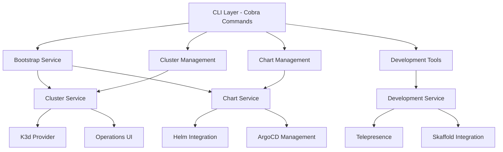

<div align="center">
  <picture>
    <source media="(prefers-color-scheme: dark)" srcset="https://raw.githubusercontent.com/flamingo-stack/openframe-oss-tenant/main/docs/assets/logo-openframe-full-dark-bg.png">
    <source media="(prefers-color-scheme: light)" srcset="https://raw.githubusercontent.com/flamingo-stack/openframe-oss-tenant/main/docs/assets/logo-openframe-full-light-bg.png">
    
  </picture>
</div>

<p align="center">
  <a href="LICENSE.md"></a>
</p>

# OpenFrame CLI

A comprehensive command-line tool for managing Kubernetes clusters and deploying the OpenFrame platform. OpenFrame CLI provides streamlined workflows for cluster creation, chart installation, development tools, and complete environment bootstrapping with support for multiple deployment modes.



## ✨ Features

- **🚀 One-Command Bootstrap** - Complete OpenFrame environment setup in minutes
- **🏗️ Cluster Management** - K8s cluster lifecycle with K3d integration (create, delete, list, status, cleanup)
- **📦 Chart Management** - Helm chart installation and ArgoCD deployment automation
- **🛠️ Development Tools** - Local development workflows with Telepresence and Skaffold integration
- **🔄 GitOps Ready** - ArgoCD-based application deployment and management
- **⚙️ Multiple Deployment Modes** - OSS-tenant, SaaS-shared, and SaaS-tenant configurations
- **🎛️ Interactive & Automated** - Both interactive prompts and CI/CD-friendly non-interactive modes
- **📊 Operations UI** - Built-in prerequisites checking and status monitoring
- **🔧 Extensible Architecture** - Clean separation of concerns with pluggable service abstractions

## 🚀 Quick Start

Get up and running with OpenFrame CLI in under 5 minutes:

### 1. Install OpenFrame CLI

```bash
# One-line install (recommended)
curl -sSL https://get.openframe.io | bash

# Or download manually
curl -LO https://github.com/flamingo-stack/openframe-cli/releases/latest/download/openframe-linux-amd64
chmod +x openframe-linux-amd64
sudo mv openframe-linux-amd64 /usr/local/bin/openframe
```

### 2. Bootstrap Your Environment

```bash
# Create complete OpenFrame environment
openframe bootstrap my-dev-cluster

# What this does:
# ✅ Checks prerequisites (Docker, kubectl, Helm, K3d)
# 🏗️ Creates K3d Kubernetes cluster
# ⚡ Installs ArgoCD for GitOps
# 📦 Deploys OpenFrame platform components
# 🎉 Ready to use!
```

### 3. Verify Installation

```bash
# Check cluster status
openframe cluster status

# View all pods
kubectl get pods -A

# Access ArgoCD UI (optional)
kubectl port-forward svc/argocd-server -n argocd 8080:443 &
```

### 4. Start Developing

```bash
# Intercept traffic for local development
openframe dev intercept api-service

# Or use Skaffold for live reloading
openframe dev skaffold my-dev-cluster
```

## 📖 Available Commands

| Command | Usage | Description |
|---------|-------|-------------|
| `bootstrap` | `openframe bootstrap [cluster-name]` | Complete environment setup (cluster + charts) |
| `cluster create` | `openframe cluster create [name]` | Create K8s cluster with interactive config |
| `cluster delete` | `openframe cluster delete [name]` | Delete cluster with confirmation |
| `cluster list` | `openframe cluster list` | Show all managed clusters |
| `cluster status` | `openframe cluster status [name]` | Detailed cluster information |
| `cluster cleanup` | `openframe cluster cleanup [name]` | Remove unused cluster resources |
| `chart install` | `openframe chart install [cluster-name]` | Install ArgoCD and app-of-apps |
| `dev intercept` | `openframe dev intercept [service-name]` | Traffic interception for local development |
| `dev skaffold` | `openframe dev skaffold [cluster-name]` | Live development with Skaffold |

### Common Flags
- `--deployment-mode`: Specify deployment type (oss-tenant, saas-tenant, saas-shared)
- `--non-interactive`: Skip prompts for CI/CD usage
- `--verbose, -v`: Detailed logging output
- `--force`: Skip confirmations for destructive operations
- `--dry-run`: Preview operations without execution

## 🏗️ Architecture

OpenFrame CLI follows a layered architecture with clear separation between command handlers, business logic, and infrastructure concerns:



### Core Components

- **Bootstrap Service** - Orchestrates complete OpenFrame setup
- **Cluster Management** - K8s cluster lifecycle operations
- **Chart Management** - Helm chart installation and ArgoCD deployment
- **Development Tools** - Local development workflow integration
- **Shared UI** - Common user interface components and operations display

## 🎯 Deployment Modes

| Mode | Use Case | Description |
|------|----------|-------------|
| **oss-tenant** | Development, learning | Single-tenant open source deployment |
| **saas-shared** | Multi-tenancy testing | Shared infrastructure for multiple tenants |
| **saas-tenant** | Production-like | Dedicated tenant infrastructure |

## 📋 Prerequisites

OpenFrame CLI automatically checks for and requires these tools:

- **Docker** - Container runtime for cluster nodes
- **kubectl** - Kubernetes cluster interaction
- **Helm** - Chart installation and templating
- **K3d** - Lightweight Kubernetes cluster management

## 🛠️ Development

Interested in contributing? Here's how to get started:

```bash
# Clone the repository
git clone https://github.com/flamingo-stack/openframe-cli.git
cd openframe-cli

# Set up development environment
make setup

# Build the binary
make build

# Run tests
make test

# Run integration tests
make test-integration
```

## 📚 Documentation

📚 See the [Documentation](./docs/README.md) for comprehensive guides:

- **[Getting Started](./docs/getting-started/)** - Installation, quick start, and first steps
- **[Development](./docs/development/)** - Contributing, architecture, and local development
- **[Reference](./docs/reference/)** - Technical documentation and API references

## 🤝 Contributing

We welcome contributions! Please see our [Contributing Guidelines](CONTRIBUTING.md) for details on:

- Code of conduct
- Development process
- Submitting pull requests
- Code review process

## 📄 License

This project is licensed under the Flamingo AI Unified License v1.0. See [LICENSE.md](LICENSE.md) for details.

## 🆘 Support

- 📖 Check the [documentation](./docs/README.md)
- 🐛 Report issues on [GitHub Issues](https://github.com/flamingo-stack/openframe-cli/issues)
- 💬 Join our [Discord community](https://discord.gg/flamingo)
- ⭐ Star us on GitHub if this project helped you!

---
<div align="center">
  Built with 💛 by the <a href="https://www.flamingo.run/about"><b>Flamingo</b></a> team
</div>