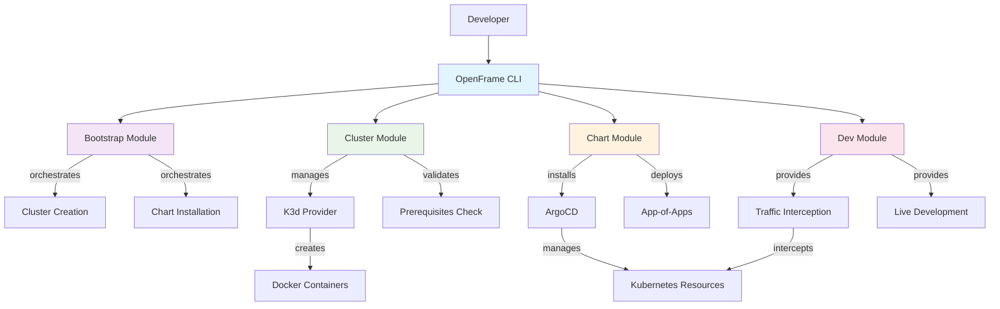

<div align="center">
  <picture>
    <source media="(prefers-color-scheme: dark)" srcset="https://raw.githubusercontent.com/flamingo-stack/openframe-oss-tenant/main/docs/assets/logo-openframe-full-dark-bg.png">
    <source media="(prefers-color-scheme: light)" srcset="https://raw.githubusercontent.com/flamingo-stack/openframe-oss-tenant/main/docs/assets/logo-openframe-full-light-bg.png">
    
  </picture>
</div>

<p align="center">
  <a href="LICENSE.md"></a>
</p>

# OpenFrame CLI

OpenFrame CLI is a comprehensive Kubernetes cluster management tool that transforms complex local development workflows into simple, one-command operations. Built for developers and DevOps teams, it provides streamlined cluster creation, GitOps-ready ArgoCD integration, and powerful development tools for traffic interception and live debugging.

**🎯 In one sentence:** OpenFrame CLI gets you from zero to a fully configured local Kubernetes cluster with GitOps capabilities in minutes, not hours.

## ✨ Features

### 🚀 **One-Command Bootstrap**
Complete environment setup with a single command - eliminates multi-step configuration complexity.

### 🐳 **K3d Integration** 
Native K3d cluster lifecycle management for lightweight, fast local Kubernetes clusters.

### 🔄 **ArgoCD Automation**
Automatic ArgoCD and app-of-apps installation - GitOps-ready from day one.

### 🛠️ **Development Tools**
Built-in Telepresence and Skaffold support for seamless local development workflows.

### 🎛️ **Interactive Wizards**
Smart configuration prompts and validation to reduce setup errors.

### 🏢 **Multi-Deployment Support**
Flexible deployment modes: OSS-tenant, SaaS-tenant, and SaaS-shared configurations.

## 🎥 Product Overview

Get a comprehensive overview of OpenFrame's capabilities:



## ⚡ Quick Start

### Prerequisites
- Docker Desktop or Docker Engine
- kubectl (Kubernetes CLI)
- Git

### Installation & Setup

```bash
# Complete environment in one command
openframe bootstrap my-cluster

# Expected output:
# 🚀 OpenFrame CLI v1.0.0
# ✅ Prerequisites validated
# ✅ K3d cluster 'my-cluster' created
# ✅ ArgoCD installed and configured
# ✅ App-of-apps deployed successfully
# 🎉 Environment ready! Access ArgoCD at: http://localhost:8080
```

### Alternative: Step-by-Step Setup

```bash
# Create cluster
openframe cluster create my-cluster

# Install ArgoCD and charts
openframe chart install my-cluster

# Enable development tools (coming soon)
openframe dev intercept my-service
```

## 📋 Common Commands

### Cluster Management
```bash
# Interactive cluster creation
openframe cluster create

# Create with specific name
openframe cluster create my-cluster

# List all clusters
openframe cluster list

# Check cluster status
openframe cluster status my-cluster

# Delete cluster
openframe cluster delete my-cluster
```

### Chart Management
```bash
# Interactive ArgoCD installation
openframe chart install

# Install on specific cluster
openframe chart install my-cluster

# Install with custom deployment mode
openframe chart install --deployment-mode=saas-tenant

# Use custom GitHub branch
openframe chart install --github-branch develop
```

### Global Options
- `--verbose, -v`: Enable detailed logging
- `--non-interactive`: Skip prompts for CI/CD
- `--deployment-mode`: Specify deployment type
- `--dry-run`: Preview operations without execution

## 🏗️ Architecture Overview



## 🎯 Use Cases

### 👨‍💻 **Local Development**
Perfect for developing and testing applications on a local Kubernetes cluster with GitOps workflows.

### 🔄 **CI/CD Integration**
Non-interactive modes support automated testing and deployment pipelines.

### 🏗️ **Learning Kubernetes**
Simplified way to experiment with Kubernetes concepts without complex setup.

### 🔧 **Prototyping**
Quickly spin up environments to test new ideas or configurations.

## 📚 Documentation

📚 See the [Documentation](./docs/README.md) for comprehensive guides including:

- **[Getting Started](./docs/getting-started/introduction.md)** - Introduction and setup guides
- **[Prerequisites](./docs/getting-started/prerequisites.md)** - System requirements
- **[Quick Start Guide](./docs/getting-started/quick-start.md)** - 5-minute setup
- **[Development Documentation](./docs/development/README.md)** - For contributors and developers
- **[Architecture Reference](./docs/reference/architecture/overview.md)** - Technical architecture details

## 🤝 Contributing

We welcome contributions! Please see our [Contributing Guide](./CONTRIBUTING.md) for details on:

- Setting up the development environment
- Code standards and best practices
- Pull request process
- How to report bugs and suggest features

## 📄 License

This project is licensed under the Flamingo AI Unified License v1.0. See [LICENSE.md](LICENSE.md) for details.

## 🆘 Getting Help

- **Commands Help**: Run any command with `--help` flag
- **Interactive Modes**: Most commands offer guided configuration
- **Detailed Logging**: Use `--verbose` flag for troubleshooting
- **GitHub Issues**: Report bugs or request features
- **GitHub Discussions**: Ask questions and share ideas

---
<div align="center">
  Built with 💛 by the <a href="https://www.flamingo.run/about"><b>Flamingo</b></a> team
</div>