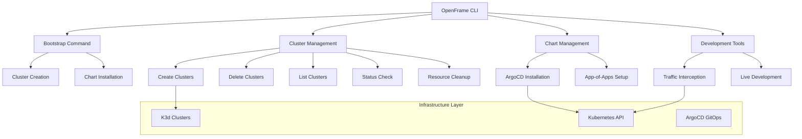

<div align="center">
  <picture>
    <source media="(prefers-color-scheme: dark)" srcset="https://shdrojejslhgnojzkzak.supabase.co/storage/v1/object/public/public/doc-orchestrator/logos/1771384772513-n227fc-logo-openframe-full-dark-bg.png">
    <source media="(prefers-color-scheme: light)" srcset="https://shdrojejslhgnojzkzak.supabase.co/storage/v1/object/public/public/doc-orchestrator/logos/1771384777189-nbcwbo-logo-openframe-full-light-bg.png">
    
  </picture>
</div>

<p align="center">
  <a href="LICENSE.md"></a>
</p>

# OpenFrame CLI

**From zero to GitOps-enabled Kubernetes cluster in minutes** - OpenFrame CLI is a comprehensive command-line interface for bootstrapping and managing Kubernetes clusters with ArgoCD for MSP (Managed Service Provider) environments. It eliminates the complexity of setting up local development environments by automating cluster creation with K3d, installing ArgoCD for GitOps workflows, and providing integrated development tools.

[](https://www.youtube.com/watch?v=O8hbBO5Mym8)

## ✨ Features

- **🚀 One-Command Bootstrap**: Complete environment setup with `openframe bootstrap`
- **🎯 Interactive Wizards**: Guided cluster creation and configuration
- **📦 GitOps Integration**: Automatic ArgoCD installation and app-of-apps pattern
- **🔧 Development Tools**: Traffic interception and live reloading capabilities
- **🧹 Resource Management**: Cleanup and status monitoring commands
- **🌐 Multi-Platform**: Support for multiple deployment modes (OSS tenant, SaaS shared, SaaS tenant)
- **⚡ Lightweight**: K3d-based clusters for efficient resource usage
- **🛡️ Safe Operations**: Confirmation prompts and resource cleanup

## 🚀 Quick Start

### Prerequisites

- **Docker** 20.10+
- **24GB RAM** minimum (32GB recommended)
- **6 CPU cores** minimum (12 recommended)

### Installation

| Platform | Download |
|----------|----------|
| **Windows (AMD64)** | [openframe-cli_windows_amd64.zip](https://github.com/flamingo-stack/openframe-cli/releases/latest/download/openframe-cli_windows_amd64.zip) |
| **Linux (AMD64)** | [openframe-cli_linux_amd64.tar.gz](https://github.com/flamingo-stack/openframe-cli/releases/latest/download/openframe-cli_linux_amd64.tar.gz) |
| **macOS (Intel)** | [openframe-cli_darwin_amd64.tar.gz](https://github.com/flamingo-stack/openframe-cli/releases/latest/download/openframe-cli_darwin_amd64.tar.gz) |
| **macOS (Apple Silicon)** | [openframe-cli_darwin_arm64.tar.gz](https://github.com/flamingo-stack/openframe-cli/releases/latest/download/openframe-cli_darwin_arm64.tar.gz) |

### 5-Minute Setup

```bash
# 1. Bootstrap complete environment
openframe bootstrap my-first-cluster

# 2. Verify cluster is running
openframe cluster status

# 3. Check ArgoCD installation
kubectl get pods -n argocd
```

That's it! You now have a fully functional Kubernetes cluster with ArgoCD GitOps capabilities.

## 🏗️ Architecture

OpenFrame CLI follows a modular architecture with command-specific packages handling different aspects of cluster lifecycle management:


```mermaid
graph TB
    CLI[OpenFrame CLI] --> Bootstrap[Bootstrap Command]
    CLI --> Cluster[Cluster Management]
    CLI --> Chart[Chart Management]
    CLI --> Dev[Development Tools]
    
    Bootstrap --> ClusterCreate[Cluster Creation]
    Bootstrap --> ChartInstall[Chart Installation]
    
    Cluster --> Create[Create Clusters]
    Cluster --> Delete[Delete Clusters]
    Cluster --> List[List Clusters]
    Cluster --> Status[Status Check]
    Cluster --> Cleanup[Resource Cleanup]
    
    Chart --> ArgoCD[ArgoCD Installation]
    Chart --> AppOfApps[App-of-Apps Setup]
    
    Dev --> Intercept[Traffic Interception]
    Dev --> Skaffold[Live Development]
    
    subgraph Infrastructure[Infrastructure Layer]
        K3d[K3d Clusters]
        Kubernetes[Kubernetes API]
        ArgoCDSvc[ArgoCD GitOps]
    end
    
    Create --> K3d
    ArgoCD --> Kubernetes
    Intercept --> Kubernetes
```

## 🛠️ Technology Stack

| Component | Technology | Purpose |
|-----------|------------|---------|
| **Core Language** | Go 1.21+ | CLI implementation and business logic |
| **CLI Framework** | Cobra | Command structure and argument parsing |
| **Container Runtime** | Docker | K3d cluster management |
| **Kubernetes** | K3d, kubectl | Local cluster creation and management |
| **GitOps** | ArgoCD, Helm | Application deployment and management |
| **Development Tools** | Telepresence, Skaffold | Traffic interception and live development |

## 📖 Commands Overview

| Category | Commands | Purpose |
|----------|----------|---------|
| **Bootstrap** | `bootstrap` | Complete environment setup |
| **Cluster** | `create`, `delete`, `list`, `status`, `cleanup` | Cluster lifecycle management |
| **Chart** | `install` | ArgoCD and Helm chart management |
| **Development** | `intercept`, `skaffold` | Development workflow tools |

### Bootstrap Commands
```bash
openframe bootstrap                                    # Interactive mode
openframe bootstrap my-cluster                        # Custom cluster name
openframe bootstrap --deployment-mode=oss-tenant     # Skip deployment selection
openframe bootstrap --verbose                         # Detailed logging
```

### Cluster Management
```bash
openframe cluster create                    # Interactive cluster creation
openframe cluster delete my-cluster        # Delete specific cluster
openframe cluster list                     # Show all clusters
openframe cluster status my-cluster        # Detailed cluster status
openframe cluster cleanup my-cluster       # Clean unused resources
```

### Chart Management
```bash
openframe chart install                                    # Interactive installation
openframe chart install my-cluster                        # Install on specific cluster
openframe chart install --deployment-mode=saas-shared     # Skip deployment selection
```

## 📚 Documentation

📚 See the [Documentation](./docs/README.md) for comprehensive guides including:

- **Getting Started** - Prerequisites, quick start, and first steps
- **Development** - Local setup, contributing, and architecture guides  
- **Reference** - Architecture documentation and technical specifications

## 🤝 Community & Support

- **OpenMSP Slack Community**: [Join our Slack](https://join.slack.com/t/openmsp/shared_invite/zt-36bl7mx0h-3~U2nFH6nqHqoTPXMaHEHA)
- **Website**: [flamingo.run](https://flamingo.run)
- **OpenFrame Platform**: [openframe.ai](https://openframe.ai)

## 💡 What You Get

Your OpenFrame environment includes:

### Infrastructure Components
- **K3d Cluster**: Lightweight Kubernetes cluster running in Docker
- **ArgoCD**: GitOps continuous delivery platform
- **Helm Charts**: Pre-configured application templates

### GitOps Setup
- **App-of-Apps Pattern**: ArgoCD managing multiple applications
- **Automated Sync**: Continuous deployment from Git repositories
- **Declarative Configuration**: Infrastructure as code approach

### Development Workflows
- **Traffic Interception**: Route cluster traffic to local development
- **Live Reloading**: Deploy with automatic updates on code changes
- **Resource Management**: Cleanup and monitoring capabilities

## 🧹 Quick Cleanup

When you're done experimenting:

```bash
# Delete the cluster
openframe cluster delete my-cluster

# Clean up Docker resources
openframe cluster cleanup
```

---
<div align="center">
  Built with 💛 by the <a href="https://www.flamingo.run/about"><b>Flamingo</b></a> team
</div>