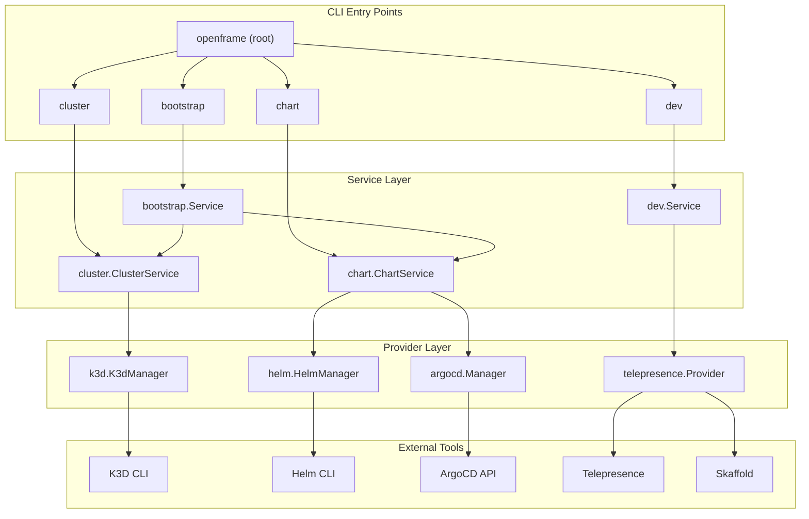

<div align="center">
  <picture>
    <source media="(prefers-color-scheme: dark)" srcset="https://shdrojejslhgnojzkzak.supabase.co/storage/v1/object/public/public/doc-orchestrator/logos/1771384772513-n227fc-logo-openframe-full-dark-bg.png">
    <source media="(prefers-color-scheme: light)" srcset="https://shdrojejslhgnojzkzak.supabase.co/storage/v1/object/public/public/doc-orchestrator/logos/1771384777189-nbcwbo-logo-openframe-full-light-bg.png">
    
  </picture>
</div>

<p align="center">
  <a href="LICENSE.md"></a>
</p>

# OpenFrame CLI

**OpenFrame CLI** is a modern, interactive command-line tool for bootstrapping and managing [OpenFrame](https://openframe.ai) Kubernetes environments. Part of the [Flamingo](https://flamingo.run) AI-powered MSP platform, it replaces fragile shell-script workflows with a structured Go application that supports both guided wizard modes for new users and fully non-interactive CI/CD automation for production pipelines.

> **In one command**, `openframe bootstrap`, you get a fully operational K3D Kubernetes cluster with ArgoCD GitOps pipelines and all OpenFrame services installed and healthy.

---

[](https://www.youtube.com/watch?v=bINdW0CQbvY)

---

## Features

- **One-Command Bootstrap** — Full environment setup: K3D cluster + ArgoCD + app-of-apps deployment in a single `openframe bootstrap` call
- **Interactive Wizards** — Step-by-step guided setup for clusters, charts, and developer workflows
- **Cluster Lifecycle Management** — Create, delete, list, and inspect K3D Kubernetes clusters
- **GitOps via ArgoCD** — Automated chart installation using the App-of-Apps pattern with health/sync polling
- **Developer Intercepts** — Route live Kubernetes service traffic to your local machine via Telepresence
- **Live Reload Development** — Skaffold-powered hot-reload development sessions inside the cluster
- **CI/CD Ready** — `--non-interactive` flags for every operation, fully suitable for automation pipelines
- **Prerequisite Checking** — Automatically validates and guides installation of required tools (Docker, kubectl, k3d, Helm, mkcert)
- **WSL2 Support** — First-class Windows WSL2 compatibility with automatic IP detection and platform-specific optimizations
- **Multiple Deployment Modes** — Supports `oss-tenant`, `saas-tenant`, and `saas-shared` deployment targets

---

## Architecture


```mermaid
graph TB
    subgraph CLI["CLI Entry Points"]
        Root["openframe (root)"]
        Bootstrap["bootstrap"]
        Cluster["cluster"]
        Chart["chart"]
        Dev["dev"]
    end

    subgraph Services["Service Layer"]
        BootstrapSvc["bootstrap.Service"]
        ClusterSvc["cluster.ClusterService"]
        ChartSvc["chart.ChartService"]
        DevSvc["dev.Service"]
    end

    subgraph Providers["Provider Layer"]
        K3dMgr["k3d.K3dManager"]
        HelmMgr["helm.HelmManager"]
        ArgoCDMgr["argocd.Manager"]
        TelepresenceProv["telepresence.Provider"]
    end

    subgraph External["External Tools"]
        K3D["K3D CLI"]
        HelmCLI["Helm CLI"]
        ArgoCD["ArgoCD API"]
        TelepresenceCLI["Telepresence"]
        SkaffoldCLI["Skaffold"]
    end

    Root --> Bootstrap
    Root --> Cluster
    Root --> Chart
    Root --> Dev

    Bootstrap --> BootstrapSvc
    Cluster --> ClusterSvc
    Chart --> ChartSvc
    Dev --> DevSvc

    BootstrapSvc --> ClusterSvc
    BootstrapSvc --> ChartSvc
    ClusterSvc --> K3dMgr
    ChartSvc --> HelmMgr
    ChartSvc --> ArgoCDMgr
    DevSvc --> TelepresenceProv

    K3dMgr --> K3D
    HelmMgr --> HelmCLI
    ArgoCDMgr --> ArgoCD
    TelepresenceProv --> TelepresenceCLI
    TelepresenceProv --> SkaffoldCLI
```

The CLI follows a strict layered architecture: **Commands → Services → Providers → Shared Executor → External Tools**. Every workflow supports both interactive wizard-guided mode and non-interactive flag-driven mode.

---

## Hardware Requirements

| Tier | RAM | CPU Cores | Disk Space |
|---|---|---|---|
| **Minimum** | 24 GB | 6 cores | 50 GB |
| **Recommended** | 32 GB | 12 cores | 100 GB |

> K3D runs Kubernetes nodes as Docker containers. Insufficient memory is the most common cause of failed bootstraps.

---

## Quick Start

[](https://www.youtube.com/watch?v=-_56_qYvMWk)

### Step 1: Install the OpenFrame CLI

**Linux (amd64):**

```bash
curl -Lo openframe https://github.com/flamingo-stack/openframe-cli/releases/latest/download/openframe-cli_linux_amd64
chmod +x openframe
sudo mv openframe /usr/local/bin/openframe
```

**macOS (Apple Silicon):**

```bash
curl -Lo openframe https://github.com/flamingo-stack/openframe-cli/releases/latest/download/openframe-cli_darwin_arm64
chmod +x openframe
sudo mv openframe /usr/local/bin/openframe
```

**Windows (AMD64):**

1. Download [openframe-cli_windows_amd64.zip](https://github.com/flamingo-stack/openframe-cli/releases/latest/download/openframe-cli_windows_amd64.zip)
2. Extract the archive
3. Move `openframe.exe` to a directory on your `$PATH`

**Build from source:**

```bash
git clone https://github.com/flamingo-stack/openframe-cli.git
cd openframe-cli
go build -o openframe main.go
sudo mv openframe /usr/local/bin/openframe
```

### Step 2: Verify Installation

```bash
openframe --version
openframe --help
```

### Step 3: Bootstrap Your First Environment

**Interactive mode (recommended for first-time users):**

```bash
openframe bootstrap
```

The wizard will guide you through cluster naming, deployment mode selection, and configuration.

**Non-interactive / CI mode:**

```bash
openframe bootstrap my-cluster --deployment-mode=oss-tenant --non-interactive
```

### Step 4: Verify the Environment

```bash
openframe cluster list
openframe cluster status my-cluster --detailed
```

---

## Command Reference

| Command | Description |
|---|---|
| `openframe bootstrap [cluster-name]` | Full environment setup: cluster + ArgoCD + app-of-apps |
| `openframe cluster create [name]` | Create a K3D Kubernetes cluster |
| `openframe cluster list` | List all managed clusters |
| `openframe cluster status [name]` | Show cluster health and ArgoCD app status |
| `openframe cluster delete [name]` | Delete a cluster |
| `openframe cluster cleanup [name]` | Remove unused Docker resources from cluster nodes |
| `openframe chart install [cluster-name]` | Install ArgoCD and app-of-apps on an existing cluster |
| `openframe dev intercept [service-name]` | Intercept Kubernetes service traffic locally via Telepresence |
| `openframe dev skaffold [cluster-name]` | Run a live-reload development session with Skaffold |

---

## Deployment Modes

| Mode | Repository | Use Case |
|---|---|---|
| `oss-tenant` | `flamingo-stack/openframe-oss-tenant` | Default self-hosted OpenFrame |
| `saas-tenant` | `flamingo-stack/openframe-saas-tenant` | SaaS tenant deployment |
| `saas-shared` | `flamingo-stack/openframe-saas-shared` | Shared SaaS platform |

---

## Technology Stack

| Layer | Technology |
|---|---|
| **Language** | Go 1.22+ |
| **CLI Framework** | [Cobra](https://github.com/spf13/cobra) |
| **Terminal UI** | [pterm](https://github.com/pterm/pterm), [promptui](https://github.com/manifoldco/promptui) |
| **Kubernetes Client** | [client-go](https://github.com/kubernetes/client-go) |
| **GitOps** | [ArgoCD](https://argoproj.github.io/cd/) via native K8s client |
| **Cluster Provider** | [K3D](https://k3d.io) |
| **Package Manager** | [Helm](https://helm.sh) |
| **Dev Intercept** | [Telepresence](https://www.telepresence.io) |
| **Live Reload** | [Skaffold](https://skaffold.dev) |
| **Testing** | [testify](https://github.com/stretchr/testify) |

---

## Documentation

📚 See the [Documentation](./docs/README.md) for comprehensive guides including getting started tutorials, development setup, architecture reference, and contributing guidelines.

---

## Community & Support

> We do **not** use GitHub Issues or GitHub Discussions. All questions, bug reports, and feature requests are handled in the OpenMSP Slack community.

- 💬 **OpenMSP Slack**: [Join here](https://join.slack.com/t/openmsp/shared_invite/zt-36bl7mx0h-3~U2nFH6nqHqoTPXMaHEHA)
- 🌐 **OpenMSP Community**: [https://www.openmsp.ai/](https://www.openmsp.ai/)
- 🌐 **OpenFrame**: [https://openframe.ai](https://openframe.ai)
- 🌐 **Flamingo**: [https://flamingo.run](https://flamingo.run)

---

<div align="center">
  Built with 💛 by the <a href="https://www.flamingo.run/about"><b>Flamingo</b></a> team
</div>
