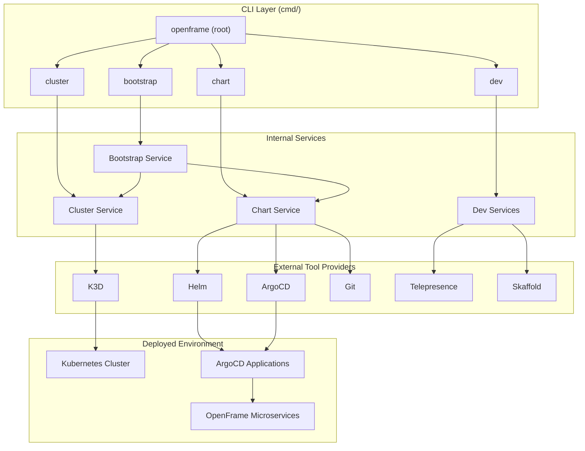

<div align="center">
  <picture>
    <source media="(prefers-color-scheme: dark)" srcset="https://shdrojejslhgnojzkzak.supabase.co/storage/v1/object/public/public/doc-orchestrator/logos/1771384772513-n227fc-logo-openframe-full-dark-bg.png">
    <source media="(prefers-color-scheme: light)" srcset="https://shdrojejslhgnojzkzak.supabase.co/storage/v1/object/public/public/doc-orchestrator/logos/1771384777189-nbcwbo-logo-openframe-full-light-bg.png">
    
  </picture>
</div>

<p align="center">
  <a href="LICENSE.md"></a>
</p>

# OpenFrame CLI

**OpenFrame CLI** is a modern, interactive command-line tool written in Go that bootstraps and manages OpenFrame Kubernetes environments. It is the primary entry point for spinning up fully functional, production-grade [OpenFrame](https://openframe.ai) deployments on local or remote Kubernetes clusters — in minutes, not days.

OpenFrame CLI automates the full lifecycle of an OpenFrame environment: cluster provisioning, GitOps installation via ArgoCD, interactive Helm values configuration, and developer tooling for Telepresence intercepts and Skaffold hot-reload workflows.

It is part of the broader [OpenFrame](https://openframe.ai) platform — the unified, AI-driven MSP operations suite built by [Flamingo](https://flamingo.run).

---

[](https://www.youtube.com/watch?v=a45pzxtg27k)

---

## ✨ Features

| Feature | Description |
|---|---|
| **One-command bootstrap** | `openframe bootstrap` provisions a cluster and installs all charts end-to-end |
| **Interactive wizard** | Guided Helm values configuration — branch, Docker registry, ingress, deployment mode |
| **K3D cluster management** | Create, delete, list, status, and cleanup local K3D clusters |
| **ArgoCD GitOps** | Installs ArgoCD and deploys app-of-apps patterns with health monitoring |
| **Telepresence intercepts** | Route live Kubernetes traffic to your local machine for rapid iteration |
| **Skaffold hot-reload** | Rebuild and sync containers on code change within a running cluster |
| **Non-interactive / CI mode** | All commands support `--non-interactive` flags for CI/CD pipelines |
| **Cross-platform** | Supports macOS, Linux, and Windows (WSL2) |
| **Prerequisite auto-installer** | Automatically detects and guides installation of Docker, k3d, kubectl, Helm, and more |

---

## 🏗️ Architecture


```mermaid
graph TB
    subgraph CLI["CLI Layer (cmd/)"]
        Root["openframe (root)"]
        BootstrapCmd["bootstrap"]
        ClusterCmd["cluster"]
        ChartCmd["chart"]
        DevCmd["dev"]
    end

    subgraph Services["Internal Services"]
        BootstrapSvc["Bootstrap Service"]
        ClusterSvc["Cluster Service"]
        ChartSvc["Chart Service"]
        DevSvc["Dev Services"]
    end

    subgraph Providers["External Tool Providers"]
        K3D["K3D"]
        Helm["Helm"]
        ArgoCD["ArgoCD"]
        Git["Git"]
        Telepresence["Telepresence"]
        Skaffold["Skaffold"]
    end

    subgraph Target["Deployed Environment"]
        K8s["Kubernetes Cluster"]
        Apps["ArgoCD Applications"]
        Services2["OpenFrame Microservices"]
    end

    Root --> BootstrapCmd
    Root --> ClusterCmd
    Root --> ChartCmd
    Root --> DevCmd

    BootstrapCmd --> BootstrapSvc
    ClusterCmd --> ClusterSvc
    ChartCmd --> ChartSvc
    DevCmd --> DevSvc

    BootstrapSvc --> ClusterSvc
    BootstrapSvc --> ChartSvc

    ClusterSvc --> K3D
    ChartSvc --> Helm
    ChartSvc --> ArgoCD
    ChartSvc --> Git
    DevSvc --> Telepresence
    DevSvc --> Skaffold

    K3D --> K8s
    Helm --> Apps
    ArgoCD --> Apps
    Apps --> Services2
```

---

## 🖥️ Hardware Requirements

| Tier | RAM | CPU Cores | Disk Space |
|---|---|---|---|
| **Minimum** | 24 GB | 6 cores | 50 GB |
| **Recommended** | 32 GB | 12 cores | 100 GB |

> K3D runs Kubernetes nodes as Docker containers. Insufficient memory is the most common cause of failed bootstraps — ensure Docker has access to at least 16 GB RAM.

---

## 🚀 Quick Start

### Step 1 — Install the CLI

#### macOS (Apple Silicon)

```bash
curl -L https://github.com/flamingo-stack/openframe-cli/releases/latest/download/openframe-cli_darwin_arm64.tar.gz | tar xz
chmod +x openframe
sudo mv openframe /usr/local/bin/
```

#### macOS (Intel)

```bash
curl -L https://github.com/flamingo-stack/openframe-cli/releases/latest/download/openframe-cli_darwin_amd64.tar.gz | tar xz
chmod +x openframe
sudo mv openframe /usr/local/bin/
```

#### Linux (AMD64)

```bash
curl -L https://github.com/flamingo-stack/openframe-cli/releases/latest/download/openframe-cli_linux_amd64.tar.gz | tar xz
chmod +x openframe
sudo mv openframe /usr/local/bin/
```

#### Linux (ARM64)

```bash
curl -L https://github.com/flamingo-stack/openframe-cli/releases/latest/download/openframe-cli_linux_arm64.tar.gz | tar xz
chmod +x openframe
sudo mv openframe /usr/local/bin/
```

#### Windows (AMD64)

1. Download: [openframe-cli_windows_amd64.zip](https://github.com/flamingo-stack/openframe-cli/releases/latest/download/openframe-cli_windows_amd64.zip)
2. Extract the zip archive
3. Move `openframe.exe` to a directory in your `PATH` (e.g., `C:\Windows\System32\` or a custom tools folder)

> **Windows users**: Run all commands from a WSL2 terminal for the best experience.

---

### Step 2 — Bootstrap Your Environment

```bash
# Interactive bootstrap (recommended for first-time users)
openframe bootstrap

# Non-interactive (CI/CD)
openframe bootstrap my-cluster --deployment-mode=oss-tenant --non-interactive
```

The `bootstrap` command will:

1. Check and guide installation of any missing prerequisites (Docker, k3d, kubectl, Helm, Git, mkcert)
2. Create a local K3D Kubernetes cluster
3. Install ArgoCD via Helm
4. Clone and deploy the app-of-apps GitOps chart
5. Wait for all ArgoCD applications to become Healthy and Synced

> Typical bootstrap time: **5–15 minutes** depending on network speed and hardware.

---

### Step 3 — Verify

```bash
# Check cluster status
openframe cluster status my-openframe

# List all managed clusters
openframe cluster list
```

---

[](https://www.youtube.com/watch?v=-_56_qYvMWk)

---

## 📦 Deployment Modes

| Mode | Repository | Use Case |
|---|---|---|
| `oss-tenant` | `openframe-oss-tenant` | Default self-hosted OpenFrame deployment |
| `saas-tenant` | `openframe-saas-tenant` | SaaS managed tenant deployment |
| `saas-shared` | `openframe-saas-shared` | Shared SaaS infrastructure deployment |

> For most operators getting started, `oss-tenant` is the recommended deployment mode.

---

## 🧰 CLI Command Reference

| Command | Description |
|---|---|
| `openframe bootstrap [name]` | Full environment setup: cluster create + chart install |
| `openframe cluster create [name]` | Create a K3D cluster |
| `openframe cluster delete [name]` | Delete a cluster |
| `openframe cluster list` | List all managed clusters |
| `openframe cluster status [name]` | Show cluster health and ArgoCD app status |
| `openframe cluster cleanup [name]` | Remove unused Docker images and resources |
| `openframe chart install [name]` | Install ArgoCD + app-of-apps on a cluster |
| `openframe dev intercept [service]` | Start a Telepresence intercept for local development |
| `openframe dev skaffold [cluster]` | Run a Skaffold hot-reload workflow |

---

## 🔧 Technology Stack

| Component | Technology |
|---|---|
| Language | Go |
| CLI framework | [Cobra](https://github.com/spf13/cobra) |
| Terminal UI | [pterm](https://github.com/pterm/pterm) |
| Interactive prompts | [promptui](https://github.com/manifoldco/promptui) |
| Kubernetes client | [client-go](https://pkg.go.dev/k8s.io/client-go) |
| ArgoCD client | [argo-cd/v2](https://pkg.go.dev/github.com/argoproj/argo-cd/v2) |
| YAML processing | [sigs.k8s.io/yaml](https://pkg.go.dev/sigs.k8s.io/yaml), [gopkg.in/yaml.v3](https://pkg.go.dev/gopkg.in/yaml.v3) |
| Testing | [testify](https://github.com/stretchr/testify) |
| Cluster provider | K3D |
| GitOps | ArgoCD + Helm app-of-apps |

---

## 📚 Documentation

Comprehensive documentation is available in the [`docs/`](./docs/README.md) directory:

- **[Getting Started](./docs/README.md)** — Prerequisites, quick start, and first steps
- **[Development Guides](./docs/README.md)** — Local setup, architecture, testing, contributing
- **[Reference](./docs/README.md)** — Full architecture reference and component documentation

---

## 🤝 Community & Support

> **Support happens in Slack, not GitHub Issues.**

| Resource | Link |
|---|---|
| OpenMSP Community | [openmsp.ai](https://www.openmsp.ai/) |
| Slack Invite | [Join OpenMSP Slack](https://join.slack.com/t/openmsp/shared_invite/zt-36bl7mx0h-3~U2nFH6nqHqoTPXMaHEHA) |
| OpenFrame Platform | [openframe.ai](https://openframe.ai) |
| Flamingo | [flamingo.run](https://flamingo.run) |

---

## 🤲 Contributing

We welcome contributions! Please read our [Contributing Guidelines](./CONTRIBUTING.md) before opening a pull request.

---

<div align="center">
  Built with 💛 by the <a href="https://www.flamingo.run/about"><b>Flamingo</b></a> team
</div>
