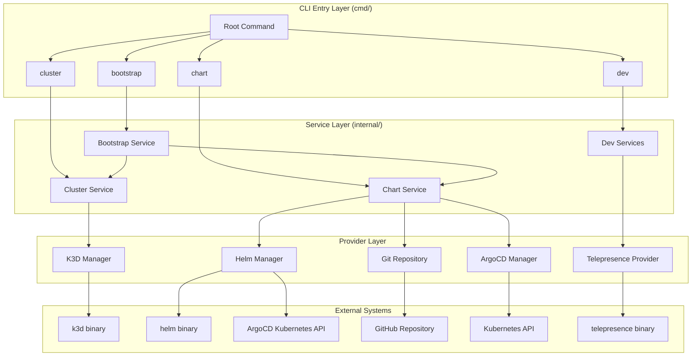

<div align="center">
  <picture>
    <source media="(prefers-color-scheme: dark)" srcset="https://shdrojejslhgnojzkzak.supabase.co/storage/v1/object/public/public/doc-orchestrator/logos/1771384772513-n227fc-logo-openframe-full-dark-bg.png">
    <source media="(prefers-color-scheme: light)" srcset="https://shdrojejslhgnojzkzak.supabase.co/storage/v1/object/public/public/doc-orchestrator/logos/1771384777189-nbcwbo-logo-openframe-full-light-bg.png">
    
  </picture>
</div>

<p align="center">
  <a href="LICENSE.md"></a>
</p>

# OpenFrame CLI

**OpenFrame CLI** is a modern, interactive command-line tool written in Go for bootstrapping and managing [OpenFrame](https://openframe.ai) Kubernetes environments. It is the primary developer-facing entry point to the OpenFrame AI-powered MSP platform — replacing brittle shell scripts with a wizard-style terminal interface that guides you through every step of your environment lifecycle.

From a single command you can spin up a fully operational local Kubernetes cluster, install ArgoCD, deploy the complete OpenFrame application stack via the App-of-Apps GitOps pattern, and begin intercepting live cluster traffic in your local IDE — all without memorizing dozens of manual steps.

> Part of the [Flamingo](https://flamingo.run) ecosystem — an AI-powered MSP platform that replaces expensive proprietary software with open-source alternatives enhanced by intelligent automation (Mingo AI for technicians, Fae for clients).

---

[](https://www.youtube.com/watch?v=jEkFcS4AcQ4)

---

## Features

| Feature | Description |
|---------|-------------|
| **One-Command Bootstrap** | `openframe bootstrap` creates a K3D cluster, installs ArgoCD, and deploys the full stack in one shot |
| **Interactive Wizard UI** | Step-by-step guided prompts for cluster names, deployment modes, ingress, and Docker registry settings |
| **Cluster Lifecycle Management** | Create, delete, list, check status, and clean up K3D clusters |
| **Helm & ArgoCD Integration** | Installs ArgoCD via Helm and waits for all Application CRDs to reach Healthy+Synced state |
| **Local Dev Workflows** | Telepresence-based service intercepts route live cluster traffic to your local process |
| **Skaffold Hot Reload** | `openframe dev skaffold` discovers `skaffold.yaml` files and starts live-reload dev sessions |
| **Prerequisite Checking** | Validates Docker, k3d, kubectl, helm, git, and mkcert before any operation |
| **Cross-Platform** | Full Linux, macOS, and Windows (WSL2) support with native path handling |
| **CI/CD Friendly** | `--non-interactive` and `--deployment-mode` flags for fully automated pipelines |

---

## Architecture

OpenFrame CLI follows a layered clean architecture: thin Cobra command handlers delegate to service layers, which compose providers and infrastructure utilities. All external I/O is abstracted behind interfaces to maximize testability.


```mermaid
graph TD
    subgraph CLI["CLI Entry Layer (cmd/)"]
        Root["Root Command"]
        Bootstrap["bootstrap"]
        Cluster["cluster"]
        Chart["chart"]
        Dev["dev"]
    end

    subgraph Services["Service Layer (internal/)"]
        BootstrapSvc["Bootstrap Service"]
        ClusterSvc["Cluster Service"]
        ChartSvc["Chart Service"]
        DevSvc["Dev Services"]
    end

    subgraph Providers["Provider Layer"]
        K3D["K3D Manager"]
        HelmMgr["Helm Manager"]
        ArgoCDMgr["ArgoCD Manager"]
        GitRepo["Git Repository"]
        TelepresenceProv["Telepresence Provider"]
    end

    subgraph External["External Systems"]
        K3dBin["k3d binary"]
        HelmBin["helm binary"]
        ArgoCDAPI["ArgoCD Kubernetes API"]
        GitHubRepo["GitHub Repository"]
        K8sAPI["Kubernetes API"]
        TelepresenceBin["telepresence binary"]
    end

    Root --> Bootstrap
    Root --> Cluster
    Root --> Chart
    Root --> Dev

    Bootstrap --> BootstrapSvc
    Cluster --> ClusterSvc
    Chart --> ChartSvc
    Dev --> DevSvc

    BootstrapSvc --> ClusterSvc
    BootstrapSvc --> ChartSvc

    ClusterSvc --> K3D
    ChartSvc --> HelmMgr
    ChartSvc --> ArgoCDMgr
    ChartSvc --> GitRepo
    DevSvc --> TelepresenceProv

    K3D --> K3dBin
    HelmMgr --> HelmBin
    HelmMgr --> ArgoCDAPI
    ArgoCDMgr --> K8sAPI
    GitRepo --> GitHubRepo
    TelepresenceProv --> TelepresenceBin
```

---

## Quick Start

### System Requirements

| Tier | RAM | CPU Cores | Disk Space |
|------|-----|-----------|------------|
| **Minimum** | 24 GB | 6 cores | 50 GB |
| **Recommended** | 32 GB | 12 cores | 100 GB |

### Step 1 — Download the CLI

| Platform | Download |
|----------|----------|
| Linux AMD64 | `openframe-cli_linux_amd64.tar.gz` |
| macOS (Apple Silicon) | `openframe-cli_darwin_arm64.tar.gz` |
| macOS (Intel) | `openframe-cli_darwin_amd64.tar.gz` |
| Windows AMD64 | [`openframe-cli_windows_amd64.zip`](https://github.com/flamingo-stack/openframe-cli/releases/latest/download/openframe-cli_windows_amd64.zip) |

All releases: [https://github.com/flamingo-stack/openframe-cli/releases](https://github.com/flamingo-stack/openframe-cli/releases)

### Step 2 — Install the Binary

```bash
# Linux / macOS
curl -LO https://github.com/flamingo-stack/openframe-cli/releases/latest/download/openframe-cli_linux_amd64.tar.gz
tar -xzf openframe-cli_linux_amd64.tar.gz
chmod +x openframe
sudo mv openframe /usr/local/bin/openframe

# Verify installation
openframe --version
```

For Windows (AMD64), download the zip from the link above, extract it, and run the installer the same way as other platforms.

### Step 3 — Bootstrap Your Environment

```bash
# Interactive mode — wizard guides you through all setup steps
openframe bootstrap

# Non-interactive OSS tenant setup
openframe bootstrap my-cluster --deployment-mode=oss-tenant

# Verbose output to watch ArgoCD sync progress
openframe bootstrap my-cluster --deployment-mode=oss-tenant -v
```

### Step 4 — Verify

```bash
# List your cluster
openframe cluster list

# Check cluster status
openframe cluster status my-cluster

# Confirm all pods are running
kubectl get pods -A
```

### Build from Source

```bash
git clone https://github.com/flamingo-stack/openframe-cli.git
cd openframe-cli
go build -o openframe ./main.go
./openframe --version
```

---

## Command Reference

| Command | Alias | Description |
|---------|-------|-------------|
| `openframe bootstrap` | — | Full one-shot environment setup (cluster + charts) |
| `openframe cluster` | `k` | Manage K3D cluster lifecycle (create/delete/list/status/cleanup) |
| `openframe chart` | `c` | Manage Helm charts and ArgoCD installations |
| `openframe dev intercept` | — | Route live Kubernetes traffic to your local dev process |
| `openframe dev skaffold` | — | Run live hot-reload dev sessions with Skaffold |

### Deployment Modes

| Mode | Description |
|------|-------------|
| `oss-tenant` | Open-source self-hosted tenant deployment |
| `saas-tenant` | SaaS tenant deployment with dedicated resources |
| `saas-shared` | SaaS shared infrastructure deployment |

---

## Technology Stack

| Component | Technology |
|-----------|-----------|
| **Language** | Go 1.21+ |
| **CLI Framework** | [Cobra](https://github.com/spf13/cobra) |
| **Terminal UI** | [pterm](https://github.com/pterm/pterm) + [promptui](https://github.com/manifoldco/promptui) |
| **Kubernetes Client** | [client-go](https://github.com/kubernetes/client-go) |
| **ArgoCD Client** | ArgoCD v2 generated clientset |
| **YAML Parsing** | [gopkg.in/yaml.v3](https://pkg.go.dev/gopkg.in/yaml.v3) |
| **Cluster Provider** | K3D (K3s-in-Docker) |
| **GitOps** | ArgoCD with App-of-Apps pattern |
| **Dev Workflows** | Telepresence + Skaffold |

---

## Documentation

📚 See the [Documentation](./docs/README.md) for comprehensive guides including Getting Started, Development, and Architecture Reference.

---

## Community & Support

All issues, discussions, and feature requests are managed in the **OpenMSP Slack community** — not GitHub Issues or GitHub Discussions.

- **OpenMSP Community Slack:** [Join here](https://join.slack.com/t/openmsp/shared_invite/zt-36bl7mx0h-3~U2nFH6nqHqoTPXMaHEHA)
- **OpenMSP Website:** [https://www.openmsp.ai/](https://www.openmsp.ai/)
- **OpenFrame Platform:** [https://openframe.ai](https://openframe.ai)
- **Flamingo Platform:** [https://flamingo.run](https://flamingo.run)

---

<div align="center">
  Built with 💛 by the <a href="https://www.flamingo.run/about"><b>Flamingo</b></a> team
</div>
