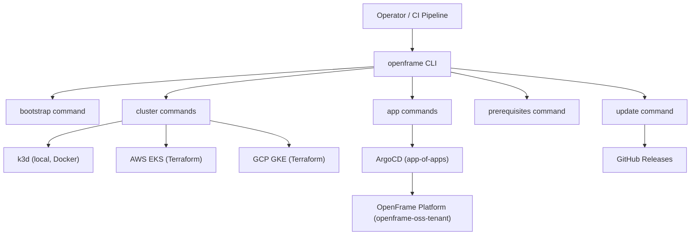

<div align="center">
  <picture>
    <source media="(prefers-color-scheme: dark)" srcset="https://shdrojejslhgnojzkzak.supabase.co/storage/v1/object/public/public/doc-orchestrator/logos/1771371901777-lc3cse-logo-openframe-full-dark-bg.png">
    <source media="(prefers-color-scheme: light)" srcset="https://shdrojejslhgnojzkzak.supabase.co/storage/v1/object/public/public/doc-orchestrator/logos/1771372526604-k3y1w-logo-openframe-full-light-bg.png">
    
  </picture>
</div>

<p align="center">
  <a href="LICENSE.md"></a>
</p>

# OpenFrame CLI

**OpenFrame CLI** (`openframe`) is a Go-based command-line tool for provisioning Kubernetes clusters — locally with [k3d](https://k3d.io/) or in the cloud with AWS EKS / GCP GKE via Terraform — and deploying the [OpenFrame](https://openframe.ai) platform onto them using ArgoCD's app-of-apps pattern.

It is the operator-facing entry point into the broader OpenFrame ecosystem. The platform it deploys is maintained in the main repository, [flamingo-stack/openframe-oss-tenant](https://github.com/flamingo-stack/openframe-oss-tenant); OpenFrame CLI itself lives here in [flamingo-stack/openframe-cli](https://github.com/flamingo-stack/openframe-cli) and is published as the Go module `github.com/flamingo-stack/openframe-cli`.

OpenFrame is part of [Flamingo](https://flamingo.run), an AI-powered MSP platform that replaces expensive proprietary tooling with open-source alternatives enhanced by intelligent automation (Mingo AI for technicians, Fae for clients). OpenFrame unifies multiple MSP tools into a single AI-driven interface, and OpenFrame CLI is how you stand up and operate that platform on your own infrastructure.

## Features

- **One-command bootstrap** — `openframe bootstrap` creates a cluster and installs the full platform in a single step.
- **Multiple cluster backends** — local `k3d` (Docker-based, for development) or cloud `EKS`/`GKE` (Terraform-based, for production), behind a unified `Provider` interface.
- **Full lifecycle management** — create, list, check status, switch context (`use`), clean up images, and delete clusters.
- **Platform lifecycle** — install, upgrade, check readiness (including a live TUI), retrieve ArgoCD access credentials, and uninstall the OpenFrame platform without touching the underlying cluster.
- **Interactive and scriptable** — fully interactive wizards for humans (`huh`-based prompts, `pterm` rendering) and non-interactive flags/`--plain`/`-o json|yaml` output for CI/CD automation.
- **Secure by design** — checksum-verified, pinned downloads for external tools (k3d, Helm, Terraform, mkcert, infracost) instead of unverified `curl | bash`; self-updates are signed and verified via Sigstore/cosign against a pinned GitHub Actions release identity.
- **Windows support via WSL2** — the CLI transparently forwards execution into WSL2 on Windows, since Docker/k3d and Kubernetes client networking need to run in a Linux environment.

## Architecture

OpenFrame CLI is organized as a Cobra command tree (`cmd/`) backed by domain packages under `internal/`. Each command group (`bootstrap`, `cluster`, `app`, `prerequisites`, `update`) is a thin adapter that wires flags to a corresponding internal service, keeping business logic out of the CLI layer.


```mermaid
graph TB
    User["Operator / CI Pipeline"] --> CLI["openframe CLI"]
    CLI --> Bootstrap["bootstrap command"]
    CLI --> Cluster["cluster commands"]
    CLI --> App["app commands"]
    CLI --> Prereq["prerequisites command"]
    CLI --> Update["update command"]

    Cluster --> K3d["k3d (local, Docker)"]
    Cluster --> EKS["AWS EKS (Terraform)"]
    Cluster --> GKE["GCP GKE (Terraform)"]

    App --> ArgoCD["ArgoCD (app-of-apps)"]
    ArgoCD --> Platform["OpenFrame Platform (openframe-oss-tenant)"]

    Update --> GitHubReleases["GitHub Releases"]
```

## Technology Stack

- **Go 1.26+** — core language, module `github.com/flamingo-stack/openframe-cli`
- **[Cobra](https://github.com/spf13/cobra)** — CLI command framework
- **[pterm](https://github.com/pterm/pterm)** / **[charmbracelet/huh](https://github.com/charmbracelet/huh)** / **[charmbracelet/bubbletea](https://github.com/charmbracelet/bubbletea)** — terminal rendering, interactive prompts, and the `app status --interactive` TUI
- **`k8s.io/client-go`** / **`k8s.io/apimachinery`** — native Kubernetes cluster access (health checks, `rest.Config` resolution)
- **Pinned external CLIs** (downloaded and checksum-verified): `k3d`, `helm`, `terraform`, `mkcert`, `infracost`
- **Cloud provider CLIs**: `gcloud` (+ `gke-gcloud-auth-plugin`) and the AWS CLI
- **`sigstore/sigstore-go`** — cosign signature verification for self-update, pinned to this repository's GitHub Actions OIDC release identity

## Quick Start

### 1. Install OpenFrame CLI

**Windows (amd64):**

Download [openframe-cli_windows_amd64.zip](https://github.com/flamingo-stack/openframe-cli/releases/latest/download/openframe-cli_windows_amd64.zip), extract it, and run the `openframe` executable the same way you would on any other OS. Because Docker/k3d and Kubernetes networking need to run in a Linux environment, OpenFrame CLI automatically forwards its execution into WSL2 on Windows — make sure WSL2 with an Ubuntu distro is installed and available.

**macOS / Linux:**

Grab the appropriate archive for your OS/architecture from the [releases page](https://github.com/flamingo-stack/openframe-cli/releases), extract it, and place the `openframe` binary somewhere on your `$PATH` (for example `/usr/local/bin`).

**Build from source (all platforms):**

```bash
git clone https://github.com/flamingo-stack/openframe-cli.git
cd openframe-cli
go build -o openframe .
./openframe --version
```

### 2. Check Prerequisites

```bash
openframe prerequisites check
openframe prerequisites install
```

### 3. Bootstrap a Cluster + Platform

```bash
openframe bootstrap my-cluster
```

This creates a local `k3d` cluster and installs ArgoCD + the app-of-apps in one step. For CI/automation:

```bash
openframe bootstrap my-cluster --non-interactive
```

### 4. Check Platform Status & Get Access

```bash
openframe app status
openframe app access
```

## Hardware Requirements

| Resource | Minimum | Recommended |
|---|---|---|
| RAM | 24 GB | 32 GB |
| CPU Cores | 6 | 12 |
| Disk Space | 50 GB | 100 GB |

These figures reflect running the full OpenFrame platform (ArgoCD + app-of-apps + all platform services) on a local `k3d` cluster.

## Documentation

📚 See the [Documentation](./docs/README.md) for comprehensive guides, including Getting Started tutorials, development workflows, and architecture reference.

## Community

This project does not use GitHub Issues or Discussions. All questions, feature ideas, and discussions happen in the [OpenMSP Slack community](https://www.openmsp.ai/) ([invite link](https://join.slack.com/t/openmsp/shared_invite/zt-36bl7mx0h-3~U2nFH6nqHqoTPXMaHEHA)).

---
<div align="center">
  Built with 💛 by the <a href="https://www.flamingo.run/about"><b>Flamingo</b></a> team
</div>
