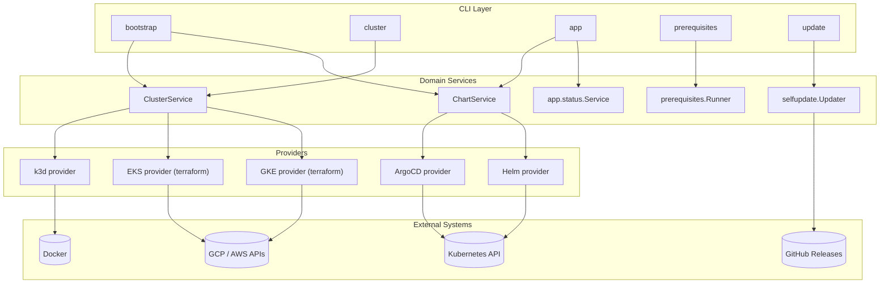

<div align="center">
  <picture>
    <source media="(prefers-color-scheme: dark)" srcset="https://shdrojejslhgnojzkzak.supabase.co/storage/v1/object/public/public/doc-orchestrator/logos/1771371901777-lc3cse-logo-openframe-full-dark-bg.png">
    <source media="(prefers-color-scheme: light)" srcset="https://shdrojejslhgnojzkzak.supabase.co/storage/v1/object/public/public/doc-orchestrator/logos/1771372526604-k3y1w-logo-openframe-full-light-bg.png">
    
  </picture>
</div>

<p align="center">
  <a href="LICENSE.md"></a>
</p>

# OpenFrame CLI

**OpenFrame CLI** (`openframe`) is a modern, interactive command-line tool for provisioning Kubernetes clusters — locally via [k3d](https://k3d.io) or in the cloud via GKE/EKS (using Terraform) — and deploying the [OpenFrame](https://openframe.ai) platform onto them using ArgoCD's app-of-apps pattern.

It is the primary bootstrap and lifecycle-management tool for [OpenFrame](https://www.flamingo.run/openframe), the unified, AI-driven MSP platform built by [Flamingo](https://flamingo.run). OpenFrame CLI manages the full lifecycle of an OpenFrame deployment: checking prerequisites, provisioning a cluster, installing the platform, monitoring status, upgrading, and tearing down — with both fully interactive wizards and non-interactive flags for CI/automation.

> **Note:** OpenFrame CLI is one component of the broader OpenFrame ecosystem. The main platform code lives in a separate repository, [`flamingo-stack/openframe-oss-tenant`](https://github.com/flamingo-stack/openframe-oss-tenant), which this CLI deploys and manages.

## Features

- **One-command bootstrap** — `openframe bootstrap` creates a local k3d cluster and installs the entire OpenFrame platform (ArgoCD + app-of-apps) in a single step.
- **Multi-provider cluster support** — Provision clusters locally with k3d (Docker-based, Kubernetes-in-Docker) or in the cloud with GKE (Google) and EKS (AWS), all through Terraform under the hood.
- **Platform lifecycle management** — Install, upgrade, monitor status, and uninstall the OpenFrame platform via ArgoCD, without touching the underlying cluster.
- **Interactive and CI-friendly** — Every workflow supports an interactive wizard (prompts, spinners, cost estimates) as well as `--non-interactive`/`--skip-wizard` flags for automation pipelines.
- **Built-in prerequisites management** — Detects missing tools (Docker, k3d, Helm, Terraform, gcloud, AWS CLI) and can auto-install them on macOS/Linux.
- **Live status dashboard** — An interactive, k9s-style terminal UI (`openframe app status --interactive`) for inspecting ArgoCD application health and triggering syncs.
- **Secure by default** — All tool binaries are downloaded with pinned versions and SHA256 checksum verification (no `curl | bash`), and CLI self-updates are verified with Sigstore/cosign signatures.
- **Self-updating** — `openframe update` checks for, downloads, verifies, and applies new CLI releases, with rollback support.

## Hardware Requirements

| Resource | Minimum | Recommended |
|---|---|---|
| RAM | 24 GB | 32 GB |
| CPU Cores | 6 | 12 |
| Disk Space | 50 GB | 100 GB |

These figures reflect running a full local OpenFrame platform install (ArgoCD + app-of-apps) inside a k3d cluster on your machine. Cloud cluster deployments (EKS/GKE) shift most resource consumption to the cloud provider, but the CLI host still needs enough local resources to run Docker, Terraform, and Helm operations.

## Quick Start

### Install

**Windows** — download the AMD64 build directly:

```text
https://github.com/flamingo-stack/openframe-cli/releases/latest/download/openframe-cli_windows_amd64.zip
```

Unzip the archive and run the `openframe` executable the same way you would run any other installer/binary on your system.

**macOS / Linux** — download the platform-appropriate archive from the [Releases page](https://github.com/flamingo-stack/openframe-cli/releases/latest), unzip it, and place the `openframe` binary somewhere on your `$PATH` (e.g. `/usr/local/bin`).

If you have a Go toolchain available, you can alternatively install directly from source:

```bash
go install github.com/flamingo-stack/openframe-cli@latest
```

Verify the install:

```bash
openframe --version
```

### Bootstrap your first environment

```bash
# 1. Check that Docker/k3d/helm are ready (auto-installs on macOS/Linux where possible)
openframe prerequisites check

# 2. Bootstrap: creates a local k3d cluster AND installs the OpenFrame platform
openframe bootstrap
```

`openframe bootstrap` runs interactively by default — it validates (or prompts for) a cluster name, creates a local k3d cluster, installs ArgoCD via Helm, installs the app-of-apps chart, waits for all ArgoCD applications to become synced/healthy, and prints a summary card with access instructions.

For CI/automation, run it non-interactively:

```bash
openframe bootstrap --non-interactive
```

Confirm everything is healthy and view ArgoCD access credentials:

```bash
openframe app status
openframe app access
```

## Technology Stack

OpenFrame CLI is a Go service (module `github.com/flamingo-stack/openframe-cli`) built with:

- **[Cobra](https://github.com/spf13/cobra)** — command routing and flag parsing for the entire `cmd/` tree.
- **[client-go](https://github.com/kubernetes/client-go)** — native Kubernetes API access, replacing shelled-out `kubectl` calls.
- **[pterm](https://github.com/pterm/pterm)** — terminal rendering: tables, spinners, boxes, colored status printers.
- **[huh](https://github.com/charmbracelet/huh)** and **[bubbletea](https://github.com/charmbracelet/bubbletea)** — interactive prompts/wizards and the `app status --interactive` TUI.
- **[sigstore-go](https://github.com/sigstore/sigstore-go)** — cosign keyless signature verification for self-update integrity.
- **External CLI tools** invoked via a testable `CommandExecutor` abstraction: Docker, k3d, Helm, Terraform, gcloud, aws — binaries verified and pinned via a checksum-verified download layer (k3d, Helm, mkcert, Terraform, infracost).

## Architecture

OpenFrame CLI is organized around three core abstractions — **cluster** (provisioning), **app** (platform deployment via ArgoCD), and **prerequisites** (tool verification/installation) — plus supporting shared infrastructure for UI, execution, and self-update.


```mermaid
graph TB
    subgraph "CLI Layer"
        Bootstrap[bootstrap]
        Cluster[cluster]
        App[app]
        Prereq[prerequisites]
        Update[update]
    end

    subgraph "Domain Services"
        ClusterSvc["ClusterService"]
        ChartSvc["ChartService"]
        AppStatus["app.status.Service"]
        PrereqFw["prerequisites.Runner"]
        SelfUpdate["selfupdate.Updater"]
    end

    subgraph "Providers"
        K3d["k3d provider"]
        EKS["EKS provider (terraform)"]
        GKE["GKE provider (terraform)"]
        ArgoCD["ArgoCD provider"]
        Helm["Helm provider"]
    end

    subgraph "External Systems"
        Docker[(Docker)]
        K8sAPI[(Kubernetes API)]
        CloudAPI[(GCP / AWS APIs)]
        GitHub[(GitHub Releases)]
    end

    Bootstrap --> ClusterSvc
    Bootstrap --> ChartSvc
    Cluster --> ClusterSvc
    App --> ChartSvc
    App --> AppStatus
    Prereq --> PrereqFw
    Update --> SelfUpdate

    ClusterSvc --> K3d
    ClusterSvc --> EKS
    ClusterSvc --> GKE
    ChartSvc --> ArgoCD
    ChartSvc --> Helm

    K3d --> Docker
    EKS --> CloudAPI
    GKE --> CloudAPI
    ArgoCD --> K8sAPI
    Helm --> K8sAPI
    SelfUpdate --> GitHub
```

The CLI deploys the [OpenFrame](https://openframe.ai) platform, whose main code lives in the separate [`flamingo-stack/openframe-oss-tenant`](https://github.com/flamingo-stack/openframe-oss-tenant) repository.

## Documentation

📚 See the [Documentation](./docs/README.md) for comprehensive guides, including getting-started tutorials, development workflows, and architecture reference.

## Community

There are no GitHub Issues or Discussions for this project — all discussions happen in the **OpenMSP Slack community**:

- Join: [https://join.slack.com/t/openmsp/shared_invite/zt-36bl7mx0h-3~U2nFH6nqHqoTPXMaHEHA](https://join.slack.com/t/openmsp/shared_invite/zt-36bl7mx0h-3~U2nFH6nqHqoTPXMaHEHA)
- Visit: [https://www.openmsp.ai/](https://www.openmsp.ai/)

---
<div align="center">
  Built with 💛 by the <a href="https://www.flamingo.run/about"><b>Flamingo</b></a> team
</div>
