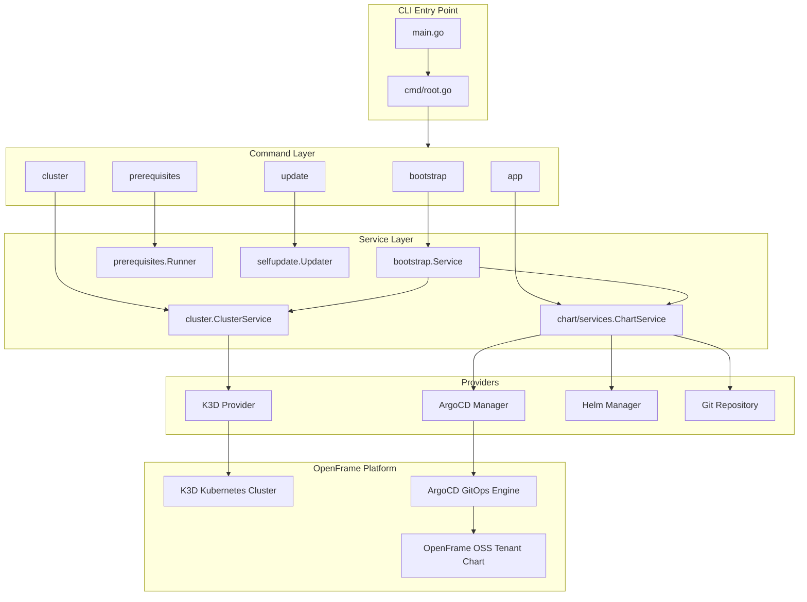

<div align="center">
  <picture>
    <source media="(prefers-color-scheme: dark)" srcset="https://shdrojejslhgnojzkzak.supabase.co/storage/v1/object/public/public/doc-orchestrator/logos/1771371901777-lc3cse-logo-openframe-full-dark-bg.png">
    <source media="(prefers-color-scheme: light)" srcset="https://shdrojejslhgnojzkzak.supabase.co/storage/v1/object/public/public/doc-orchestrator/logos/1771372526604-k3y1w-logo-openframe-full-light-bg.png">
    
  </picture>
</div>

<p align="center">
  <a href="LICENSE.md"></a>
  <a href="https://github.com/flamingo-stack/openframe-cli/releases"></a>
  <a href="https://www.openmsp.ai/"></a>
</p>

# OpenFrame CLI

**OpenFrame CLI** is a modern, interactive command-line tool written in Go that bootstraps and manages [OpenFrame](https://openframe.ai) Kubernetes environments. With a single `openframe` binary, you can provision local K3D clusters, install the full OpenFrame platform stack via ArgoCD GitOps, and manage the entire lifecycle of your deployment — through both guided interactive wizards and fully scriptable non-interactive modes.

> **OpenFrame** is the unified platform from [Flamingo](https://flamingo.run) that integrates multiple MSP tools into a single AI-driven interface, automating IT support operations across the stack.

---

## ✨ Features

| Feature | Description |
|---|---|
| **One-command bootstrap** | `openframe bootstrap` provisions a cluster and deploys the full platform in one step |
| **Interactive wizards** | Step-by-step guided prompts for new users — no YAML editing required |
| **Non-interactive / CI mode** | `--non-interactive` flag makes every command scriptable for pipelines |
| **ArgoCD GitOps integration** | Platform deployment is fully GitOps-driven using the `openframe-oss-tenant` chart |
| **Auto-prerequisite management** | Detects and installs Docker, k3d, and Helm automatically on macOS/Linux |
| **Cosign signature verification** | All self-updates are cryptographically verified against the official release workflow |
| **WSL2 support on Windows** | Transparently re-executes inside WSL2 — no manual Linux setup needed |
| **Secret redaction** | Credentials and tokens are automatically scrubbed from all debug output |
| **Machine-readable output** | `--output json/yaml` for clean scripted consumption |

---

## 🏗️ Architecture


```mermaid
graph TB
    subgraph CLI["CLI Entry Point"]
        main["main.go"]
        root["cmd/root.go"]
    end

    subgraph Commands["Command Layer"]
        bootstrap["bootstrap"]
        cluster_cmd["cluster"]
        app_cmd["app"]
        prereq_cmd["prerequisites"]
        update_cmd["update"]
    end

    subgraph Services["Service Layer"]
        bsvc["bootstrap.Service"]
        csvc["cluster.ClusterService"]
        chsvc["chart/services.ChartService"]
        prefw["prerequisites.Runner"]
        supdater["selfupdate.Updater"]
    end

    subgraph Providers["Providers"]
        k3dp["K3D Provider"]
        argop["ArgoCD Manager"]
        helmp["Helm Manager"]
        gitp["Git Repository"]
    end

    subgraph Platform["OpenFrame Platform"]
        k3d["K3D Kubernetes Cluster"]
        argocd["ArgoCD GitOps Engine"]
        openframe["OpenFrame OSS Tenant Chart"]
    end

    main --> root
    root --> Commands
    bootstrap --> bsvc
    cluster_cmd --> csvc
    app_cmd --> chsvc
    prereq_cmd --> prefw
    update_cmd --> supdater

    bsvc --> csvc
    bsvc --> chsvc
    csvc --> k3dp
    chsvc --> argop
    chsvc --> helmp
    chsvc --> gitp

    k3dp --> k3d
    argop --> argocd
    argocd --> openframe
```

---

## 🚀 Quick Start

### System Requirements

| Resource | Minimum | Recommended |
|---|---|---|
| **RAM** | 24 GB | 32 GB |
| **CPU Cores** | 6 cores | 12 cores |
| **Disk Space** | 50 GB free | 100 GB free |

### Step 1: Download the CLI

**macOS (Apple Silicon)**

```bash
curl -L https://github.com/flamingo-stack/openframe-cli/releases/latest/download/openframe-cli_darwin_arm64.tar.gz | tar xz
sudo mv openframe /usr/local/bin/
```

**macOS (Intel)**

```bash
curl -L https://github.com/flamingo-stack/openframe-cli/releases/latest/download/openframe-cli_darwin_amd64.tar.gz | tar xz
sudo mv openframe /usr/local/bin/
```

**Linux (amd64)**

```bash
curl -L https://github.com/flamingo-stack/openframe-cli/releases/latest/download/openframe-cli_linux_amd64.tar.gz | tar xz
sudo mv openframe /usr/local/bin/
```

**Windows (amd64)**

Download: https://github.com/flamingo-stack/openframe-cli/releases/latest/download/openframe-cli_windows_amd64.zip

Extract and run the `openframe.exe` — it automatically forwards commands into WSL2.

Browse all releases: [https://github.com/flamingo-stack/openframe-cli/releases](https://github.com/flamingo-stack/openframe-cli/releases)

### Step 2: Check Prerequisites

```bash
openframe prerequisites check
```

Install any missing tools automatically (macOS/Linux):

```bash
openframe prerequisites install
```

### Step 3: Bootstrap OpenFrame

```bash
openframe bootstrap
```

The interactive wizard guides you through cluster naming, configuration, and version selection. For CI/CD environments:

```bash
openframe bootstrap --non-interactive
```

---

## 🛠️ Command Reference

### `openframe bootstrap`

Creates a K3D cluster and installs the full OpenFrame platform in a single step.

```bash
openframe bootstrap                    # Interactive wizard
openframe bootstrap my-cluster        # Named cluster
openframe bootstrap --non-interactive  # CI/CD mode
openframe bootstrap --verbose          # Show detailed ArgoCD sync progress
```

### `openframe cluster`

```bash
openframe cluster create              # Create a new K3D cluster
openframe cluster list                # List all managed clusters
openframe cluster status              # Show detailed cluster status
openframe cluster delete my-cluster   # Delete a cluster
openframe cluster cleanup             # Remove unused resources
```

### `openframe app`

```bash
openframe app install                 # Install ArgoCD + OpenFrame platform
openframe app upgrade --ref v1.4.0   # Change to a new release tag
openframe app status                  # Show platform readiness
openframe app access                  # Print ArgoCD credentials and URLs
openframe app uninstall               # Remove app (keep cluster)
```

### `openframe update`

```bash
openframe update                      # Update to latest release
openframe update check                # Check for available updates
openframe update rollback             # Revert to previous version
```

---

## 🔧 Technology Stack

| Technology | Role |
|---|---|
| **Go** | Primary language |
| **Cobra** | CLI framework (command/flag parsing) |
| **K3D** | Local Kubernetes cluster provider |
| **ArgoCD** | GitOps deployment engine (via client-go dynamic client) |
| **Helm** | Kubernetes package manager (CLI wrapper) |
| **go-git** | Git operations (no `git` binary dependency) |
| **client-go** | Kubernetes API client |
| **pterm** | Terminal UI rendering (spinners, prompts, colors) |
| **Sigstore/cosign** | Binary signature verification for self-updates |

---

## 📦 External Platform Repository

The OpenFrame platform configuration (Helm charts, values) lives in a separate repository:

- **Repository:** [flamingo-stack/openframe-oss-tenant](https://github.com/flamingo-stack/openframe-oss-tenant)
- **Documentation:** [https://github.com/flamingo-stack/openframe-oss-tenant/tree/main/docs](https://github.com/flamingo-stack/openframe-oss-tenant/tree/main/docs)

---

## 📚 Documentation

See the [Documentation Index](./docs/README.md) for comprehensive guides:

- [Introduction](./docs/getting-started/introduction.md) — What is OpenFrame CLI?
- [Prerequisites](./docs/getting-started/prerequisites.md) — Environment setup
- [Quick Start](./docs/getting-started/quick-start.md) — 5-minute setup guide
- [First Steps](./docs/getting-started/first-steps.md) — Post-install exploration
- [Architecture Reference](./docs/reference/architecture/overview.md) — Full technical reference

---

## 💬 Community & Support

All discussions, support, and feature requests happen in the **OpenMSP Slack community** — there are no GitHub Issues or Discussions for this project.

- **Join Slack:** [https://www.openmsp.ai/](https://www.openmsp.ai/)
- **Invite link:** [https://join.slack.com/t/openmsp/shared_invite/zt-36bl7mx0h-3~U2nFH6nqHqoTPXMaHEHA](https://join.slack.com/t/openmsp/shared_invite/zt-36bl7mx0h-3~U2nFH6nqHqoTPXMaHEHA)

---

## 🤝 Contributing

See [CONTRIBUTING.md](./CONTRIBUTING.md) for guidelines on code style, branch naming, commit messages, and the PR process.

---

<div align="center">
  Built with 💛 by the <a href="https://www.flamingo.run/about"><b>Flamingo</b></a> team
</div>
