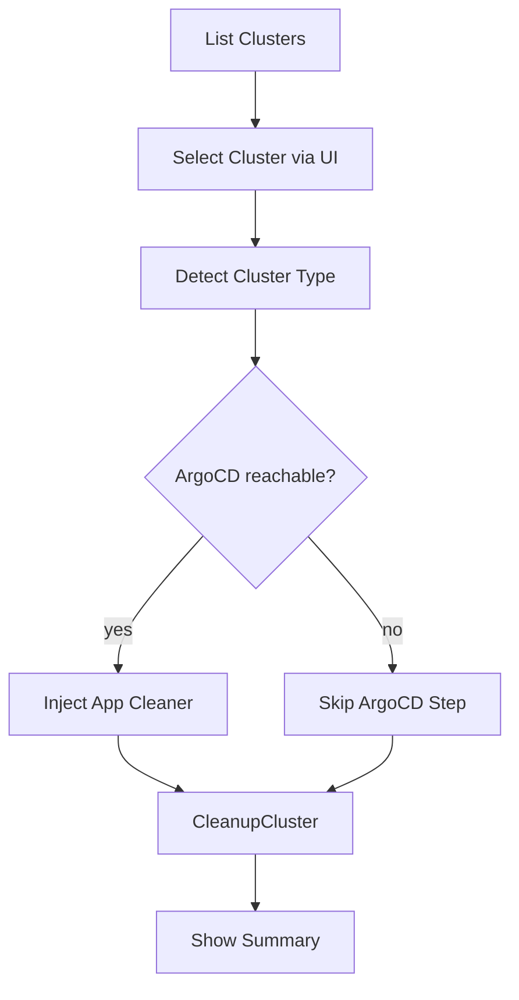

<!-- source-hash: 3059dcdf86d8c4442ad70eab5a006a22 -->
Handles the `cluster cleanup` subcommand, removing unused Docker images and resources from cluster nodes to free disk space.

## Key Components

- **`getCleanupCmd()`** — Builds and returns the `cobra.Command` for `openframe cluster cleanup [NAME]`, wiring up flag validation, aliases (`c`), and the run handler.
- **`runCleanupCluster()`** — Core execution function that orchestrates cluster selection, ArgoCD application cleanup injection, and cleanup execution via the service layer.

## Usage Example

```bash
# Clean up the default/only cluster interactively
openframe cluster cleanup

# Target a specific cluster by name
openframe cluster cleanup my-cluster

# Skip confirmation prompt
openframe cluster cleanup my-cluster --force
```

## ArgoCD Integration

Before executing cleanup, the function attempts to inject an ArgoCD-backed application cleaner at the composition root. This handles `Application` deletion and finalizer stripping, preventing namespaces from getting stuck in `Terminating`. If the cluster is unreachable or ArgoCD is not present, cleanup continues without it (best-effort). Pass `--verbose` to surface ArgoCD availability warnings.

## Flow

