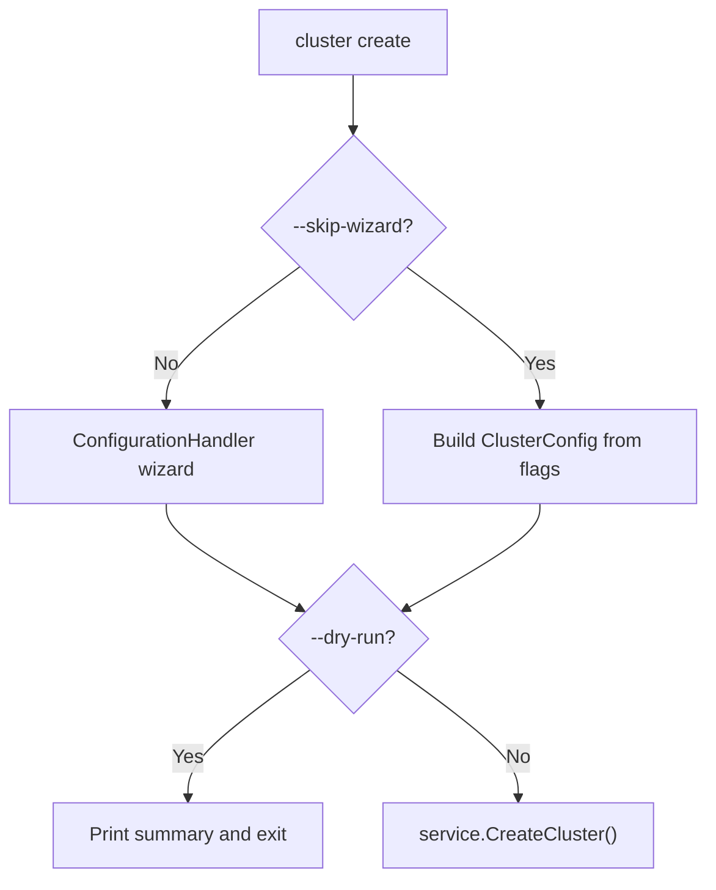

<!-- source-hash: 67ddb7685dde2f2bd20881a34ba037d1 -->
Handles the `create` subcommand for provisioning new Kubernetes clusters, supporting both an interactive configuration wizard and a direct non-interactive mode via flags.

## Key Components

| Symbol | Type | Description |
|--------|------|-------------|
| `getCreateCmd()` | `func` | Builds and returns the `cobra.Command` for `cluster create`, wiring flags and pre-run validation |
| `runCreateCluster()` | `func` | Core handler — branches between interactive wizard flow and flag-driven config, then delegates to the service layer |

## Usage Example

```bash
# Show creation mode selection (interactive)
openframe cluster create

# Pass a custom cluster name into the wizard
openframe cluster create my-cluster

# Skip wizard — create immediately with defaults
openframe cluster create --skip-wizard

# Skip wizard with explicit overrides
openframe cluster create --nodes 3 --type k3d --skip-wizard

# Dry-run to preview config without creating
openframe cluster create --skip-wizard --dry-run
```

## Flow Summary



**Non-interactive defaults:** cluster type `k3d`, node count `3`, name `openframe-dev`. If a cluster with the same name already exists it is reused without modification — run `cluster delete` first to start fresh. Use the `bootstrap` command after creation to install OpenFrame components.