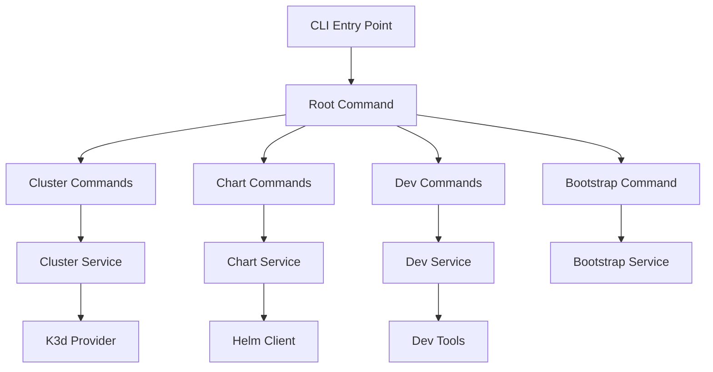

# OpenFrame CLI Documentation

Welcome to the comprehensive documentation for OpenFrame CLI - a modern command-line tool for managing OpenFrame Kubernetes clusters and development workflows.

## 📚 Table of Contents

### Getting Started
Start here if you're new to OpenFrame CLI:

- [Introduction](./getting-started/introduction.md) - What is OpenFrame CLI and why use it?
- [Prerequisites](./getting-started/prerequisites.md) - Required tools and dependencies
- [Quick Start](./getting-started/quick-start.md) - Get up and running in 5 minutes
- [First Steps](./getting-started/first-steps.md) - Essential commands and workflows

### Development
For contributors and developers working with OpenFrame CLI:

- [Development Overview](./development/README.md) - Development section index and overview
- [Environment Setup](./development/setup/environment.md) - Set up your development environment
- [Local Development](./development/setup/local-development.md) - Run and test OpenFrame CLI locally
- [Architecture Overview](./development/architecture/overview.md) - System architecture and design
- [Testing Guide](./development/testing/overview.md) - Testing strategies and practices
- [Contributing Guidelines](./development/contributing/guidelines.md) - How to contribute to the project

### Reference
Technical reference and architecture documentation:

- [Architecture Overview](./reference/architecture/overview.md) - Detailed technical architecture
- [Command Reference](./reference/commands/) - Complete CLI command documentation
- [API Reference](./reference/api/) - Internal API and service documentation

### Diagrams
Visual documentation and system diagrams:

- [Architecture Diagrams](./diagrams/architecture/) - Mermaid diagrams showing system architecture
- [Flow Diagrams](./diagrams/flows/) - Process and workflow diagrams
- [Component Diagrams](./diagrams/components/) - Component interaction diagrams

## 🚀 Quick Navigation

### Common Tasks

| Task | Documentation |
|------|---------------|
| **Install OpenFrame CLI** | [Prerequisites](./getting-started/prerequisites.md) → [Quick Start](./getting-started/quick-start.md) |
| **Create your first cluster** | [Quick Start](./getting-started/quick-start.md) → [First Steps](./getting-started/first-steps.md) |
| **Set up development environment** | [Environment Setup](./development/setup/environment.md) |
| **Understand the architecture** | [Architecture Overview](./reference/architecture/overview.md) |
| **Contribute to the project** | [Contributing Guidelines](./development/contributing/guidelines.md) |

### Command Groups

| Command Group | Purpose | Documentation |
|---------------|---------|---------------|
| `openframe bootstrap` | Complete OpenFrame setup | [Quick Start](./getting-started/quick-start.md) |
| `openframe cluster` | Cluster lifecycle management | [First Steps](./getting-started/first-steps.md) |
| `openframe chart` | Helm chart and ArgoCD management | [Architecture Overview](./reference/architecture/overview.md) |
| `openframe dev` | Development tools integration | [Local Development](./development/setup/local-development.md) |

## 🛠 Key Features

OpenFrame CLI provides these core capabilities:

- **🎯 Interactive Cluster Creation** - Guided wizard for K3d clusters
- **⚡ Complete Lifecycle Management** - Create, manage, and cleanup clusters
- **📦 Chart Management** - Seamless Helm and ArgoCD integration
- **🚀 Development Tools** - Built-in Skaffold and Telepresence support
- **🔧 Smart Configuration** - Automatic tool detection and validation
- **💻 Cross-Platform** - Support for macOS, Linux, and Windows

## 📋 Prerequisites Overview

Before getting started, you'll need:

| Tool | Purpose | Installation |
|------|---------|--------------|
| **Docker** | Container runtime for K3d | [Docker Installation](https://docs.docker.com/get-docker/) |
| **Go 1.21+** | For building from source | [Go Installation](https://golang.org/doc/install) |
| **Git** | Source code management | [Git Installation](https://git-scm.com/downloads) |

Optional development tools:
- **K3d** - Managed automatically by OpenFrame CLI
- **kubectl** - Installed with Docker Desktop or separately
- **Helm** - Package manager for Kubernetes

See [Prerequisites](./getting-started/prerequisites.md) for detailed setup instructions.

## 🏗 Architecture Overview

OpenFrame CLI follows a layered architecture:

For detailed architecture information, see [Architecture Overview](./reference/architecture/overview.md).

## 🧪 Development & Testing

### Development Workflow

1. **Setup** - [Environment Setup](./development/setup/environment.md)
2. **Development** - [Local Development](./development/setup/local-development.md)
3. **Testing** - [Testing Guide](./development/testing/overview.md)
4. **Contributing** - [Contributing Guidelines](./development/contributing/guidelines.md)

### Testing Strategy

- **Unit Tests** - Test individual components
- **Integration Tests** - Test component interactions
- **End-to-End Tests** - Test complete workflows
- **Manual Testing** - Interactive CLI testing

## 📖 Additional Resources

### External Documentation
- [K3d Documentation](https://k3d.io/) - Lightweight Kubernetes distribution
- [Helm Documentation](https://helm.sh/docs/) - Kubernetes package manager
- [ArgoCD Documentation](https://argo-cd.readthedocs.io/) - GitOps continuous delivery
- [Telepresence Documentation](https://www.telepresence.io/) - Local development tool
- [Skaffold Documentation](https://skaffold.dev/) - Kubernetes development workflow

### Project Resources
- [Project README](../README.md) - Main project overview and quick start
- [Contributing Guide](../CONTRIBUTING.md) - Detailed contribution guidelines
- [License](../LICENSE.md) - Project license information
- [Changelog](../CHANGELOG.md) - Release notes and version history

### Community
- [GitHub Issues](https://github.com/flamingo-stack/openframe-cli/issues) - Bug reports and feature requests
- [GitHub Discussions](https://github.com/flamingo-stack/openframe-cli/discussions) - Community questions and ideas
- [Discord Community](https://discord.gg/flamingo) - Real-time community chat

## 🚀 Getting Started

Ready to start using OpenFrame CLI? Begin with our getting started guides:

1. **[Introduction](./getting-started/introduction.md)** - Understand what OpenFrame CLI does
2. **[Prerequisites](./getting-started/prerequisites.md)** - Install required dependencies  
3. **[Quick Start](./getting-started/quick-start.md)** - Create your first cluster
4. **[First Steps](./getting-started/first-steps.md)** - Learn essential workflows

For developers interested in contributing:

1. **[Development Overview](./development/README.md)** - Understand the development process
2. **[Environment Setup](./development/setup/environment.md)** - Set up your dev environment
3. **[Contributing Guidelines](./development/contributing/guidelines.md)** - Learn how to contribute

---

*Documentation generated by [OpenFrame Doc Orchestrator](https://github.com/flamingo-stack/openframe-oss-tenant)*

For questions or improvements to this documentation, please [open an issue](https://github.com/flamingo-stack/openframe-cli/issues) or contribute via [pull request](../CONTRIBUTING.md).