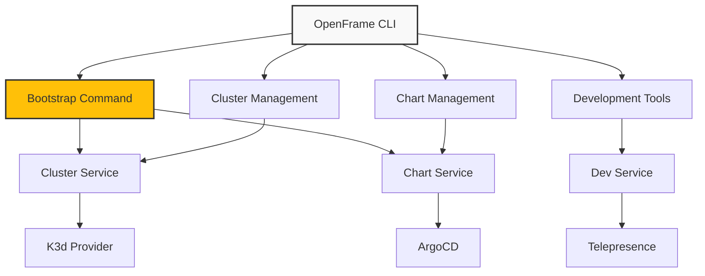

# OpenFrame CLI Documentation

Welcome to the comprehensive documentation for OpenFrame CLI - a powerful command-line interface for managing Kubernetes clusters and OpenFrame environments.

## 📚 Table of Contents

### Getting Started
Start here if you're new to OpenFrame CLI:
- [Introduction](./getting-started/introduction.md) - What is OpenFrame CLI and why use it?
- [Prerequisites](./getting-started/prerequisites.md) - System requirements and dependencies
- [Quick Start](./getting-started/quick-start.md) - Get running in 5 minutes
- [First Steps](./getting-started/first-steps.md) - Essential post-installation tasks

### Development
For contributors and developers:
- [Development Overview](./development/README.md) - Development section index
- [Environment Setup](./development/setup/environment.md) - Set up your development environment
- [Local Development](./development/setup/local-development.md) - Run and test locally
- [Architecture](./development/architecture/overview.md) - Technical architecture details
- [Testing](./development/testing/overview.md) - Testing strategies and guidelines
- [Contributing](./development/contributing/guidelines.md) - How to contribute to the project

### Reference
Technical reference documentation:
- [Architecture Overview](./reference/architecture/overview.md) - Comprehensive technical architecture

### Diagrams
Visual documentation and system diagrams:
- [Architecture Diagrams](./diagrams/architecture/) - Mermaid diagrams showing system architecture

## 🚀 Quick Navigation

### I want to...

**🏃 Get started quickly**
→ [Quick Start Guide](./getting-started/quick-start.md)

**📖 Understand what OpenFrame CLI is**
→ [Introduction](./getting-started/introduction.md)

**🔧 Set up my development environment**
→ [Environment Setup](./development/setup/environment.md)

**🏗️ Learn the architecture**
→ [Architecture Overview](./development/architecture/overview.md)

**🤝 Contribute to the project**
→ [Contributing Guidelines](./development/contributing/guidelines.md)

**🐛 Report a bug or request a feature**
→ [GitHub Issues](https://github.com/flamingo-stack/openframe-cli/issues)

## 🎯 Key Features

OpenFrame CLI provides:

- **One-Command Bootstrap** - Complete environment setup with `openframe bootstrap`
- **Cluster Lifecycle Management** - Full K3d cluster automation for local development
- **ArgoCD Integration** - GitOps-ready deployments with app-of-apps pattern
- **Development Tools** - Traffic interception and hot reloading capabilities
- **Interactive UI** - Guided setup with smart defaults and intuitive prompts
- **Multiple Deployment Modes** - OSS-tenant, SaaS-tenant, and SaaS-shared configurations

## 🏗️ Architecture at a Glance

## 📋 Prerequisites

Before using OpenFrame CLI, ensure you have:

- **Docker** - Container runtime for K3d clusters
- **Git** - Version control for ArgoCD and chart management
- **Internet Connection** - For downloading charts and container images

OpenFrame CLI automatically validates and guides installation of:
- K3d (local Kubernetes clusters)
- kubectl (cluster interaction)
- Helm (chart management)
- ArgoCD CLI (GitOps operations)

## 🛠️ Command Overview

| Command | Purpose | Key Features |
|---------|---------|--------------|
| `openframe bootstrap` | Complete OpenFrame setup | Cluster creation + chart installation |
| `openframe cluster create` | Create Kubernetes cluster | Interactive configuration, multiple providers |
| `openframe cluster list` | Show all clusters | Status information, formatted output |
| `openframe cluster status` | Detailed cluster info | Health checks, resource usage |
| `openframe chart install` | Install ArgoCD charts | Deployment mode selection |
| `openframe dev intercept` | Traffic interception | Local development workflows |

## 📖 Learning Path

**For New Users:**
1. [Introduction](./getting-started/introduction.md) - Understand OpenFrame CLI
2. [Prerequisites](./getting-started/prerequisites.md) - Check system requirements
3. [Quick Start](./getting-started/quick-start.md) - 5-minute setup
4. [First Steps](./getting-started/first-steps.md) - Post-installation tasks

**For Developers:**
1. [Development Setup](./development/setup/environment.md) - Configure dev environment
2. [Architecture Overview](./development/architecture/overview.md) - Understand the system
3. [Local Development](./development/setup/local-development.md) - Development workflow
4. [Contributing](./development/contributing/guidelines.md) - How to contribute

## 📞 Support & Community

- **Documentation**: You're reading it! Browse the sections above
- **Issues**: [Report bugs or request features](https://github.com/flamingo-stack/openframe-cli/issues)
- **Discussions**: [GitHub Discussions](https://github.com/flamingo-stack/openframe-cli/discussions) for questions and ideas
- **Community**: Join our community channels for support and collaboration

## 📖 Quick Links
- [Project README](../README.md) - Main project overview and quick start
- [Contributing Guide](../CONTRIBUTING.md) - How to contribute to the project
- [License](../LICENSE.md) - Flamingo AI Unified License v1.0 details

---

*Documentation maintained by the OpenFrame CLI team. Built with 💛 by [Flamingo](https://www.flamingo.run/about).*