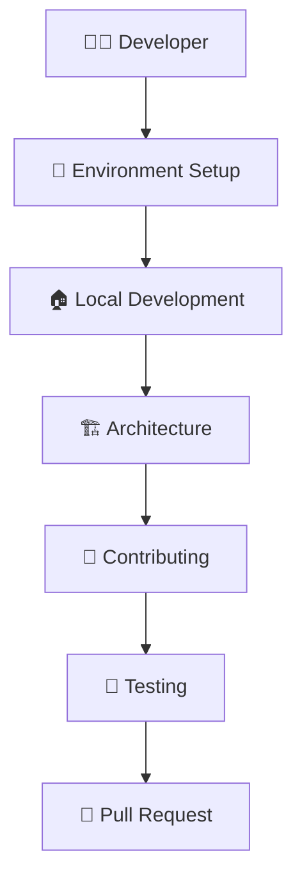

# OpenFrame CLI Documentation

Welcome to the comprehensive documentation for OpenFrame CLI, a modern command-line tool for managing OpenFrame Kubernetes clusters and development workflows.

## 📚 Table of Contents

### Getting Started
Start here if you're new to OpenFrame CLI:
- [Introduction](./getting-started/introduction.md) - What is OpenFrame CLI and why use it?
- [Prerequisites](./getting-started/prerequisites.md) - System requirements and dependencies
- [Quick Start](./getting-started/quick-start.md) - Get running in 5 minutes with bootstrap command
- [First Steps](./getting-started/first-steps.md) - Essential tasks after installation

### Development
For contributors and developers working on OpenFrame CLI:
- [Development Overview](./development/README.md) - Development section index and quick navigation
- [Environment Setup](./development/setup/environment.md) - IDE configuration and development tools
- [Local Development](./development/setup/local-development.md) - Clone, build, and run from source
- [Architecture Overview](./development/architecture/overview.md) - System design and component relationships
- [Testing Overview](./development/testing/overview.md) - Test structure, coverage, and best practices
- [Contributing Guidelines](./development/contributing/guidelines.md) - How to contribute code, docs, and features

### Reference
Technical reference documentation and architecture details:
- [Architecture Overview](./reference/architecture/overview.md) - Comprehensive technical architecture documentation

### Diagrams
Visual documentation and architectural diagrams:
- [Architecture Diagrams](./diagrams/architecture/) - Mermaid diagrams showing system structure and data flow

## 🚀 Quick Navigation

| I want to... | Go to |
|--------------|--------|
| **Install and try OpenFrame CLI** | [Quick Start](./getting-started/quick-start.md) |
| **Understand what OpenFrame CLI does** | [Introduction](./getting-started/introduction.md) |
| **Set up my development environment** | [Environment Setup](./development/setup/environment.md) |
| **Contribute code or features** | [Contributing Guidelines](./development/contributing/guidelines.md) |
| **Understand the system architecture** | [Architecture Overview](./reference/architecture/overview.md) |
| **Run OpenFrame CLI from source** | [Local Development](./development/setup/local-development.md) |
| **Learn about testing** | [Testing Overview](./development/testing/overview.md) |

## 💡 Key Features Covered

This documentation covers all aspects of OpenFrame CLI including:

### Core Functionality
- **Cluster Management**: Creating, managing, and monitoring K3d Kubernetes clusters
- **GitOps Integration**: ArgoCD installation and app-of-apps pattern setup
- **Development Tools**: Telepresence intercepts and Skaffold workflow integration
- **Bootstrap Command**: One-command environment setup for complete development environments

### Developer Experience
- **Interactive Wizards**: Guided cluster creation and configuration
- **Smart Prerequisites**: Automatic tool detection and installation guidance
- **Cross-Platform Support**: Windows, macOS, and Linux compatibility
- **Verbose Debugging**: Detailed output and error diagnostics

### Architecture & Design
- **Modular Design**: Service layer pattern with clean separation of concerns
- **Provider Pattern**: Abstracted integrations with external tools (k3d, kubectl, helm)
- **Shared Components**: Reusable UI, error handling, and execution utilities
- **Command Structure**: Cobra-based hierarchical command organization

## 🎯 Documentation Paths

### New Users
```mermaid
graph TD
    START[👋 New User] --> INTRO[📖 Introduction]
    INTRO --> PREREQ[📋 Prerequisites]
    PREREQ --> QUICK[🚀 Quick Start]
    QUICK --> FIRST[✨ First Steps]
    FIRST --> EXPLORE[🎮 Explore Commands]
    
    click INTRO "./getting-started/introduction.html"
    click PREREQ "./getting-started/prerequisites.html" 
    click QUICK "./getting-started/quick-start.html"
    click FIRST "./getting-started/first-steps.html"
```

### Developers & Contributors


## 📖 Quick Links

### Project Resources
- [Project README](../README.md) - Main project overview and installation
- [Contributing Guide](../CONTRIBUTING.md) - How to contribute to OpenFrame CLI
- [License](../LICENSE.md) - Flamingo AI Unified License v1.0

### External Resources
- [OpenFrame Ecosystem](https://github.com/flamingo-stack/openframe-oss-tenant) - Main OpenFrame repository
- [Kubernetes Documentation](https://kubernetes.io/docs/) - Official Kubernetes docs
- [K3d Documentation](https://k3d.io/) - Lightweight Kubernetes distribution
- [ArgoCD Documentation](https://argo-cd.readthedocs.io/) - GitOps continuous deployment

### Community & Support
- [GitHub Issues](https://github.com/flamingo-stack/openframe-cli/issues) - Bug reports and feature requests
- [GitHub Discussions](https://github.com/flamingo-stack/openframe-cli/discussions) - Community Q&A
- [Flamingo Team](https://www.flamingo.run/about) - About the Flamingo team

## 🔍 What's in Each Section

### Getting Started Documentation
Learn how to install, configure, and use OpenFrame CLI for the first time. Includes system requirements, installation methods, quick start tutorial, and essential first tasks.

**Best for**: New users, evaluation, getting up and running quickly

### Development Documentation  
Comprehensive guides for developers who want to contribute to OpenFrame CLI, understand its architecture, or extend its functionality.

**Best for**: Contributors, maintainers, developers extending functionality

### Reference Documentation
Technical specifications, architecture details, and in-depth system documentation for understanding how OpenFrame CLI works internally.

**Best for**: Advanced users, system architects, troubleshooting complex issues

### Visual Documentation
Mermaid diagrams showing system architecture, data flows, and component relationships for visual learners and architectural understanding.

**Best for**: Understanding system design, onboarding developers, architectural reviews

## ⚡ Quick Commands Reference

### Essential Commands
```bash
# Bootstrap complete environment
openframe bootstrap

# Create cluster
openframe cluster create

# Install GitOps tools
openframe chart install

# Check status
openframe cluster status

# Get help
openframe --help
```

### Development Commands
```bash
# Intercept service traffic
openframe dev intercept my-service --port 8080

# Run Skaffold development
openframe dev scaffold my-cluster

# Verbose debugging
openframe --verbose cluster create
```

## 🆘 Need Help?

### Documentation Issues
- **Missing information?** Open an issue to request additional documentation
- **Found errors?** Submit a PR with corrections
- **Unclear instructions?** Ask in GitHub Discussions

### Getting Support
1. **Check the docs** - Search this documentation first
2. **Review examples** - Look at code examples in getting-started guides  
3. **Search issues** - Check if your question has been asked before
4. **Ask the community** - Use GitHub Discussions for help
5. **Report bugs** - Open GitHub Issues for bugs or feature requests

---

*Documentation generated by [OpenFrame Doc Orchestrator](https://github.com/flamingo-stack/openframe-oss-tenant)*

**Last updated**: Documentation is automatically updated with each release to ensure accuracy and completeness.