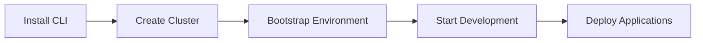
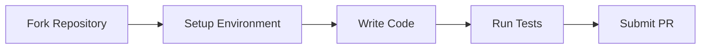

# OpenFrame CLI Documentation

Welcome to the comprehensive documentation for OpenFrame CLI - a modern command-line tool for managing OpenFrame Kubernetes clusters and development workflows.

## 📚 Table of Contents

### Getting Started
Start here if you're new to OpenFrame CLI:

- [Introduction](./getting-started/introduction.md) - What is OpenFrame CLI?
- [Prerequisites](./getting-started/prerequisites.md) - System requirements and dependencies
- [Quick Start](./getting-started/quick-start.md) - Get up and running in 5 minutes
- [First Steps](./getting-started/first-steps.md) - Essential commands and workflows

### Development
For contributors and developers:

- [Development Overview](./development/README.md) - Development section index
- [Environment Setup](./development/setup/environment.md) - Set up your development environment
- [Local Development](./development/setup/local-development.md) - Run and test OpenFrame CLI locally
- [Architecture Overview](./development/architecture/overview.md) - System architecture and design
- [Testing Guide](./development/testing/overview.md) - Testing strategies and best practices
- [Contributing Guidelines](./development/contributing/guidelines.md) - How to contribute to the project

### Reference
Technical reference documentation:

- [Architecture Overview](./reference/architecture/overview.md) - Complete technical architecture documentation
- [CLI Commands](./reference/cli/commands.md) - Detailed command reference
- [Configuration](./reference/configuration/config.md) - Configuration options and formats

### Diagrams
Visual documentation and system diagrams:

- [Architecture Diagrams](./diagrams/architecture/) - Mermaid diagrams showing system architecture
- [Workflow Diagrams](./diagrams/workflows/) - Process flow and user journey diagrams

## 🚀 Quick Navigation

### I want to...

**Use OpenFrame CLI:**
- [Install OpenFrame CLI](./getting-started/quick-start.md#installation)
- [Create my first cluster](./getting-started/quick-start.md#creating-your-first-cluster)
- [Bootstrap an OpenFrame environment](./getting-started/first-steps.md#bootstrap-workflow)

**Develop with OpenFrame CLI:**
- [Set up development tools](./getting-started/first-steps.md#development-workflows)
- [Use Telepresence intercepts](./getting-started/first-steps.md#service-intercepts)
- [Run Skaffold workflows](./getting-started/first-steps.md#continuous-development)

**Contribute to the project:**
- [Set up development environment](./development/setup/environment.md)
- [Understand the architecture](./development/architecture/overview.md)
- [Run tests locally](./development/testing/overview.md)
- [Submit a pull request](./development/contributing/guidelines.md)

**Learn about the system:**
- [Architecture overview](./reference/architecture/overview.md)
- [Component relationships](./reference/architecture/overview.md#component-relationships)
- [Data flow diagrams](./reference/architecture/overview.md#data-flow)

## 📖 Key Concepts

### Core Components

| Component | Purpose | Documentation |
|-----------|---------|---------------|
| **Cluster Management** | K3d cluster lifecycle and operations | [Architecture](./reference/architecture/overview.md#core-components) |
| **Chart Management** | Helm chart installation and ArgoCD deployment | [Getting Started](./getting-started/first-steps.md#chart-management) |
| **Development Tools** | Telepresence and Skaffold integration | [Dev Workflows](./getting-started/first-steps.md#development-workflows) |
| **Bootstrap Service** | End-to-end environment setup | [Quick Start](./getting-started/quick-start.md#bootstrap-automation) |

### Command Groups

| Command Group | Description | Examples |
|---------------|-------------|----------|
| `cluster` | Manage K3d clusters | `create`, `list`, `status`, `delete` |
| `chart` | Install Helm charts and ArgoCD | `install` |
| `dev` | Development workflow tools | `scaffold`, `intercept` |
| `bootstrap` | Complete environment setup | `bootstrap --deployment-mode=oss-tenant` |

## 🛠 Development Workflow

### For Users


### For Contributors


## 📋 Common Tasks

### Cluster Operations
```bash
# Create a new cluster
openframe cluster create my-cluster

# Check cluster status
openframe cluster status my-cluster

# Bootstrap OpenFrame
openframe bootstrap --deployment-mode=oss-tenant
```

### Development Tasks
```bash
# Start development with Skaffold
openframe dev scaffold

# Intercept a service
openframe dev intercept my-service
```

### Troubleshooting
- **Cluster won't start**: Check [Prerequisites](./getting-started/prerequisites.md)
- **Bootstrap fails**: See [Troubleshooting Guide](./getting-started/first-steps.md#troubleshooting)
- **Development issues**: Check [Local Development](./development/setup/local-development.md)

## 📖 Quick Links

- [Project README](../README.md) - Main project information and features
- [Contributing Guide](../CONTRIBUTING.md) - How to contribute to OpenFrame CLI
- [License](../LICENSE.md) - License information
- [Release Notes](https://github.com/flamingo-stack/openframe-cli/releases) - Latest releases and changes

## 🔗 External Resources

- [OpenFrame Tenant Documentation](https://github.com/flamingo-stack/openframe-oss-tenant/tree/main/docs) - Main OpenFrame documentation
- [K3d Documentation](https://k3d.io/) - K3d cluster management
- [Helm Documentation](https://helm.sh/docs/) - Helm package manager
- [ArgoCD Documentation](https://argo-cd.readthedocs.io/) - GitOps deployment tool

---
*Documentation generated by [OpenFrame Doc Orchestrator](https://github.com/flamingo-stack/openframe-oss-tenant)*