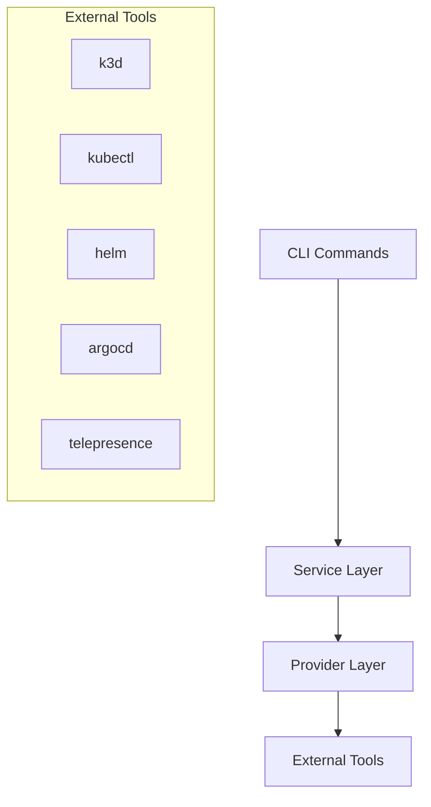

# OpenFrame CLI Documentation

Welcome to the documentation for OpenFrame CLI, a modern command-line tool for managing OpenFrame Kubernetes clusters and development workflows.

## 📚 Table of Contents

### Getting Started
Start here if you're new to OpenFrame CLI:
- [Introduction](./getting-started/introduction.md) - What is OpenFrame CLI and why use it?
- [Prerequisites](./getting-started/prerequisites.md) - Required tools and dependencies
- [Quick Start](./getting-started/quick-start.md) - Get up and running in 5 minutes
- [First Steps](./getting-started/first-steps.md) - Essential commands and workflows

### Development
For contributors and developers:
- [Development Overview](./development/README.md) - Development section index
- [Environment Setup](./development/setup/environment.md) - Set up your development environment
- [Local Development](./development/setup/local-development.md) - Running and testing locally
- [Architecture Overview](./development/architecture/overview.md) - System design and components
- [Testing Guide](./development/testing/overview.md) - Testing strategies and best practices
- [Contributing Guidelines](./development/contributing/guidelines.md) - How to contribute to the project

### Reference
Technical reference documentation:
- [Architecture Overview](./reference/architecture/overview.md) - Detailed technical architecture
- [CLI Commands Reference](./reference/cli-commands.md) - Complete command documentation
- [Configuration Reference](./reference/configuration.md) - Configuration file format and options
- [API Reference](./reference/api.md) - Internal API documentation

### Diagrams
Visual documentation and architecture diagrams:
- [Architecture Diagrams](./diagrams/architecture/README.md) - System architecture visualizations
- [Command Flow Diagrams](./diagrams/flows/README.md) - Command execution flows
- [Component Relationship Diagrams](./diagrams/components/README.md) - Component interactions

## 🚀 Quick Navigation

### Common Tasks
- **New to OpenFrame CLI?** → Start with [Introduction](./getting-started/introduction.md)
- **Ready to install?** → Check [Prerequisites](./getting-started/prerequisites.md) then [Quick Start](./getting-started/quick-start.md)
- **Want to contribute?** → See [Contributing Guidelines](./development/contributing/guidelines.md)
- **Need technical details?** → Visit [Architecture Overview](./reference/architecture/overview.md)

### By User Type
- **End Users** → [Getting Started](./getting-started/introduction.md)
- **Developers** → [Development Overview](./development/README.md)
- **Contributors** → [Contributing Guidelines](./development/contributing/guidelines.md)
- **Platform Engineers** → [Architecture Overview](./reference/architecture/overview.md)

## 📖 Quick Links
- [Project README](../README.md) - Main project overview and installation
- [Contributing Guide](../CONTRIBUTING.md) - How to contribute to the project
- [License](../LICENSE.md) - Licensing information and terms
- [Releases](https://github.com/flamingo-stack/openframe-cli/releases) - Download latest version
- [Issues](https://github.com/flamingo-stack/openframe-cli/issues) - Report bugs or request features

## 🔧 Key Features Covered

This documentation covers all major OpenFrame CLI capabilities:

- **Cluster Management** - K3d cluster creation, management, and monitoring
- **Chart Installation** - ArgoCD and Helm chart orchestration
- **Development Tools** - Telepresence and Skaffold integration
- **Bootstrap Workflows** - One-command environment setup
- **CI/CD Integration** - Non-interactive automation modes

## 🏗️ Architecture Overview

OpenFrame CLI is built with a clean, modular architecture:

## 💡 Getting Help

- **Documentation Issues:** Found something unclear? [Open an issue](https://github.com/flamingo-stack/openframe-cli/issues/new)
- **Feature Questions:** Check [GitHub Discussions](https://github.com/flamingo-stack/openframe-cli/discussions)
- **Bug Reports:** Use the [issue template](https://github.com/flamingo-stack/openframe-cli/issues/new/choose)
- **Community:** Join the [Flamingo Discord](https://discord.gg/flamingo)

---
*Documentation generated by [OpenFrame Doc Orchestrator](https://github.com/flamingo-stack/openframe-oss-tenant)*