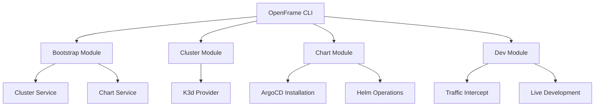

# OpenFrame CLI Documentation

Welcome to the comprehensive documentation for OpenFrame CLI - a powerful command-line tool for managing Kubernetes clusters and deploying OpenFrame environments.

## 📚 Table of Contents

### Getting Started
Start here if you're new to OpenFrame CLI:
- [Introduction](./getting-started/introduction.md) - What is OpenFrame CLI and why use it?
- [Prerequisites](./getting-started/prerequisites.md) - Required tools and setup
- [Quick Start](./getting-started/quick-start.md) - Get running in 5 minutes
- [First Steps](./getting-started/first-steps.md) - Essential tasks after installation

### Development
For contributors and developers:
- [Development Overview](./development/README.md) - Development section index and workflow
- [Environment Setup](./development/setup/environment.md) - Configure your development environment
- [Local Development](./development/setup/local-development.md) - Clone, build, and run locally
- [Architecture](./development/architecture/overview.md) - System architecture and design patterns
- [Testing](./development/testing/overview.md) - Testing strategies and best practices
- [Contributing](./development/contributing/guidelines.md) - How to contribute code and documentation

### Reference
Technical reference documentation:
- [Architecture Overview](./reference/architecture/overview.md) - Detailed technical architecture, components, and data flows

### Diagrams
Visual documentation and architecture diagrams:
- [Architecture Diagrams](./diagrams/architecture/) - Mermaid diagrams showing system components and relationships

## 🚀 Quick Navigation

### New Users
1. **[Introduction](./getting-started/introduction.md)** - Understand what OpenFrame CLI does
2. **[Prerequisites](./getting-started/prerequisites.md)** - Install required tools (Docker, kubectl, etc.)
3. **[Quick Start](./getting-started/quick-start.md)** - Bootstrap your first environment in 5 minutes
4. **[First Steps](./getting-started/first-steps.md)** - Learn essential commands and workflows

### Developers & Contributors  
1. **[Development Overview](./development/README.md)** - Start here for development setup
2. **[Environment Setup](./development/setup/environment.md)** - Configure IDE and tools
3. **[Local Development](./development/setup/local-development.md)** - Build and run locally
4. **[Contributing Guidelines](./development/contributing/guidelines.md)** - Contribution process and standards

### Technical Deep Dive
1. **[Architecture Overview](./reference/architecture/overview.md)** - System design and components
2. **[Architecture Diagrams](./diagrams/architecture/)** - Visual architecture documentation
3. **[Testing Overview](./development/testing/overview.md)** - Testing philosophy and practices

## 🎯 Key Features

OpenFrame CLI provides comprehensive tooling for:

### **Cluster Management**
- Create lightweight K3d clusters in Docker containers
- Interactive configuration with sensible defaults
- Multi-cluster environment management
- Automatic cleanup and resource management

### **GitOps Integration**
- Automated ArgoCD installation and configuration  
- OpenFrame application deployment via Helm charts
- Git-based configuration management
- Continuous delivery workflows

### **Development Tools**
- Traffic interception with Telepresence for local debugging
- Live development with Skaffold hot reloading
- Development environment isolation
- Local service development against remote clusters

### **Automation & CI/CD**
- Non-interactive mode for automation
- Comprehensive prerequisite checking
- Detailed logging and error reporting
- Environment lifecycle management

## 🛠️ Command Reference

| Command Group | Purpose | Key Commands |
|---------------|---------|--------------|
| **bootstrap** | Complete environment setup | `openframe bootstrap [cluster-name]` |
| **cluster** | Cluster lifecycle management | `create`, `delete`, `list`, `status`, `cleanup` |
| **chart** | Helm chart operations | `openframe chart install` |
| **dev** | Development workflows | `intercept`, `skaffold` |

### Essential Commands

```bash
# Complete environment setup
openframe bootstrap my-cluster

# Cluster management
openframe cluster create dev-env
openframe cluster status dev-env  
openframe cluster delete dev-env

# Development workflows
openframe dev intercept my-service
openframe dev skaffold my-app
```

## 📋 Prerequisites

Before using OpenFrame CLI, ensure you have:

- **Docker** - Container runtime for K3d clusters
- **kubectl** - Kubernetes command-line tool  
- **Helm** - Package manager for Kubernetes
- **Git** - Version control system

The CLI automatically validates these dependencies and provides installation guidance.

## 🏗️ Architecture Overview

OpenFrame CLI follows a modular architecture:



**Key Architectural Principles:**
- **Modular Design**: Each command group is self-contained
- **Service Layer**: Business logic separated from CLI interface
- **External Integration**: Clean interfaces to K3d, Helm, kubectl
- **User Experience**: Interactive prompts with automation support

## 🔍 Common Use Cases

### Local Development
```bash
# Create development cluster
openframe bootstrap dev-cluster

# Intercept service for local debugging
openframe dev intercept my-service --port 8080

# Live reload during development  
openframe dev skaffold my-app
```

### Multi-Environment Management
```bash
# Development environment
openframe bootstrap dev-env

# Staging environment
openframe bootstrap staging-env --deployment-mode=staging

# Production-like testing
openframe bootstrap prod-test --deployment-mode=oss-tenant
```

### CI/CD Integration
```bash
# Automated testing environment
openframe bootstrap test-${CI_BUILD_ID} --non-interactive --verbose

# Run tests against cluster
# ... test execution ...

# Cleanup
openframe cluster delete test-${CI_BUILD_ID} --force
```

## 📖 Documentation Sections

### 🚀 Getting Started Documentation
Perfect for new users who want to understand and use OpenFrame CLI:

- **What it is**: Introduction to OpenFrame CLI capabilities
- **What you need**: Prerequisites and tool installation
- **How to start**: Step-by-step quick start guide  
- **What's next**: Essential workflows and next steps

### 🛠️ Development Documentation
Comprehensive guides for developers and contributors:

- **Environment**: IDE setup, extensions, and development tools
- **Local Setup**: Clone, build, test, and run locally
- **Architecture**: Design patterns, components, and data flows
- **Testing**: Unit tests, integration tests, and quality practices
- **Contributing**: Code standards, PR process, and community guidelines

### 📚 Reference Documentation
Technical architecture and detailed specifications:

- **System Architecture**: Components, services, and interactions
- **Command Reference**: Detailed command documentation
- **Configuration**: All configuration options and formats
- **API Integration**: External tool integrations and protocols

## 📖 Quick Links

### Project Information
- [Project README](../README.md) - Main project overview and quick start
- [Contributing](../CONTRIBUTING.md) - How to contribute to the project
- [License](../LICENSE.md) - Flamingo AI Unified License information

### External Resources
- [OpenFrame Website](https://www.flamingo.run/) - Official OpenFrame platform
- [Flamingo Documentation](https://docs.flamingo.run/) - Platform documentation
- [GitHub Repository](https://github.com/flamingo-stack/openframe-cli) - Source code and issues

### Community
- [GitHub Discussions](https://github.com/flamingo-stack/openframe-cli/discussions) - Questions and community support
- [GitHub Issues](https://github.com/flamingo-stack/openframe-cli/issues) - Bug reports and feature requests

## 🤝 Contributing to Documentation

We welcome documentation improvements! To contribute:

1. **File Issues**: Report gaps, errors, or improvement suggestions
2. **Submit PRs**: Fix typos, add examples, or improve clarity
3. **Add Examples**: Real-world usage examples are always helpful
4. **Review Changes**: Help review documentation pull requests

See our [Contributing Guidelines](../CONTRIBUTING.md) for the full process.

---

*Documentation generated by [OpenFrame Doc Orchestrator](https://github.com/flamingo-stack/openframe-oss-tenant)*