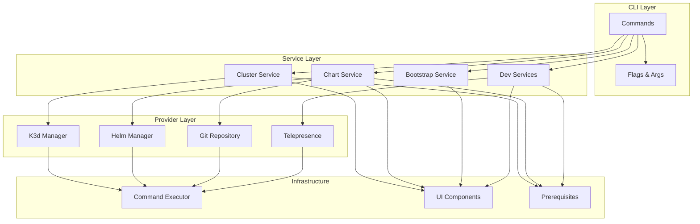

# OpenFrame CLI Documentation

Welcome to the documentation for OpenFrame CLI - a modern CLI tool for managing OpenFrame Kubernetes clusters and development workflows.

## 📚 Table of Contents

### Getting Started
Start here if you're new to the project:
- [Introduction](./getting-started/introduction.md) - What is OpenFrame CLI and why use it?
- [Prerequisites](./getting-started/prerequisites.md) - System requirements and dependencies
- [Quick Start](./getting-started/quick-start.md) - Get running in 5 minutes
- [First Steps](./getting-started/first-steps.md) - What to do after installation

### Development
For contributors and developers:
- [Development Overview](./development/README.md) - Development section index
- [Environment Setup](./development/setup/environment.md) - Set up your development environment
- [Local Development](./development/setup/local-development.md) - Run and test locally
- [Architecture](./development/architecture/overview.md) - System architecture and design
- [Testing](./development/testing/overview.md) - Testing strategies and guidelines
- [Contributing](./development/contributing/guidelines.md) - How to contribute code

### Reference
Technical reference documentation:
- [Architecture Overview](./reference/architecture/overview.md) - Technical architecture and components

### Diagrams
Visual documentation:
- [Architecture Diagrams](./diagrams/) - Mermaid diagrams showing system design

## 🎯 Quick Navigation

### Common Tasks
- **New User?** → Start with [Introduction](./getting-started/introduction.md)
- **Want to Contribute?** → See [Contributing Guidelines](./development/contributing/guidelines.md)
- **Setting up Development?** → Follow [Environment Setup](./development/setup/environment.md)
- **Understanding Architecture?** → Read [Architecture Overview](./reference/architecture/overview.md)

### Command Categories
- **Cluster Management**: Create, manage, and monitor K3d clusters
- **Chart Installation**: Install Helm charts and configure ArgoCD
- **Bootstrap Workflows**: Complete environment setup in one command
- **Development Tools**: Telepresence intercepts and Skaffold workflows

## 🚀 Key Features

OpenFrame CLI provides:

- 🎯 **Interactive Cluster Creation** - Guided setup with smart defaults
- ⚡ **K3d Management** - Full lifecycle management of development clusters
- 📊 **Real-time Monitoring** - Live status and health monitoring
- 🔧 **Auto-Configuration** - Smart system detection and tool installation
- 🛠 **Developer Workflows** - Integrated Skaffold and Telepresence support
- 📦 **ArgoCD Integration** - Automated GitOps with Helm chart deployment
- 🚀 **One-Command Bootstrap** - Complete OpenFrame environment setup

## 🏗 Architecture Overview

OpenFrame CLI is built with a layered architecture:

## 📖 Quick Links

- [Project README](../README.md) - Main project overview and quick start
- [Contributing](../CONTRIBUTING.md) - How to contribute to the project
- [License](../LICENSE.md) - License information and terms
- [Releases](https://github.com/flamingo-stack/openframe-cli/releases) - Download latest version

## 🔍 Find What You Need

| I want to... | Go to... |
|--------------|----------|
| Get started quickly | [Quick Start Guide](./getting-started/quick-start.md) |
| Understand the project | [Introduction](./getting-started/introduction.md) |
| Set up development | [Environment Setup](./development/setup/environment.md) |
| Learn the architecture | [Architecture Overview](./reference/architecture/overview.md) |
| Contribute code | [Contributing Guidelines](./development/contributing/guidelines.md) |
| Run tests | [Testing Overview](./development/testing/overview.md) |
| Report a bug | [GitHub Issues](https://github.com/flamingo-stack/openframe-cli/issues) |
| Ask questions | [GitHub Discussions](https://github.com/flamingo-stack/openframe-cli/discussions) |

## 📋 Prerequisites Summary

Before using OpenFrame CLI, ensure you have:

- **Hardware**: 8GB+ RAM, 4+ CPU cores, 20GB+ disk space
- **Software**: Docker, Git (other tools auto-installed)
- **Permissions**: Ability to run Docker containers
- **Network**: Internet access for downloading tools and images

For detailed requirements, see [Prerequisites](./getting-started/prerequisites.md).

## 🆘 Getting Help

- **Documentation**: Browse this documentation for guides and references
- **GitHub Issues**: Report bugs or request features
- **GitHub Discussions**: Ask questions and get community help
- **Code Examples**: See examples in the getting-started guides

---
*Documentation generated by [OpenFrame Doc Orchestrator](https://github.com/flamingo-stack/openframe-oss-tenant)*