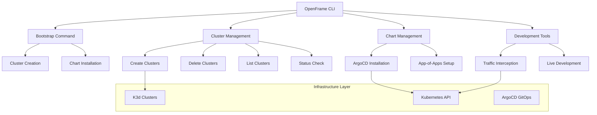

# OpenFrame CLI Documentation

Welcome to the comprehensive documentation for OpenFrame CLI - a powerful command-line interface for bootstrapping and managing Kubernetes clusters with ArgoCD for MSP environments.

## 📚 Table of Contents

### Getting Started

Complete guides to get you up and running quickly:

- **[Introduction](./getting-started/introduction.md)** - What is OpenFrame CLI and key features overview
- **[Prerequisites](./getting-started/prerequisites.md)** - System requirements and tool installation
- **[Quick Start](./getting-started/quick-start.md)** - Get your first cluster running in 5 minutes
- **[First Steps](./getting-started/first-steps.md)** - Explore key features and workflows after setup

### Development

Resources for developers working with and contributing to OpenFrame CLI:

- **[Development Overview](./development/README.md)** - Development documentation hub and workflow guide
- **[Local Development](./development/setup/local-development.md)** - Clone, build, run, and debug locally
- **[Environment Setup](./development/setup/environment.md)** - IDE, tools, and development environment configuration
- **[Security Guidelines](./development/security/README.md)** - Security best practices and vulnerability management
- **[Architecture Overview](./development/architecture/README.md)** - High-level system architecture and design patterns

### Reference

Technical reference documentation:

- **[Architecture Overview](./architecture/overview.md)** - System architecture, components, and data flow

### Diagrams

Visual documentation and architecture diagrams:

- **[Architecture Diagrams](./diagrams/architecture/README.md)** - Visual system overview and component relationships

## 🚀 Quick Navigation

| I want to... | Go to |
|--------------|-------|
| **Get started immediately** | [Quick Start Guide](./getting-started/quick-start.md) |
| **Understand what OpenFrame CLI does** | [Introduction](./getting-started/introduction.md) |
| **Set up my development environment** | [Local Development](./development/setup/local-development.md) |
| **Learn the system architecture** | [Architecture Overview](./architecture/overview.md) |
| **Contribute to the project** | [Development Overview](./development/README.md) |
| **See visual system diagrams** | [Architecture Diagrams](./diagrams/architecture/README.md) |

## 🏗️ Architecture at a Glance

OpenFrame CLI combines multiple tools into a unified workflow:

```mermaid
graph TB
    CLI[OpenFrame CLI] --> Bootstrap[Bootstrap Command]
    CLI --> Cluster[Cluster Management]
    CLI --> Chart[Chart Management]
    CLI --> Dev[Development Tools]
    
    Bootstrap --> ClusterCreate[Cluster Creation]
    Bootstrap --> ChartInstall[Chart Installation]
    
    Cluster --> Create[Create Clusters]
    Cluster --> Delete[Delete Clusters]
    Cluster --> List[List Clusters]
    Cluster --> Status[Status Check]
    
    Chart --> ArgoCD[ArgoCD Installation]
    Chart --> AppOfApps[App-of-Apps Setup]
    
    Dev --> Intercept[Traffic Interception]
    Dev --> Skaffold[Live Development]
    
    subgraph Infrastructure[Infrastructure Layer]
        K3d[K3d Clusters]
        Kubernetes[Kubernetes API]
        ArgoCDSvc[ArgoCD GitOps]
    end
    
    Create --> K3d
    ArgoCD --> Kubernetes
    Intercept --> Kubernetes
```

## 🔑 Key Features

- **🚀 One-Command Bootstrap**: Complete environment setup with `openframe bootstrap`
- **🎯 Interactive Wizards**: Guided cluster creation and configuration
- **📦 GitOps Integration**: Automatic ArgoCD installation and app-of-apps pattern
- **🔧 Development Tools**: Traffic interception and live reloading capabilities
- **🧹 Resource Management**: Cleanup and status monitoring commands
- **🌐 Multi-Platform**: Support for multiple deployment modes

## 💡 Common Use Cases

| Use Case | Recommended Path |
|----------|------------------|
| **First-time user** | [Prerequisites](./getting-started/prerequisites.md) → [Quick Start](./getting-started/quick-start.md) → [First Steps](./getting-started/first-steps.md) |
| **Developer contributing** | [Development Overview](./development/README.md) → [Local Development](./development/setup/local-development.md) |
| **Understanding architecture** | [Introduction](./getting-started/introduction.md) → [Architecture Overview](./architecture/overview.md) |
| **Setting up CI/CD** | [Quick Start](./getting-started/quick-start.md) → [Architecture Diagrams](./diagrams/architecture/README.md) |

## 🛠️ Technology Stack

| Component | Technology | Purpose |
|-----------|------------|---------|
| **Core Language** | Go 1.21+ | CLI implementation and business logic |
| **CLI Framework** | Cobra | Command structure and argument parsing |
| **Container Runtime** | Docker | K3d cluster management |
| **Kubernetes** | K3d, kubectl | Local cluster creation and management |
| **GitOps** | ArgoCD, Helm | Application deployment and management |

## 🤝 Community & Support

- **OpenMSP Slack Community**: [Join our Slack](https://join.slack.com/t/openmsp/shared_invite/zt-36bl7mx0h-3~U2nFH6nqHqoTPXMaHEHA)
- **Website**: [flamingo.run](https://flamingo.run)
- **OpenFrame Platform**: [openframe.ai](https://openframe.ai)

## 📖 Quick Links

- [Project README](../README.md) - Main project README with overview and installation
- [Contributing](../CONTRIBUTING.md) - How to contribute to OpenFrame CLI
- [License](../LICENSE.md) - License information and terms

## 🔄 Documentation Updates

This documentation is continuously updated as the project evolves. If you notice any gaps or have suggestions for improvement:

1. **Check existing issues** to see if it's already reported
2. **Create an issue** with details about the documentation improvement
3. **Join our Slack community** to discuss documentation needs
4. **Submit a pull request** with documentation improvements

---

*Documentation generated by [OpenFrame Doc Orchestrator](https://github.com/flamingo-stack/openframe-oss-tenant)*