# OpenFrame CLI Documentation

Welcome to the comprehensive documentation for OpenFrame CLI, a powerful command-line tool for managing Kubernetes clusters and development workflows. This documentation will guide you from initial setup to advanced development workflows.

## 📚 Table of Contents

### Getting Started
Start here if you're new to OpenFrame CLI:
- [Introduction](./getting-started/introduction.md) - What is OpenFrame CLI and why use it?
- [Prerequisites](./getting-started/prerequisites.md) - System requirements and tool dependencies
- [Quick Start](./getting-started/quick-start.md) - Get running in 5 minutes with bootstrap
- [First Steps](./getting-started/first-steps.md) - Essential tasks after installation

### Development
For contributors and advanced users:
- [Development Overview](./development/README.md) - Development section index and navigation
- [Environment Setup](./development/setup/environment.md) - Configure your development environment
- [Local Development](./development/setup/local-development.md) - Clone, build, and run locally
- [Architecture Overview](./development/architecture/overview.md) - System design and component structure
- [Testing Guide](./development/testing/overview.md) - Testing strategies and running tests
- [Contributing Guidelines](./development/contributing/guidelines.md) - How to contribute code and documentation

### Reference
Technical reference documentation:
- [Architecture Overview](./reference/architecture/overview.md) - Detailed technical architecture and design decisions

### Diagrams
Visual documentation and system diagrams:
- [Architecture Diagrams](./diagrams/architecture/README.md) - Mermaid diagrams showing system components and data flow

## 🚀 Quick Navigation

Choose your path based on your goals:

```mermaid
flowchart TD
    Start([👋 Welcome to OpenFrame CLI]) --> Goal{What's your goal?}
    
    Goal -->|🆕 First time using| GetStarted[Getting Started]
    Goal -->|⚡ Quick setup| QuickStart[Quick Start Guide]
    Goal -->|🛠️ Contributing| Development[Development Docs]
    Goal -->|🏗️ Understanding internals| Architecture[Architecture Reference]
    
    GetStarted --> Intro[Introduction]
    GetStarted --> Prereqs[Prerequisites]
    GetStarted --> Quick[Quick Start]
    GetStarted --> FirstSteps[First Steps]
    
    QuickStart --> Bootstrap[One-Command Bootstrap]
    
    Development --> DevOverview[Development Overview]
    Development --> Setup[Environment Setup]
    Development --> LocalDev[Local Development]
    Development --> Testing[Testing Guide]
    
    Architecture --> ArchOverview[Architecture Overview]
    Architecture --> Diagrams[System Diagrams]
    
    style GetStarted fill:#e3f2fd
    style QuickStart fill:#f3e5f5
    style Development fill:#e8f5e8
    style Architecture fill:#fff3e0
```

## 🎯 Common Use Cases

### For New Users

**"I want to try OpenFrame CLI quickly"**
→ Go to [Quick Start Guide](./getting-started/quick-start.md) and run `openframe bootstrap`

**"I want to understand what OpenFrame CLI does"**
→ Start with the [Introduction](./getting-started/introduction.md)

**"I need to set up my development environment"**
→ Follow [Prerequisites](./getting-started/prerequisites.md) then [Quick Start](./getting-started/quick-start.md)

### For Developers

**"I want to contribute to OpenFrame CLI"**
→ Read [Contributing Guidelines](./development/contributing/guidelines.md)

**"I need to set up a development environment"**
→ Follow [Environment Setup](./development/setup/environment.md) then [Local Development](./development/setup/local-development.md)

**"I want to understand the codebase"**
→ Start with [Architecture Overview](./development/architecture/overview.md)

### For DevOps Teams

**"I want to integrate OpenFrame CLI into CI/CD"**
→ See [Development Overview](./development/README.md) for automation patterns

**"I need to understand the system architecture"**
→ Review [Architecture Overview](./reference/architecture/overview.md) and [system diagrams](./diagrams/architecture/README.md)

## 📖 Documentation Structure

### 🟢 Getting Started Section
Perfect for first-time users and quick evaluation:

| Document | Time to Read | Purpose |
|----------|--------------|---------|
| [Introduction](./getting-started/introduction.md) | 5 minutes | Overview, features, and benefits |
| [Prerequisites](./getting-started/prerequisites.md) | 10 minutes | System setup and tool installation |
| [Quick Start](./getting-started/quick-start.md) | 5 minutes | Bootstrap complete environment |
| [First Steps](./getting-started/first-steps.md) | 15 minutes | Essential workflows and commands |

**Total time investment: 35 minutes from zero to productive**

### 🔵 Development Section
Comprehensive guides for contributors and advanced users:

| Document | Audience | Focus |
|----------|----------|-------|
| [Development Overview](./development/README.md) | All developers | Navigation and quick start |
| [Environment Setup](./development/setup/environment.md) | New contributors | IDE and tool configuration |
| [Local Development](./development/setup/local-development.md) | Contributors | Build and test locally |
| [Architecture Overview](./development/architecture/overview.md) | Contributors | System design understanding |
| [Testing Guide](./development/testing/overview.md) | Contributors | Testing strategies and execution |
| [Contributing Guidelines](./development/contributing/guidelines.md) | Contributors | Standards and processes |

### 🟡 Reference Section  
Technical specifications and detailed architecture:

| Document | Purpose | Audience |
|----------|---------|----------|
| [Architecture Overview](./reference/architecture/overview.md) | Technical architecture | Platform teams, senior developers |

### 🟠 Diagrams Section
Visual documentation for system understanding:

| Resource | Type | Purpose |
|----------|------|---------|
| [Architecture Diagrams](./diagrams/architecture/README.md) | Mermaid diagrams | Visual system overview |

## 🛠️ Command Reference

### Core Commands

| Command | Purpose | Quick Example |
|---------|---------|---------------|
| `bootstrap` | Complete environment setup | `openframe bootstrap --deployment-mode=oss-tenant` |
| `cluster create` | Create K3d cluster | `openframe cluster create my-cluster --nodes 3` |
| `cluster status` | Check cluster health | `openframe cluster status` |
| `chart install` | Deploy Helm charts | `openframe chart install` |
| `dev scaffold` | Live development | `openframe dev scaffold` |
| `dev intercept` | Traffic interception | `openframe dev intercept service --port 8080` |

### Command Categories

## 🏗️ Architecture Overview

OpenFrame CLI is built with a modular architecture:

For detailed architecture information, see:
- [Architecture Overview](./reference/architecture/overview.md)
- [Component Diagrams](./diagrams/architecture/README.md)

## 🚀 Deployment Modes

OpenFrame CLI supports multiple deployment architectures:

| Mode | Description | Best For | Documentation |
|------|-------------|----------|---------------|
| **oss-tenant** | Open source tenant deployment | Individual developers, small teams | [Getting Started](./getting-started/quick-start.md) |
| **saas-tenant** | SaaS tenant with dedicated resources | Enterprise customers, isolated environments | [Architecture Overview](./reference/architecture/overview.md) |
| **saas-shared** | SaaS shared multi-tenant deployment | Cost-effective scaling, development environments | [Architecture Overview](./reference/architecture/overview.md) |

## 📚 External Resources

### Tool Documentation
- **K3d**: https://k3d.io/
- **Docker**: https://docs.docker.com/
- **Helm**: https://helm.sh/docs/
- **ArgoCD**: https://argo-cd.readthedocs.io/
- **Skaffold**: https://skaffold.dev/
- **Telepresence**: https://www.telepresence.io/

### Development Resources
- **Go Documentation**: https://pkg.go.dev/
- **Cobra CLI Framework**: https://cobra.dev/
- **Kubernetes Client**: https://pkg.go.dev/k8s.io/client-go

## 🤝 Contributing

We welcome contributions of all types:

- **🐛 Bug Reports**: Help us identify and fix issues
- **✨ Feature Requests**: Suggest new functionality
- **📚 Documentation**: Improve guides and examples  
- **💻 Code Contributions**: Submit bug fixes and features
- **🧪 Testing**: Expand test coverage and quality

To get started:

1. **Read** [Contributing Guidelines](./development/contributing/guidelines.md)
2. **Set up** your [development environment](./development/setup/environment.md)
3. **Explore** the [architecture](./development/architecture/overview.md)
4. **Find** a good first issue or suggest improvements

## 📞 Getting Help

### Documentation Issues
- **Missing information**: Open an issue requesting documentation
- **Outdated content**: Submit a PR with updates
- **Unclear instructions**: Open an issue with specific questions

### Technical Support
- **Installation problems**: Check [Prerequisites](./getting-started/prerequisites.md)
- **Usage questions**: See [Quick Start](./getting-started/quick-start.md) and [First Steps](./getting-started/first-steps.md)
- **Development issues**: Review [Development Overview](./development/README.md)

### Community
- **GitHub Issues**: Bug reports and feature requests
- **GitHub Discussions**: General questions and ideas
- **Pull Request Reviews**: Code feedback and collaboration

## 📖 Quick Links

### Essential Documentation
- [Project README](../README.md) - Main project overview and installation
- [Contributing Guide](../CONTRIBUTING.md) - How to contribute to the project
- [License](../LICENSE.md) - License information and terms

### Getting Started Fast
- [Quick Start Guide](./getting-started/quick-start.md) - 5-minute bootstrap
- [Command Examples](./getting-started/first-steps.md) - Common workflows
- [Troubleshooting](./getting-started/prerequisites.md) - Common issues and solutions

### For Developers
- [Development Setup](./development/setup/environment.md) - Configure your environment
- [Architecture Guide](./development/architecture/overview.md) - Understand the codebase
- [Testing Guide](./development/testing/overview.md) - Run and write tests

---

**Ready to get started?** 

- **New user?** → [Introduction](./getting-started/introduction.md)
- **Quick setup?** → [Quick Start](./getting-started/quick-start.md)  
- **Want to contribute?** → [Contributing Guidelines](./development/contributing/guidelines.md)

---

*Documentation generated by [OpenFrame Doc Orchestrator](https://github.com/flamingo-stack/openframe-oss-tenant)*