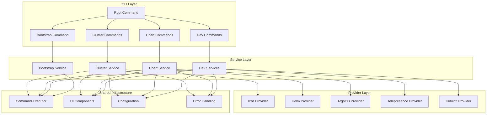
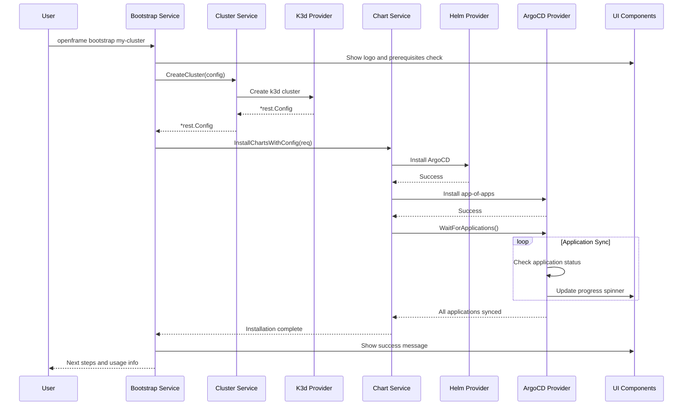
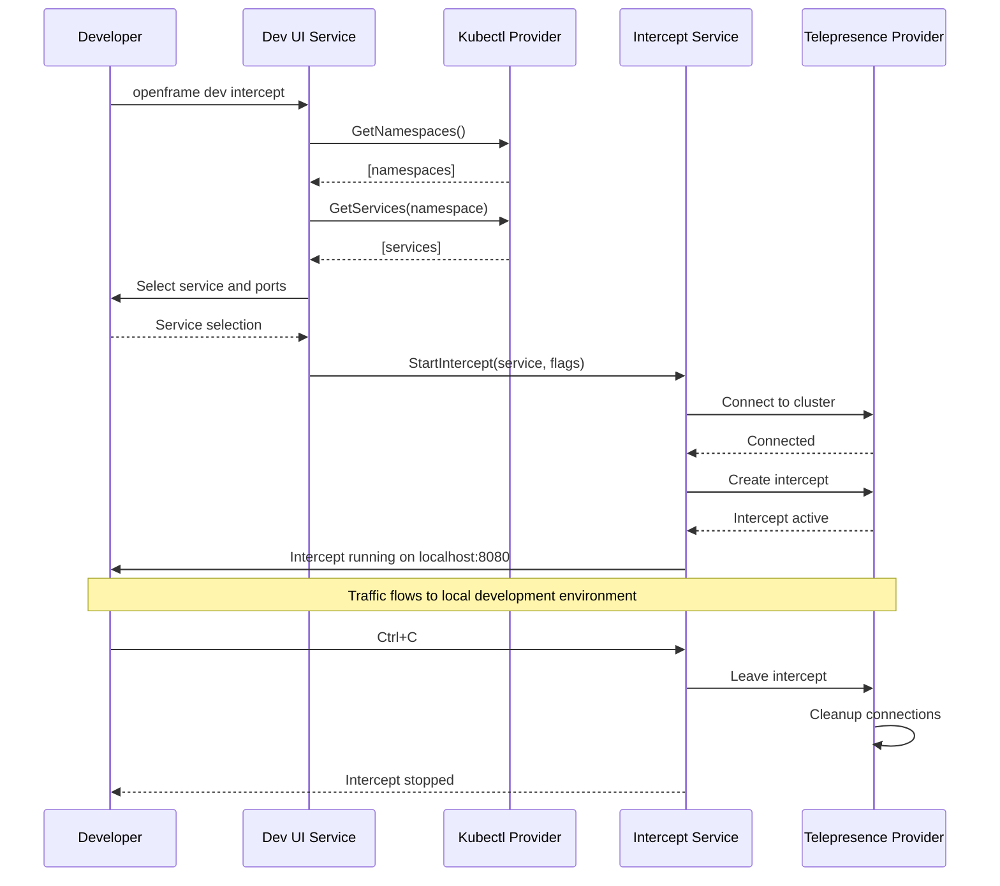

# openframe-cli Module Documentation

# OpenFrame CLI

OpenFrame CLI is a modern, interactive command-line tool for managing OpenFrame Kubernetes clusters and development workflows. It provides seamless cluster lifecycle management, chart installation with ArgoCD, and developer-friendly tools for service intercepts and scaffolding.

## Architecture

OpenFrame CLI follows a modular, service-oriented architecture that separates concerns across multiple layers and provides consistent interfaces for cluster management, chart operations, development workflows, and shared utilities.

### High-Level System Design



## Core Components

| Component | Package Path | Responsibilities |
|-----------|--------------|------------------|
| **Root Command** | `cmd/root.go` | CLI entry point, version management, global flag handling |
| **Cluster Commands** | `cmd/cluster/` | Create, delete, list, status, cleanup cluster operations |
| **Chart Commands** | `cmd/chart/` | ArgoCD and app-of-apps installation and management |
| **Development Commands** | `cmd/dev/` | Telepresence intercepts and Skaffold workflows |
| **Bootstrap Command** | `cmd/bootstrap/` | One-command cluster creation + chart installation |
| **Cluster Service** | `internal/cluster/service.go` | Business logic for cluster lifecycle management |
| **Chart Services** | `internal/chart/services/` | ArgoCD installation, app-of-apps deployment, validation |
| **K3d Manager** | `internal/cluster/providers/k3d/` | K3d cluster provider implementation |
| **Helm Manager** | `internal/chart/providers/helm/` | Helm chart operations and management |
| **ArgoCD Manager** | `internal/chart/providers/argocd/` | ArgoCD-specific operations and waiting logic |
| **Dev Services** | `internal/dev/services/` | Telepresence intercepts and Skaffold workflows |
| **Prerequisites** | `internal/*/prerequisites/` | Tool installation and validation |
| **UI Components** | `internal/shared/ui/` | Terminal UI, prompts, tables, progress indicators |
| **Command Executor** | `internal/shared/executor/` | Abstracted command execution with Windows/WSL support |
| **Configuration** | `internal/shared/config/` | System configuration and credential management |
| **Error Handling** | `internal/shared/errors/` | Centralized error handling and user-friendly messages |

## Component Relationships

### Module Dependencies and Data Flow

```mermaid
graph TB
    subgraph "Command Layer"
        RootCmd[cmd/root.go]
        ClusterCmd[cmd/cluster/]
        ChartCmd[cmd/chart/]
        DevCmd[cmd/dev/]
        BootstrapCmd[cmd/bootstrap/]
    end
    
    subgraph "Business Logic Layer"
        ClusterService[internal/cluster/service.go]
        ChartServices[internal/chart/services/]
        DevServices[internal/dev/services/]
        BootstrapService[internal/bootstrap/service.go]
    end
    
    subgraph "Provider Layer"
        K3dProvider[internal/cluster/providers/k3d/]
        HelmProvider[internal/chart/providers/helm/]
        ArgoCDProvider[internal/chart/providers/argocd/]
        GitProvider[internal/chart/providers/git/]
        TelepresenceProvider[internal/dev/providers/telepresence/]
        KubectlProvider[internal/dev/providers/kubectl/]
    end
    
    subgraph "Infrastructure Layer"
        Executor[internal/shared/executor/]
        UIComponents[internal/shared/ui/]
        Configuration[internal/shared/config/]
        ErrorHandling[internal/shared/errors/]
        Prerequisites[internal/*/prerequisites/]
    end
    
    RootCmd --> ClusterCmd
    RootCmd --> ChartCmd
    RootCmd --> DevCmd
    RootCmd --> BootstrapCmd
    
    ClusterCmd --> ClusterService
    ChartCmd --> ChartServices
    DevCmd --> DevServices
    BootstrapCmd --> BootstrapService
    BootstrapCmd --> ClusterService
    BootstrapCmd --> ChartServices
    
    ClusterService --> K3dProvider
    ChartServices --> HelmProvider
    ChartServices --> ArgoCDProvider
    ChartServices --> GitProvider
    DevServices --> TelepresenceProvider
    DevServices --> KubectlProvider
    
    K3dProvider --> Executor
    HelmProvider --> Executor
    ArgoCDProvider --> Executor
    TelepresenceProvider --> Executor
    KubectlProvider --> Executor
    
    ClusterService --> UIComponents
    ChartServices --> UIComponents
    DevServices --> UIComponents
    
    ClusterService --> Configuration
    ChartServices --> Configuration
    DevServices --> Configuration
    
    ClusterService --> ErrorHandling
    ChartServices --> ErrorHandling
    DevServices --> ErrorHandling
    
    ClusterCmd --> Prerequisites
    ChartCmd --> Prerequisites
    DevCmd --> Prerequisites
```



## Data Flow

### Complete Workflow: Bootstrap Command



### Development Workflow: Intercept Command



## Key Files

| File Path | Purpose |
|-----------|---------|
| `main.go` | Application entry point, version injection |
| `cmd/root.go` | Root command definition, global flags, CLI structure |
| `internal/cluster/service.go` | Core cluster business logic and operations |
| `internal/cluster/providers/k3d/manager.go` | K3d cluster provider with Windows/WSL support |
| `internal/chart/services/chart_service.go` | Chart installation orchestration |
| `internal/chart/providers/helm/manager.go` | Helm operations with native Kubernetes client integration |
| `internal/chart/providers/argocd/wait.go` | ArgoCD application synchronization and health monitoring |
| `internal/dev/services/intercept/service.go` | Telepresence intercept management |
| `internal/shared/executor/executor.go` | Command execution abstraction with WSL support |
| `internal/shared/ui/logo.go` | Terminal UI and branding |
| `internal/shared/config/system.go` | System configuration and initialization |

## Dependencies

OpenFrame CLI integrates with several external tools and libraries to provide its functionality:

### Kubernetes Ecosystem
- **k8s.io/client-go**: Native Kubernetes API client for cluster communication
- **k8s.io/apimachinery**: Kubernetes API machinery and types
- **k8s.io/apiextensions-apiserver**: Custom Resource Definition (CRD) support
- **github.com/argoproj/argo-cd/v2**: ArgoCD client library for GitOps operations

### External Tools (executed via Command Executor)
- **k3d**: Local Kubernetes cluster creation and management
- **helm**: Kubernetes package manager for chart installations
- **kubectl**: Kubernetes command-line tool for cluster operations
- **telepresence**: Service mesh debugging and local development
- **skaffold**: Continuous deployment for Kubernetes applications
- **docker**: Container runtime and image management

### CLI Framework
- **github.com/spf13/cobra**: Command-line interface framework
- **github.com/manifoldco/promptui**: Interactive prompts and user input
- **github.com/pterm/pterm**: Terminal styling and progress indicators

### Configuration and Serialization  
- **gopkg.in/yaml.v3**: YAML parsing for Helm values and Kubernetes manifests
- **encoding/json**: JSON handling for API responses and configuration

### Platform Integration
The CLI provides cross-platform support with special handling for Windows/WSL2 environments, automatically detecting and using WSL for Docker and Kubernetes operations when running on Windows.

## CLI Commands

### Core Commands

```bash
# Bootstrap complete environment (cluster + charts)
openframe bootstrap [cluster-name]
openframe bootstrap --deployment-mode=oss-tenant
openframe bootstrap --deployment-mode=saas-shared --non-interactive

# Cluster management
openframe cluster create [name]          # Interactive cluster creation
openframe cluster create --skip-wizard   # Non-interactive with defaults
openframe cluster list                   # List all clusters
openframe cluster status [name]          # Detailed cluster information
openframe cluster delete [name]          # Remove cluster
openframe cluster cleanup [name]         # Clean up cluster resources

# Chart installation
openframe chart install [cluster-name]   # Install ArgoCD and app-of-apps
openframe chart install --deployment-mode=oss-tenant
openframe chart install --dry-run        # Preview installation

# Development workflows  
openframe dev intercept [service-name]   # Telepresence traffic intercept
openframe dev intercept --port 8080 --namespace production
openframe dev skaffold [cluster-name]    # Live development with Skaffold
```

### Global Flags

```bash
--verbose, -v     # Enable detailed output
--dry-run        # Show what would be done without executing
--force, -f      # Skip confirmation prompts
--silent         # Suppress output except errors
```

### Examples

```bash
# Quick start - complete setup
openframe bootstrap my-dev-cluster

# Create cluster with custom configuration
openframe cluster create my-cluster --nodes 5 --type k3d

# Install charts with specific deployment mode
openframe chart install my-cluster --deployment-mode=saas-tenant

# Intercept traffic from a service to local development
openframe dev intercept api-service --port 8080 --namespace production

# Live development workflow
openframe dev skaffold my-cluster
```

The CLI provides both interactive modes for new users and flag-based operation for automation and CI/CD pipelines, with comprehensive error handling and user-friendly progress indicators throughout all operations.
