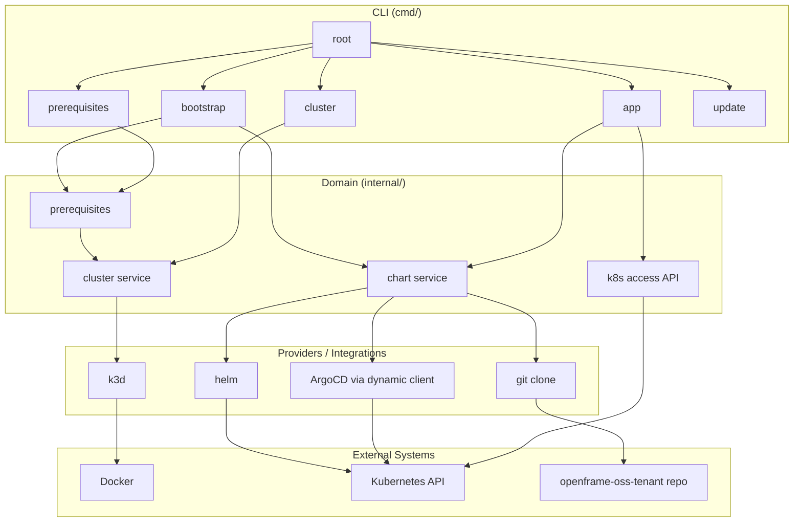
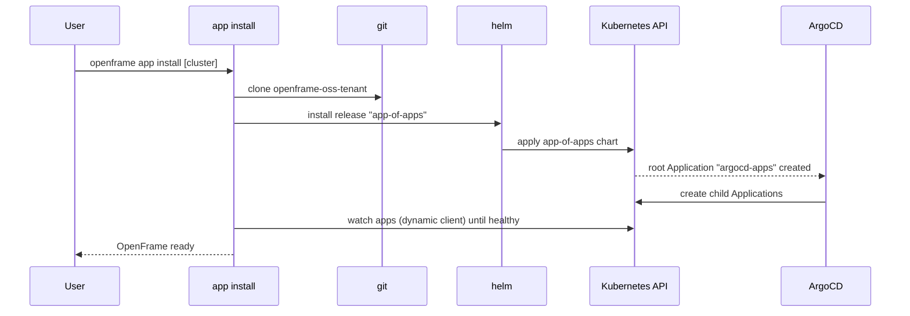

# OpenFrame CLI Architecture

OpenFrame CLI (`openframe`) is a Go 1.26 + Cobra command-line tool that stands up
OpenFrame on Kubernetes. It creates a local cluster, installs the OpenFrame
application via Helm + ArgoCD, and keeps its own tooling and binary up to date.

The CLI is organized around three isolated concerns — **cluster**, **app**, and
**prerequisites** — plus a thin **bootstrap** orchestrator and a self-**update**
command. See [decisions.md](./decisions.md) for the rationale.

## High-Level System Design

## Command Groups (`cmd/`)

| Group | Subcommands | Responsibility |
|-------|-------------|----------------|
| `bootstrap` | (orchestrator) | Runs `prerequisites → cluster create → app install` end to end |
| `cluster` | `create`, `delete`, `list`, `status`, `cleanup` | Kubernetes cluster lifecycle (k3d only; cloud "coming soon") |
| `app` | `install`, `upgrade`, `status`, `access`, `uninstall` | Deploy/operate the OpenFrame app on an existing cluster (alias: `chart`, `c`) |
| `prerequisites` | `check`, `install` | Check and install required tools |
| `update` | (self-update), `check`, `rollback` | Update the CLI binary itself |

`cmd/root.go` wires the groups together, adds global `--verbose` / `--silent`
flags, and runs commands under a signal-cancelled context (Ctrl-C / SIGTERM
cancels the running command). There is no `dev`, `chart` (as a group), or
intercept/scaffold command.

## Domain Packages (`internal/`)

| Package | Responsibility |
|---------|----------------|
| `internal/bootstrap` | Orchestration only — no business logic of its own |
| `internal/cluster` | Cluster lifecycle; `provider/` interface + `providers/k3d` implementation |
| `internal/chart` | Helm + ArgoCD app-of-apps install; `providers/{helm,git,argocd}` |
| `internal/app` | App-level `status` and `uninstall` support |
| `internal/k8s` | Cluster-access API: contexts, rest.Config, health/resource checks |
| `internal/platform` | OS detection and Windows/WSL2 documentation hints |
| `internal/prerequisites` | OS-aware prerequisite framework |
| `internal/shared/*` | Cross-cutting: `executor`, `ui`, `config`, `errors`, `redact`, `files`, `flags`, `download`, `selfupdate`, `wsllauncher` |

## Deploy Flow: `app install`

1. `git` clones the `openframe-oss-tenant` repository to a temp directory.
2. `helm` installs the app-of-apps chart from the clone as the release
   **`app-of-apps`**.
3. That chart creates an ArgoCD **root `Application` named `argocd-apps`**, which
   fans out to the child `Application` resources for each OpenFrame component.
4. The CLI waits for the ArgoCD applications to become healthy.

ArgoCD is driven entirely through the Kubernetes **dynamic / unstructured
client** (GVR `argoproj.io/v1alpha1 applications`). There is no `argocd` CLI
dependency and no typed `ApplicationSpec` — this keeps the CLI version-agnostic
against whatever ArgoCD version is deployed. See D6 in
[decisions.md](./decisions.md).

`app upgrade --sync` patches the `argocd-apps` root Application (hard refresh +
sync) through the same dynamic client; `app upgrade --ref` re-deploys the
app-of-apps at a new git ref. `app access` reads the ArgoCD admin password from
the cluster and prints how to reach the UI.

## Prerequisites

- **Docker** is required and must be running (the k3d cluster runs in Docker).
- **kubectl**, **k3d**, and **helm** are auto-installed from **verified, pinned**
  releases (SHA-256 checked) into a CLI-managed bin directory that is prepended
  to `PATH` at runtime (see `internal/shared/download`).
- **mkcert** provisions a local root CA for localhost HTTPS.

On macOS / Linux prerequisites are checked and auto-installed. Read-only
commands (`app status`, `app access`) and machine output modes skip the
interactive prerequisite gate so scripts never hang on a prompt.

## Windows → WSL2

On Windows, `ExecuteWithVersion` in `cmd/root.go` re-runs the entire CLI inside
WSL2 and executes as a Linux binary ("Option 1"), because the cluster and the
native Kubernetes client live there. The forwarding is handled by
`internal/shared/wsllauncher` and happens at most once (the Linux build inside
WSL does not forward again).

## Self-Update

`internal/shared/selfupdate` downloads the target release, verifies it with a
checksum **and** a cosign (sigstore-go) signature, then atomically replaces the
running binary with backup/rollback support. After each command the CLI does a
best-effort, non-blocking update check on stderr; setting
`OPENFRAME_AUTO_UPDATE=1` applies updates in place. `openframe update` performs
the update explicitly, `update check` reports availability, and `update
rollback` reverts to the previous binary offline.

## Key Files

| File | Purpose |
|------|---------|
| `cmd/root.go` | Root command, global flags, signal context, WSL2 forwarding, self-update hook |
| `cmd/bootstrap/bootstrap.go` | Bootstrap orchestrator command |
| `cmd/app/install.go` / `upgrade.go` / `access.go` | App install, upgrade/sync, ArgoCD access |
| `internal/cluster/service.go` | Cluster lifecycle logic |
| `internal/cluster/provider/provider.go` | Cluster provider interface (k3d impl; cloud future) |
| `internal/chart/services/appofapps.go` | Clone repo + Helm-install app-of-apps |
| `internal/chart/providers/argocd/sync.go` | ArgoCD root-app refresh/sync via dynamic client |
| `internal/k8s/accessor.go` | Cluster-access API (contexts, health, resources) |
| `internal/shared/wsllauncher/launcher.go` | Windows → WSL2 forwarding |
| `internal/shared/selfupdate/update.go` | Checksum + cosign self-update |
| `internal/shared/download/pins.go` | Verified, pinned tool downloads |

## Dependencies

- **cobra** — command structure and parsing.
- **pterm** — terminal UI (spinners, sections, tables).
- **client-go** (dynamic + typed clients) — Kubernetes access, including ArgoCD
  applications via the dynamic/unstructured client.
- **cosign / sigstore-go** — release signature verification for self-update.
- External CLIs invoked via the shared executor: **k3d**, **helm**, **kubectl**,
  **git**, **docker**, **mkcert**.
