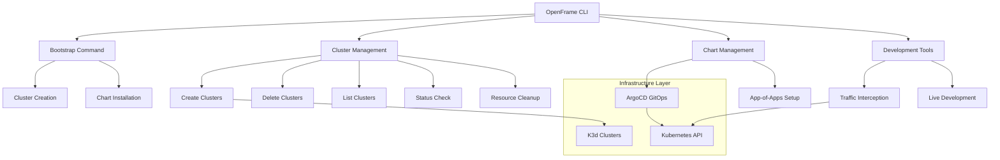
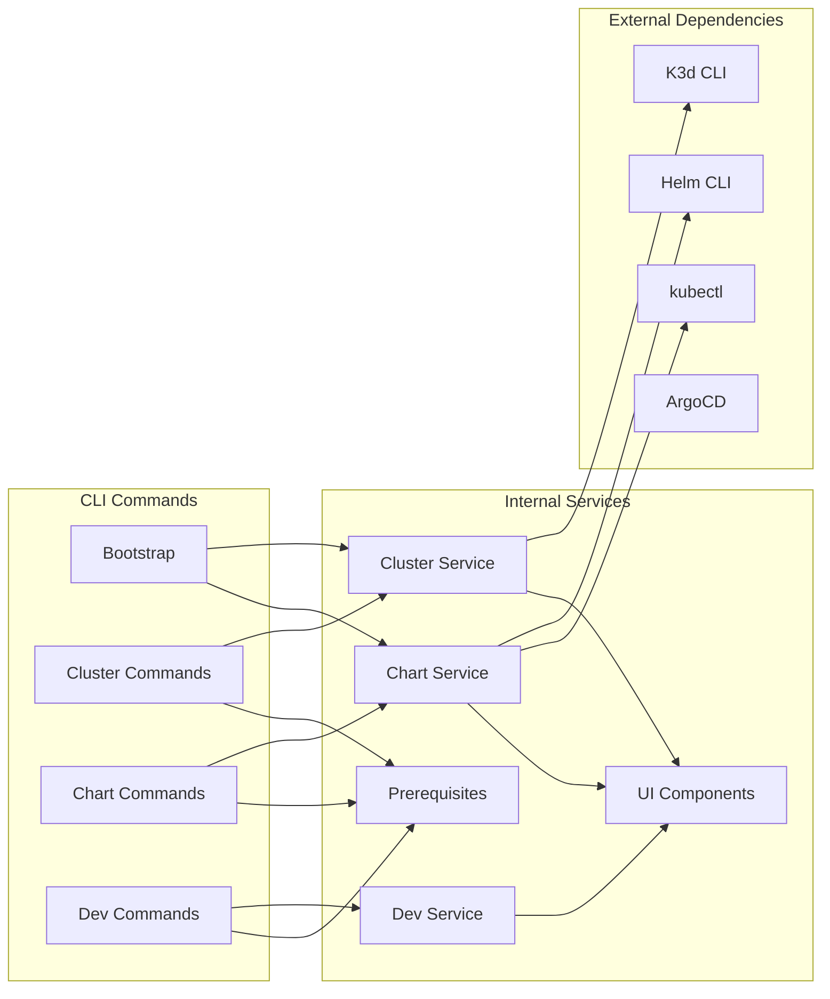
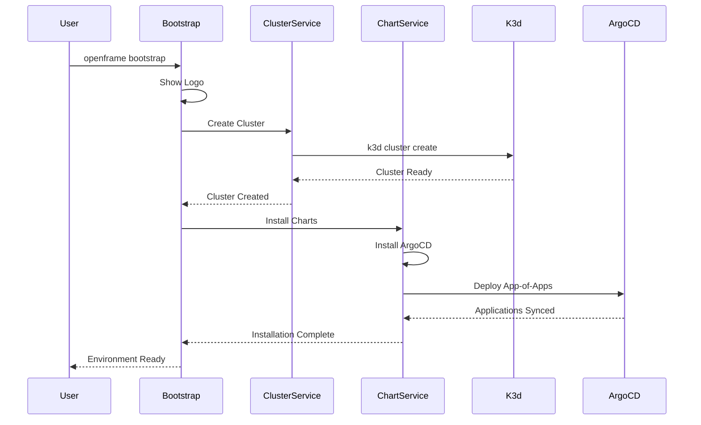
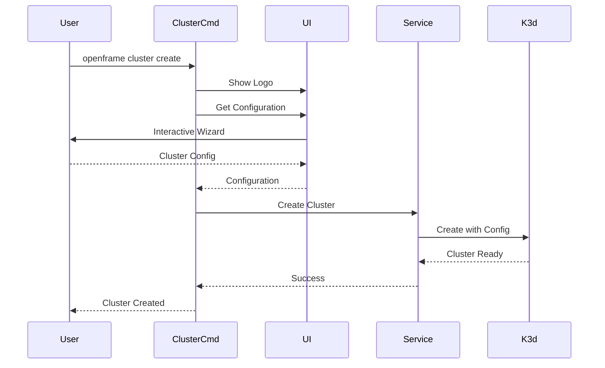

# openframe-cli Module Documentation

# OpenFrame CLI Architecture Documentation

OpenFrame CLI is a comprehensive command-line interface for bootstrapping and managing Kubernetes clusters with ArgoCD for MSP (Managed Service Provider) environments. It provides streamlined workflows for creating development clusters, installing GitOps components, and managing development tools.

## Architecture

The CLI follows a modular architecture with command-specific packages handling different aspects of cluster lifecycle management and development workflows.

### High-Level Architecture



## Core Components

| Component | Package | Responsibility |
|-----------|---------|----------------|
| **Bootstrap** | `cmd/bootstrap` | Orchestrates complete OpenFrame environment setup |
| **Cluster Management** | `cmd/cluster` | Kubernetes cluster lifecycle operations |
| **Chart Management** | `cmd/chart` | Helm chart and ArgoCD installation |
| **Development Tools** | `cmd/dev` | Local development workflow tools |
| **Create Command** | `cmd/cluster/create.go` | Interactive cluster creation with configuration wizard |
| **Install Command** | `cmd/chart/install.go` | ArgoCD and app-of-apps installation |
| **Delete Command** | `cmd/cluster/delete.go` | Safe cluster deletion with resource cleanup |
| **Status Command** | `cmd/cluster/status.go` | Detailed cluster health and information display |

## Component Relationships



## Data Flow

### Bootstrap Workflow



### Cluster Management Workflow



## Key Files

| File | Purpose |
|------|---------|
| `cmd/bootstrap/bootstrap.go` | Main bootstrap command orchestrating complete setup |
| `cmd/cluster/create.go` | Interactive cluster creation with configuration wizard |
| `cmd/cluster/delete.go` | Safe cluster deletion with confirmation prompts |
| `cmd/chart/install.go` | ArgoCD and GitOps application installation |
| `cmd/cluster/list.go` | Display all managed clusters in formatted table |
| `cmd/cluster/status.go` | Detailed cluster health and resource information |
| `cmd/cluster/cleanup.go` | Remove unused Docker images and cluster resources |
| `cmd/dev/dev.go` | Development tools parent command with Telepresence integration |

## Dependencies

The CLI integrates with several external tools and internal packages:

### External Tool Dependencies
- **K3d**: Lightweight Kubernetes clusters using Docker containers
- **Helm**: Package manager for Kubernetes applications
- **kubectl**: Kubernetes command-line tool for cluster interaction
- **ArgoCD**: GitOps continuous delivery tool for Kubernetes

### Internal Package Structure
- **Models**: Define configuration structures and validation rules
- **Services**: Business logic for cluster and chart operations
- **UI Components**: Interactive prompts and formatted output display
- **Prerequisites**: Tool availability and version checking
- **Utils**: Common utilities and command wrapping functions

## CLI Commands

### Bootstrap Commands
```bash
openframe bootstrap                                    # Interactive mode
openframe bootstrap my-cluster                        # Custom cluster name
openframe bootstrap --deployment-mode=oss-tenant     # Skip deployment selection
openframe bootstrap --verbose                         # Detailed logging
```

### Cluster Management Commands
```bash
openframe cluster create                    # Interactive cluster creation
openframe cluster delete my-cluster        # Delete specific cluster
openframe cluster list                     # Show all clusters
openframe cluster status my-cluster        # Detailed cluster status
openframe cluster cleanup my-cluster       # Clean unused resources
```

### Chart Management Commands
```bash
openframe chart install                                    # Interactive installation
openframe chart install my-cluster                        # Install on specific cluster
openframe chart install --deployment-mode=saas-shared     # Skip deployment selection
openframe chart install --github-branch develop          # Use develop branch
```

### Development Commands
```bash
openframe dev intercept my-service         # Traffic interception
openframe dev skaffold my-service          # Live development workflow
```

The CLI provides a unified interface for managing the complete OpenFrame development lifecycle, from initial cluster creation through application deployment and development workflows.
