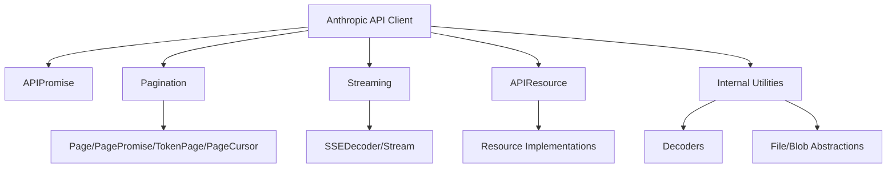
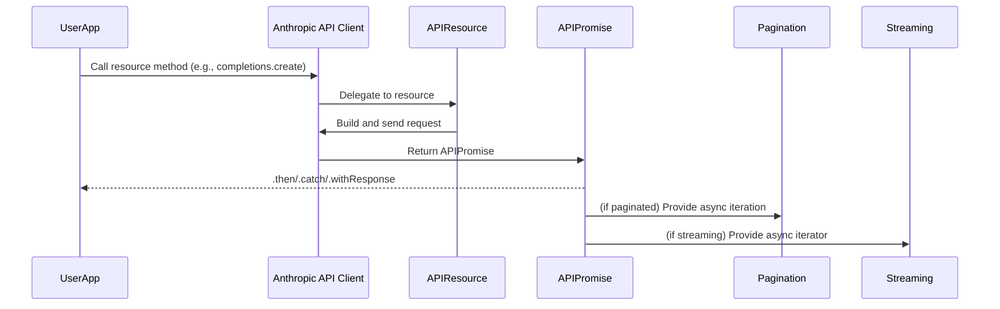

# Core Module Documentation

## Introduction and Purpose

The `core` module provides the foundational building blocks for the Anthropic SDK. It implements the API client, request/response handling, pagination, streaming, and resource abstractions that are used throughout the SDK. This module is designed to be robust, extensible, and to provide a consistent interface for interacting with Anthropic's API and its various resources.

## Architecture Overview

The core module is organized around several key abstractions:

- **API Client**: Handles authentication, request construction, retries, and error handling.
- **API Promise**: Extends the native Promise to provide SDK-specific helpers for response handling.
- **Pagination**: Provides utilities for iterating over paginated API responses.
- **Streaming**: Supports server-sent events (SSE) and streaming data from the API.
- **Resource Abstraction**: Base class for all API resource classes.
- **Internal Utilities**: Decoders, file abstractions, and type helpers for cross-environment compatibility.

### High-Level Architecture Diagram

## Sub-modules and Core Components

### 1. API Client
- **Components**: `Anthropic`, `BaseAnthropic`
- **Description**: Implements the main API client, handling authentication, request building, retries, and resource access. Exposes resource groups (completions, messages, models, beta) as properties.
- [See detailed documentation](core_client.md)

### 2. API Promise
- **Component**: `APIPromise`
- **Description**: A subclass of Promise that adds SDK-specific helpers for response parsing and metadata access.
- [See detailed documentation](core_api-promise.md)

### 3. Pagination
- **Components**: `Page`, `TokenPage`, `PageCursor`, `PagePromise`, and related types
- **Description**: Provides abstractions for paginated API responses, including async iteration and page navigation.
- [See detailed documentation](core_pagination.md)

### 4. Streaming
- **Components**: `SSEDecoder`, `Stream`
- **Description**: Handles server-sent events and streaming API responses, including utilities for splitting and converting streams.
- [See detailed documentation](core_streaming.md)

### 5. Resource Abstraction
- **Component**: `APIResource`
- **Description**: Base class for all API resource classes, providing a consistent interface for resource modules.
- [See detailed documentation](core_resource.md)

### 6. Internal Utilities
- **Components**: `FilePropertyBag`, `BlobPropertyBag`, `JSONLDecoder`, `LineDecoder`, `ResponseLike`, `FileLike`, `BunFile`
- **Description**: Type and utility definitions for cross-environment compatibility, file handling, and decoding.
- [See detailed documentation](core_internal_utilities.md)

## Module Relationships

- The `core` module is the foundation for all other modules in the SDK, such as `lib`, `resources_beta`, and `resources_stable`.
- Resource modules (see [resources_beta.md] and [resources_stable.md]) extend `APIResource` and use the API client and pagination/streaming utilities from `core`.
- The `lib` module provides higher-level abstractions and tool runners, building on the primitives defined in `core`.

## Data Flow Diagram

## See Also
- [lib.md] - Higher-level abstractions and tool runners
- [resources_beta.md] - Beta resource group
- [resources_stable.md] - Stable resource group
