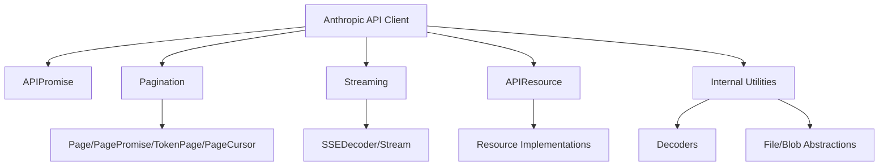
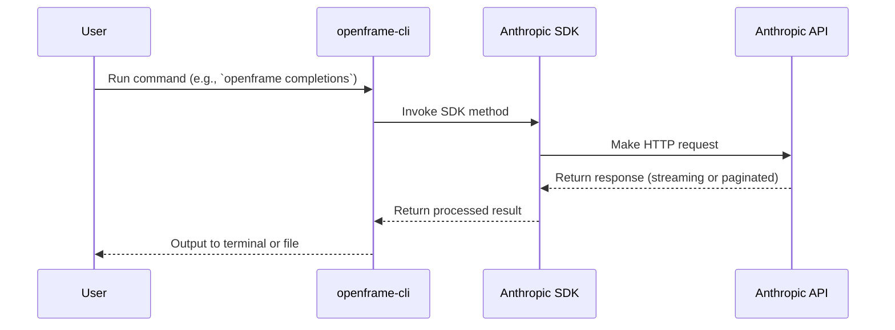

# openframe-cli Repository Overview

## Purpose

The `openframe-cli` repository provides a command-line interface (CLI) for interacting with Anthropic's Claude API and related services. It is built on top of the official Anthropic SDK, enabling developers and power users to access Claude's capabilities—such as text completions, conversational messaging, model management, and tool integrations—directly from the terminal or within scripts. The CLI leverages the SDK's robust abstractions for API communication, streaming, pagination, and resource management, making it a powerful tool for automation, prototyping, and operational workflows.

---

## End-to-End Architecture

The architecture of `openframe-cli` is modular and layered, relying on the Anthropic SDK's core, resource, and utility modules. Below are high-level diagrams illustrating the relationships and data flow.

### High-Level System Architecture

```mermaid
graph TD
    A[User (CLI Command)] --> B[openframe-cli CLI]
    B --> C[Anthropic SDK]
    C --> D[Core Module]
    C --> E[Resources (Stable/Beta)]
    C --> F[Lib (Tool Runners, Streams)]
    D -->|API Calls| G[Anthropic API]
```

### SDK Core Module Architecture



### Data Flow: CLI to API



---

## Repository Structure

```
openframe-cli/
├── core/                # Anthropic SDK core abstractions (API client, pagination, streaming, etc.)
├── lib/                 # Higher-level utilities (tool runners, message streams)
├── resources_beta/      # Beta/experimental API resources
├── resources_stable/    # Stable, production-ready API resources
├── src/                 # Source code (TypeScript/JavaScript)
└── ...                  # CLI entry points, configuration, docs, etc.
```

---

## Core Modules Documentation

### 1. [Core Module](node_modules/@anthropic-ai/sdk/core)
- **Purpose:** Foundational SDK layer for API client, request/response handling, pagination, streaming, and resource abstractions.
- **Key Components:**
  - `Anthropic` (API client)
  - `APIPromise` (SDK-extended Promise)
  - Pagination utilities (`Page`, `TokenPage`, etc.)
  - Streaming utilities (`SSEDecoder`, `Stream`)
  - `APIResource` (base class for resources)
  - Internal utilities (decoders, file abstractions)
- **Documentation:**  
  See [Core Module Documentation](node_modules/@anthropic-ai/sdk/core/docs)

### 2. [resources_stable Module](node_modules/@anthropic-ai/sdk/resources)
- **Purpose:** Stable, production-ready Claude API resources (completions, messages, models).
- **Key Components:**
  - `Completions` (legacy text completions)
  - `Messages` (modern conversational API)
  - `Models` (model discovery and metadata)
- **Documentation:**  
  See [resources_stable Module Documentation](node_modules/@anthropic-ai/sdk/resources/docs)

### 3. [resources_beta Module](node_modules/@anthropic-ai/sdk/resources/beta)
- **Purpose:** Beta/experimental Claude API resources (advanced messaging, skills, files, etc.).
- **Key Components:**
  - `Beta`, `Files`, `Messages`, `Models`, `Skills`, `Versions`
- **Documentation:**  
  (See in-source documentation and type definitions)

### 4. [lib Module](node_modules/@anthropic-ai/sdk/lib)
- **Purpose:** Higher-level abstractions, tool runners, and streaming utilities.
- **Key Components:**
  - `MessageStream`, `BetaMessageStream`
  - `BetaToolRunner`, `ToolRunner`
- **Documentation:**  
  (See in-source documentation and type definitions)

---

## References

- [Core Module Documentation](node_modules/@anthropic-ai/sdk/core/docs)
- [resources_stable Module Documentation](node_modules/@anthropic-ai/sdk/resources/docs)
- [resources_beta Module Documentation](node_modules/@anthropic-ai/sdk/resources/beta)
- [lib Module Documentation](node_modules/@anthropic-ai/sdk/lib)

---

*For more details on CLI usage and available commands, see the repository's README and command help output.*