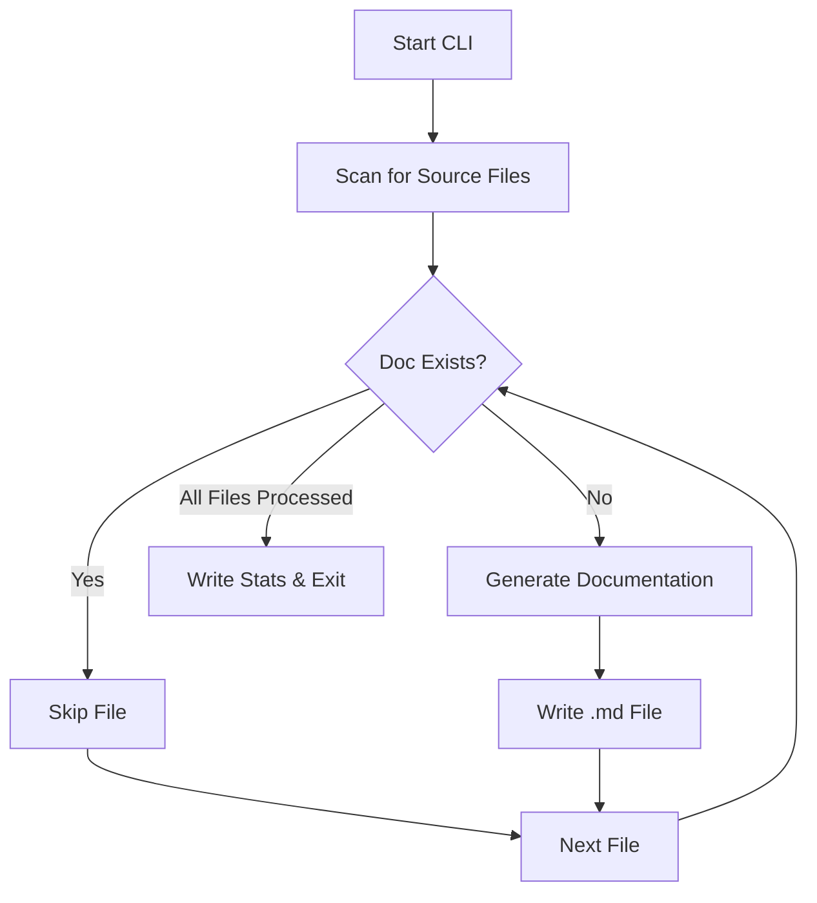
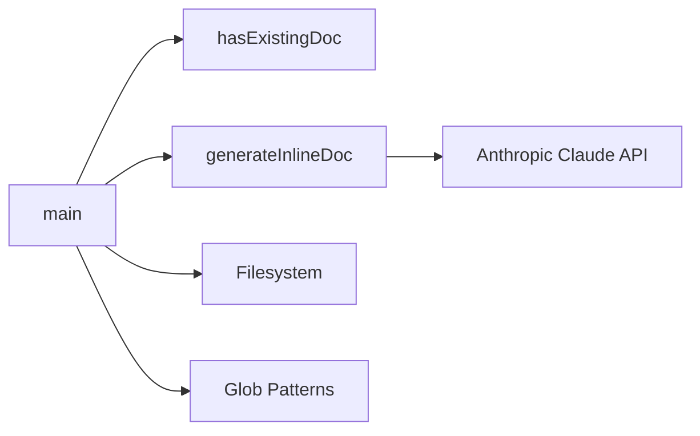
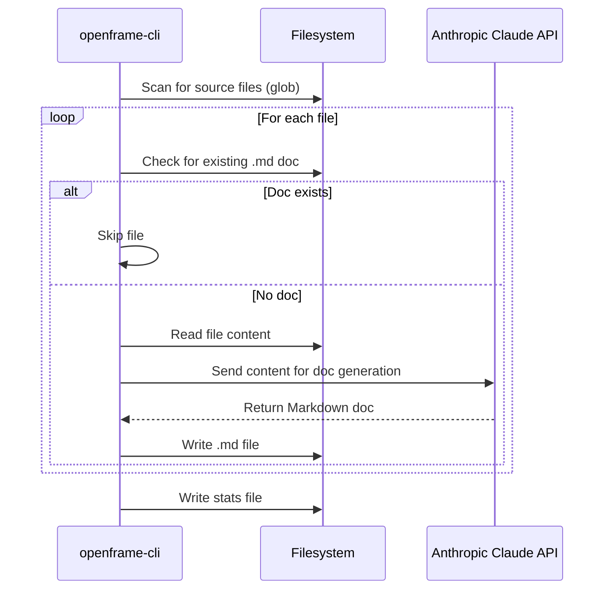

# openframe-cli Module Documentation

## Introduction

The `openframe-cli` module provides an automated command-line tool for generating concise, developer-friendly documentation for source code files across multiple programming languages and project structures. It leverages the Anthropic Claude API to analyze source files and produce Markdown documentation, streamlining the process of maintaining up-to-date inline documentation for large, polyglot codebases.

## Core Functionality

The primary functionality of the `openframe-cli` module is to scan a repository for source files, determine which files lack corresponding documentation, and generate Markdown documentation for those files using an AI-powered approach. The module is designed to be extensible, supporting a wide range of languages and project layouts, and can be configured to limit the number of files processed in a single run.

### Key Components

- **`main`**: Orchestrates the CLI workflow, including file discovery, filtering, documentation generation, and reporting.
- **`generateInlineDoc`**: Handles the process of generating documentation for a single source file by invoking the Anthropic Claude API and writing the resulting Markdown file.
- **`hasExistingDoc`**: Checks if a documentation file already exists for a given source file to avoid redundant generation.

## Architecture Overview

The `openframe-cli` module is structured as a single entry-point script that coordinates the documentation generation process. It interacts with the filesystem, uses glob patterns to discover source files, and communicates with the Anthropic Claude API for documentation synthesis.

## Component Relationships

- The `main` function coordinates the overall process, calling `hasExistingDoc` to check for existing documentation and `generateInlineDoc` to create new docs as needed.
- `generateInlineDoc` interacts with the Anthropic Claude API to generate documentation content.
- The module uses Node.js `fs` and `glob` libraries for file operations and pattern matching.

## Data Flow

## Process Flow

1. **Scan for Source Files**: Uses a comprehensive set of glob patterns to identify source files across multiple languages and project structures.
2. **Check for Existing Documentation**: For each file, checks if a corresponding `.md` file exists.
3. **Generate Documentation**: For files without documentation, reads the file content and sends it to the Anthropic Claude API for documentation generation.
4. **Write Documentation**: Saves the generated documentation as a Markdown file alongside the source file.
5. **Reporting**: Logs statistics on generated, skipped, and errored files for later review.

## Integration with the Overall System

The `openframe-cli` module is designed to be used as a standalone CLI tool or as part of a larger documentation automation pipeline. It can be integrated with other modules responsible for documentation aggregation, publishing, or quality checks. For more information on how documentation files are managed and published, see the [openframe-docs](openframe-docs.md) module documentation.

## References

- [openframe-docs.md](openframe-docs.md): For details on documentation aggregation and publishing workflows.
- [Anthropic Claude API](https://docs.anthropic.com/claude/docs/api-overview): For information on the AI model used for documentation generation.

---

*This documentation was generated to provide a comprehensive overview of the `openframe-cli` module, its architecture, and its role within the broader system.*
