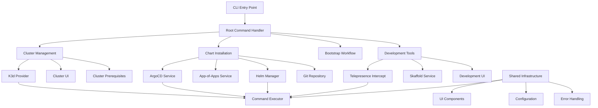
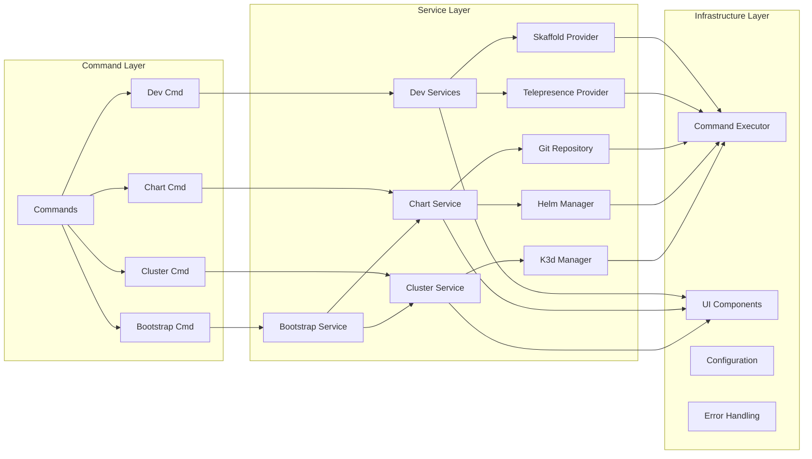
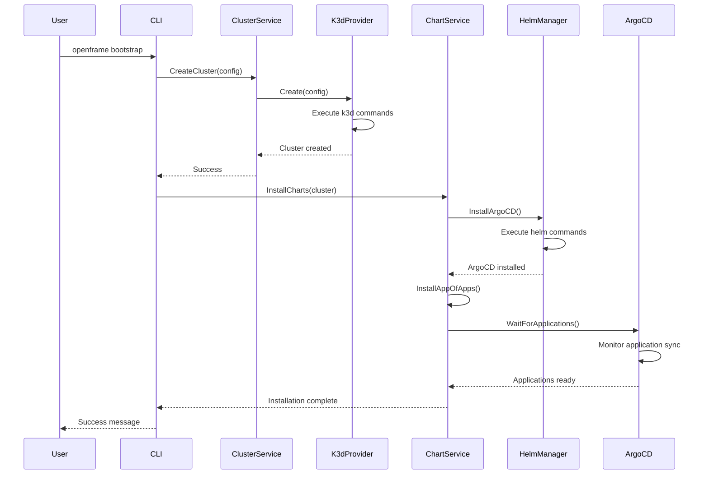

# openframe-cli Module Documentation

# OpenFrame CLI Architecture Documentation

## Overview

OpenFrame CLI is a comprehensive command-line tool for managing Kubernetes clusters and development workflows. It provides interactive cluster management with K3d support, ArgoCD-based GitOps deployment, and development tools including Telepresence traffic interception and Skaffold workflows for local Kubernetes development.

## Architecture



## Core Components

| Component | Package | Responsibility |
|-----------|---------|----------------|
| **CLI Commands** | `cmd/` | Cobra-based command definitions and flag handling |
| **Cluster Management** | `internal/cluster/` | K3d cluster lifecycle, providers, and status management |
| **Chart Services** | `internal/chart/` | ArgoCD and Helm chart installation with GitOps workflows |
| **Bootstrap Orchestration** | `internal/bootstrap/` | Combined cluster + chart installation workflow |
| **Development Tools** | `internal/dev/` | Telepresence intercepts and Skaffold development workflows |
| **Shared Infrastructure** | `internal/shared/` | Command execution, UI components, configuration, and utilities |
| **Prerequisites** | `*/prerequisites/` | Tool validation and automatic installation (Docker, k3d, kubectl, etc.) |
| **User Interface** | `*/ui/` | Interactive prompts, wizards, and progress indicators |

## Component Relationships



## Data Flow



## Key Files

| File | Purpose |
|------|---------|
| `main.go` | Application entry point and CLI initialization |
| `cmd/root.go` | Root command configuration and global flags |
| `internal/cluster/service.go` | Core cluster management business logic |
| `internal/cluster/providers/k3d/manager.go` | K3d cluster provider implementation |
| `internal/chart/services/chart_service.go` | Chart installation orchestration |
| `internal/bootstrap/service.go` | Combined cluster + chart workflow |
| `internal/shared/executor/executor.go` | Command execution abstraction |
| `internal/shared/ui/logo.go` | CLI branding and user interface |
| `internal/dev/services/intercept/service.go` | Telepresence traffic interception |
| `internal/dev/services/scaffold/service.go` | Skaffold development workflows |

## Dependencies

The project leverages several key external dependencies:

- **Cobra & Viper**: CLI framework and configuration management
- **pterm**: Terminal UI components for progress indicators and interactive prompts
- **promptui & manifoldco**: Interactive user input and selection menus
- **testify & stretchr**: Testing framework for unit and integration tests
- **golang.org/x/term**: Terminal handling for interactive features
- **gopkg.in/yaml.v3**: YAML parsing for configuration files

The CLI acts as an orchestrator, executing external tools:
- **k3d**: Kubernetes cluster management
- **helm**: Chart installation and management
- **kubectl**: Kubernetes API interaction
- **telepresence**: Development traffic interception
- **skaffold**: Development workflow automation

## CLI Commands

| Command | Subcommands | Purpose |
|---------|-------------|---------|
| `cluster` | `create`, `delete`, `list`, `status`, `cleanup` | K3d cluster lifecycle management |
| `chart` | `install` | ArgoCD and app-of-apps installation |
| `bootstrap` | - | Combined cluster creation + chart installation |
| `dev` | `intercept`, `skaffold` | Development workflow tools |

### Usage Examples

```bash
# Quick start - create cluster and install OpenFrame
openframe bootstrap

# Cluster management
openframe cluster create my-dev-cluster
openframe cluster status my-dev-cluster
openframe cluster delete my-dev-cluster

# Chart installation
openframe chart install --deployment-mode=oss-tenant

# Development workflows
openframe dev intercept my-service --port 8080
openframe dev skaffold my-cluster
```

### Key Features

- **Interactive Wizards**: Step-by-step cluster configuration and deployment setup
- **Prerequisites Management**: Automatic detection and installation of required tools
- **Error Recovery**: Comprehensive error handling with troubleshooting guidance
- **Development Integration**: Seamless local development with traffic interception and hot reloading
- **GitOps Ready**: ArgoCD-based deployment with app-of-apps pattern support
