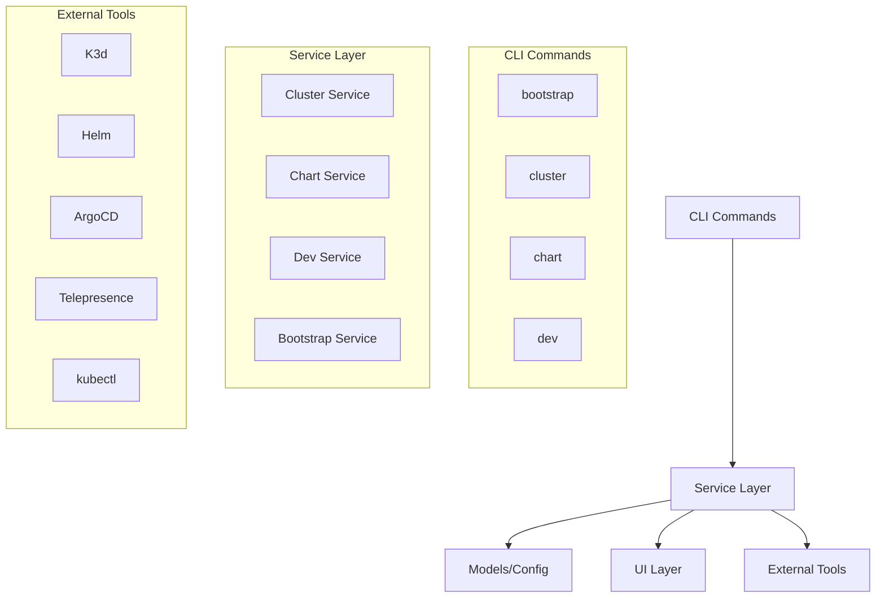
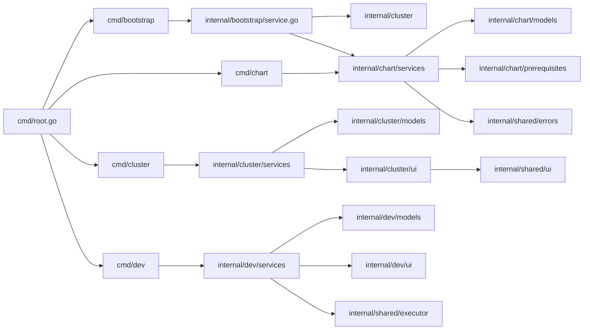
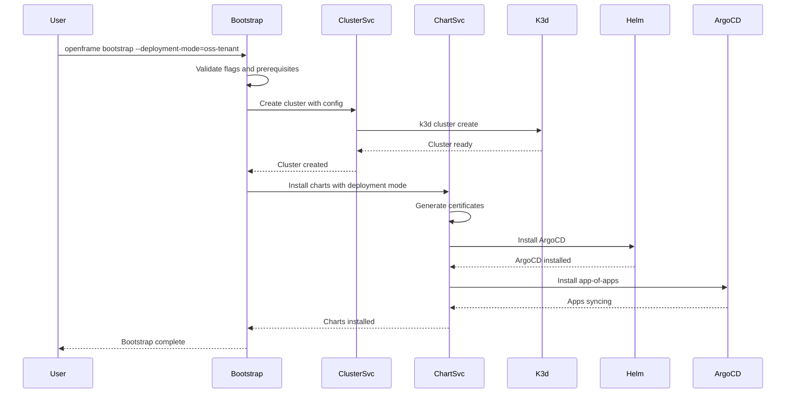

# openframe-cli Module Documentation

# OpenFrame CLI Architecture Documentation

## Overview

OpenFrame CLI is a modern command-line tool built in Go that provides interactive Kubernetes cluster management and development workflow automation. It replaces shell scripts with a wizard-style interface for bootstrapping OpenFrame Kubernetes deployments, managing K3d clusters, installing Helm charts with ArgoCD, and providing developer tools like Telepresence traffic interception.

## Architecture

The CLI follows a layered architecture with clear separation between command handling, business logic, and external integrations:



## Core Components

| Component | Package | Responsibility |
|-----------|---------|----------------|
| **Root Command** | `cmd/root.go` | Main CLI entry point, command routing, version management |
| **Bootstrap Service** | `internal/bootstrap/` | Orchestrates cluster creation + chart installation |
| **Cluster Management** | `internal/cluster/` | K3d cluster lifecycle, status monitoring, cleanup |
| **Chart Management** | `internal/chart/` | Helm chart installation, ArgoCD deployment |
| **Dev Tools** | `internal/dev/` | Telepresence intercepts, Skaffold workflows |
| **UI Layer** | `internal/*/ui/` | Interactive prompts, progress display, error handling |
| **Prerequisites** | `internal/*/prerequisites/` | Tool validation and auto-installation |
| **Shared Services** | `internal/shared/` | Common utilities, error handling, configuration |

## Component Relationships



## Data Flow

The following sequence shows the bootstrap command flow, which demonstrates the typical orchestration pattern:



## Key Files

| File | Purpose |
|------|---------|
| `cmd/root.go` | Main CLI structure, global flags, version handling |
| `internal/bootstrap/service.go` | Orchestrates full OpenFrame setup workflow |
| `internal/cluster/models/config.go` | Cluster configuration and validation |
| `internal/chart/services/install.go` | ArgoCD and app-of-apps installation logic |
| `internal/dev/services/intercept/service.go` | Telepresence traffic interception |
| `internal/shared/ui/logo.go` | Consistent branding and user interface |
| `internal/shared/errors/handler.go` | Centralized error handling and display |

## Dependencies

The project integrates with several external tools and libraries:

- **Cobra CLI Framework**: Command structure, flag parsing, help generation
- **PTerm**: Interactive prompts, progress bars, styled terminal output
- **K3d**: Local Kubernetes cluster management via subprocess execution
- **Helm**: Chart installation and management through CLI calls
- **kubectl**: Kubernetes cluster interaction and status checking
- **Telepresence**: Development traffic interception for local debugging
- **Skaffold**: Live code reloading and development workflows
- **mkcert**: Automatic TLS certificate generation for local development

## CLI Commands

| Command | Subcommands | Description |
|---------|-------------|-------------|
| `openframe bootstrap` | - | Full environment setup (cluster + charts) |
| `openframe cluster` | create, delete, list, status, cleanup | K3d cluster lifecycle management |
| `openframe chart` | install | ArgoCD and app-of-apps installation |
| `openframe dev` | intercept, skaffold | Development workflow tools |

### Key Command Examples

```bash
# Complete OpenFrame setup
openframe bootstrap --deployment-mode=oss-tenant

# Create cluster with custom configuration
openframe cluster create --nodes 3 --skip-wizard

# Install ArgoCD with specific branch
openframe chart install --github-branch develop

# Intercept service traffic for local development
openframe dev intercept my-service --port 8080
```

The CLI provides both interactive wizard modes for new users and flag-based operation for automation, with comprehensive error handling and prerequisite validation throughout all workflows.
