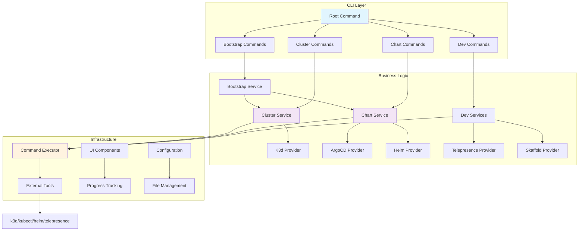
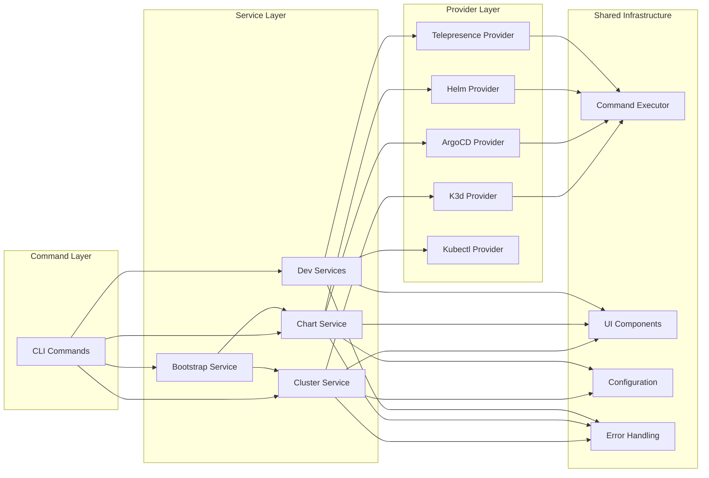
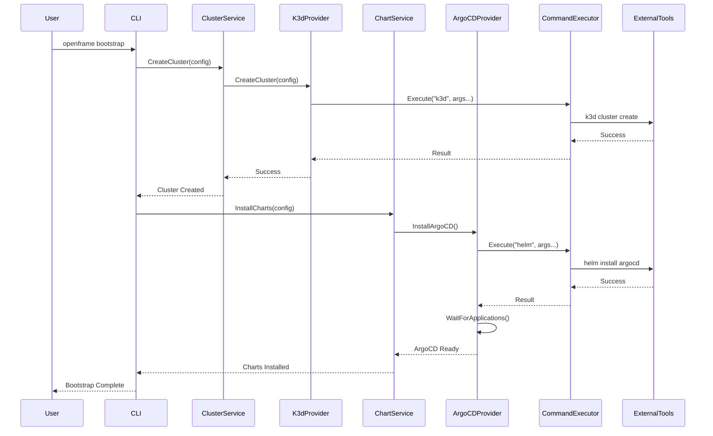

# openframe-cli Module Documentation

# OpenFrame CLI Architecture Documentation

## Overview

OpenFrame CLI is a modern command-line tool for managing Kubernetes clusters and development workflows. It provides interactive wizards for cluster creation, chart installation with ArgoCD, and development tools like Telepresence intercepts and Skaffold workflows, replacing shell scripts with a robust Go-based CLI.

## Architecture

## Core Components

| Component | Package | Responsibility |
|-----------|---------|----------------|
| **CLI Commands** | `cmd/*` | Command definitions, flag parsing, user interaction |
| **Cluster Service** | `internal/cluster` | Cluster lifecycle management (create, delete, list, status) |
| **Chart Service** | `internal/chart` | Helm chart and ArgoCD installation management |
| **Bootstrap Service** | `internal/bootstrap` | Orchestrates cluster creation + chart installation |
| **Dev Services** | `internal/dev` | Development workflow tools (intercept, scaffold) |
| **Command Executor** | `internal/shared/executor` | Abstraction for external command execution |
| **UI Components** | `internal/shared/ui` | Interactive prompts, progress indicators, display |
| **K3d Provider** | `internal/cluster/providers/k3d` | K3d-specific cluster operations |
| **ArgoCD Provider** | `internal/chart/providers/argocd` | ArgoCD installation and application sync |
| **Telepresence Provider** | `internal/dev/providers/telepresence` | Traffic interception for development |

## Component Relationships

## Data Flow

## Key Files

| File | Purpose |
|------|---------|
| `main.go` | Application entry point |
| `cmd/root.go` | Root command definition with version info |
| `cmd/bootstrap/bootstrap.go` | Bootstrap command combining cluster + chart operations |
| `internal/cluster/service.go` | Core cluster management business logic |
| `internal/chart/services/chart_service.go` | Chart installation orchestration |
| `internal/shared/executor/executor.go` | Command execution abstraction |
| `internal/cluster/providers/k3d/manager.go` | K3d cluster provider implementation |
| `internal/chart/providers/argocd/wait.go` | ArgoCD application synchronization logic |
| `internal/shared/ui/logo.go` | CLI branding and visual elements |
| `internal/dev/services/intercept/service.go` | Telepresence traffic interception |

## Dependencies

The project leverages several key external libraries:

- **Cobra** (`spf13/cobra`): CLI framework for command structure and flag parsing
- **PTerm** (`pterm/pterm`): Terminal UI components for progress indicators and interactive elements
- **PromptUI** (`manifoldco/promptui`): Interactive prompts for user input
- **YAML** (`gopkg.in/yaml.v3`): Configuration file parsing for Helm values
- **Testify** (`stretchr/testify`): Testing framework for unit and integration tests

The CLI acts as an orchestrator that shells out to external Kubernetes tools:
- **k3d**: Local Kubernetes cluster management
- **kubectl**: Kubernetes API interaction
- **helm**: Chart installation and management
- **telepresence**: Development traffic interception
- **skaffold**: Development workflow automation

## CLI Commands

| Command | Description | Example |
|---------|-------------|---------|
| `openframe cluster create` | Create a new Kubernetes cluster | `openframe cluster create my-cluster` |
| `openframe cluster list` | List all managed clusters | `openframe cluster list` |
| `openframe cluster status` | Show detailed cluster information | `openframe cluster status my-cluster` |
| `openframe cluster delete` | Remove a cluster | `openframe cluster delete my-cluster` |
| `openframe chart install` | Install ArgoCD and charts | `openframe chart install my-cluster` |
| `openframe bootstrap` | Complete cluster + chart setup | `openframe bootstrap --deployment-mode=oss-tenant` |
| `openframe dev intercept` | Intercept service traffic | `openframe dev intercept my-service --port 8080` |
| `openframe dev skaffold` | Run development workflow | `openframe dev skaffold my-cluster` |

The CLI provides both interactive wizards and flag-based automation, supporting both developer workflows and CI/CD integration.
