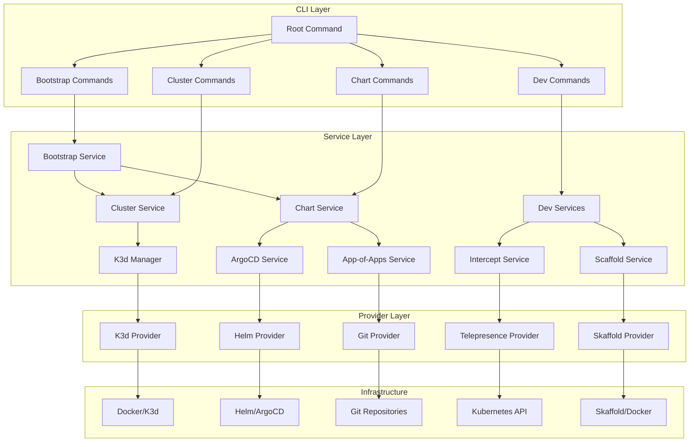
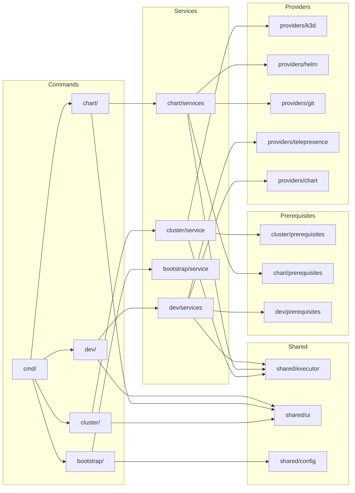
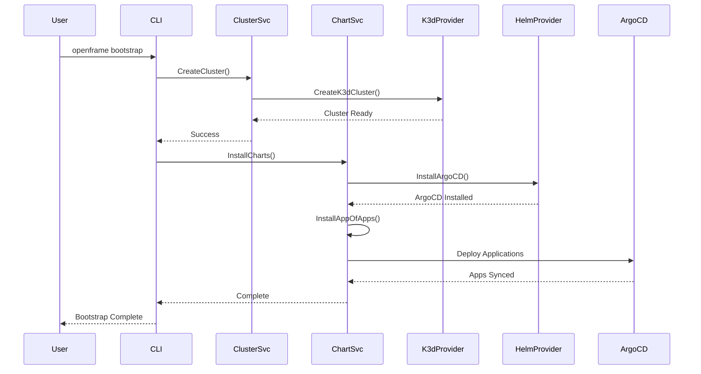
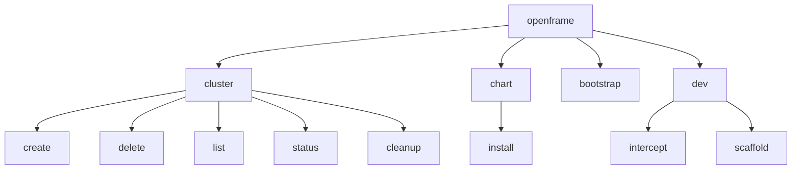

# openframe-cli Module Documentation

# OpenFrame CLI Architecture Documentation

## Overview

OpenFrame CLI is a modern command-line tool for managing Kubernetes clusters and development workflows. It provides an interactive wizard-style interface for bootstrapping OpenFrame deployments on Kubernetes, managing K3d clusters locally, installing ArgoCD with chart management, and supporting developer workflows with Telepresence intercepts and Skaffold scaffolding.

## Architecture

The CLI follows a layered architecture with clear separation between command handling, business logic, and infrastructure concerns:

## Core Components

| Component | Package | Responsibility |
|-----------|---------|---------------|
| **Root Command** | `cmd/` | CLI entry point and command orchestration |
| **Cluster Management** | `internal/cluster/` | K3d cluster lifecycle management |
| **Chart Management** | `internal/chart/` | ArgoCD and Helm chart installation |
| **Bootstrap Service** | `internal/bootstrap/` | Combined cluster + chart setup workflow |
| **Dev Tools** | `internal/dev/` | Developer workflows (intercept, scaffold) |
| **UI Components** | `internal/shared/ui/` | Interactive prompts and display logic |
| **Command Execution** | `internal/shared/executor/` | Abstraction for external command execution |
| **Prerequisites** | `internal/*/prerequisites/` | Tool validation and installation |
| **Providers** | `internal/*/providers/` | External tool integrations |
| **Configuration** | `internal/shared/config/` | System configuration management |

## Component Relationships

## Data Flow

## Key Files

| File | Purpose |
|------|---------|
| `main.go` | Application entry point |
| `cmd/root.go` | Root command definition and CLI structure |
| `internal/cluster/service.go` | Core cluster management business logic |
| `internal/chart/services/chart_service.go` | Chart installation orchestration |
| `internal/bootstrap/service.go` | Combined bootstrap workflow |
| `internal/shared/executor/executor.go` | Command execution abstraction |
| `internal/cluster/providers/k3d/manager.go` | K3d cluster provider implementation |
| `internal/chart/providers/helm/manager.go` | Helm chart management |
| `internal/dev/services/intercept/service.go` | Telepresence intercept management |
| `internal/shared/ui/logo.go` | CLI branding and user interface |

## Dependencies

The project manages its dependencies through Go modules and integrates with external tools:

**External Tool Dependencies:**
- **Docker**: Required for K3d cluster management
- **K3d**: Kubernetes cluster creation and management  
- **Kubectl**: Kubernetes API interaction
- **Helm**: Chart installation and management
- **ArgoCD**: GitOps application deployment
- **Telepresence**: Service traffic interception
- **Skaffold**: Development workflow automation

**Library Dependencies:**
- **Cobra**: CLI framework for command structure
- **PTerm**: Terminal UI components and styling
- **Promptui**: Interactive prompts and selections
- **YAML**: Configuration file parsing

## CLI Commands

### Core Commands

| Command | Description | Example |
|---------|-------------|---------|
| `openframe bootstrap` | Complete environment setup (cluster + charts) | `openframe bootstrap --deployment-mode=oss-tenant` |
| `openframe cluster create` | Create new K3d cluster | `openframe cluster create my-cluster` |
| `openframe cluster list` | List all managed clusters | `openframe cluster list` |
| `openframe cluster delete` | Remove cluster and resources | `openframe cluster delete my-cluster` |
| `openframe chart install` | Install ArgoCD and charts | `openframe chart install` |
| `openframe dev intercept` | Intercept service traffic | `openframe dev intercept my-service --port 8080` |
| `openframe dev scaffold` | Deploy with live reloading | `openframe dev scaffold --port 8080` |

### Command Structure

The CLI supports both interactive wizard mode (default) and flag-based automation mode for CI/CD environments. Each command includes comprehensive help, validation, and error handling with troubleshooting suggestions.
