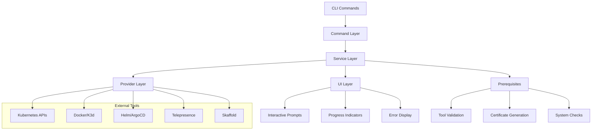
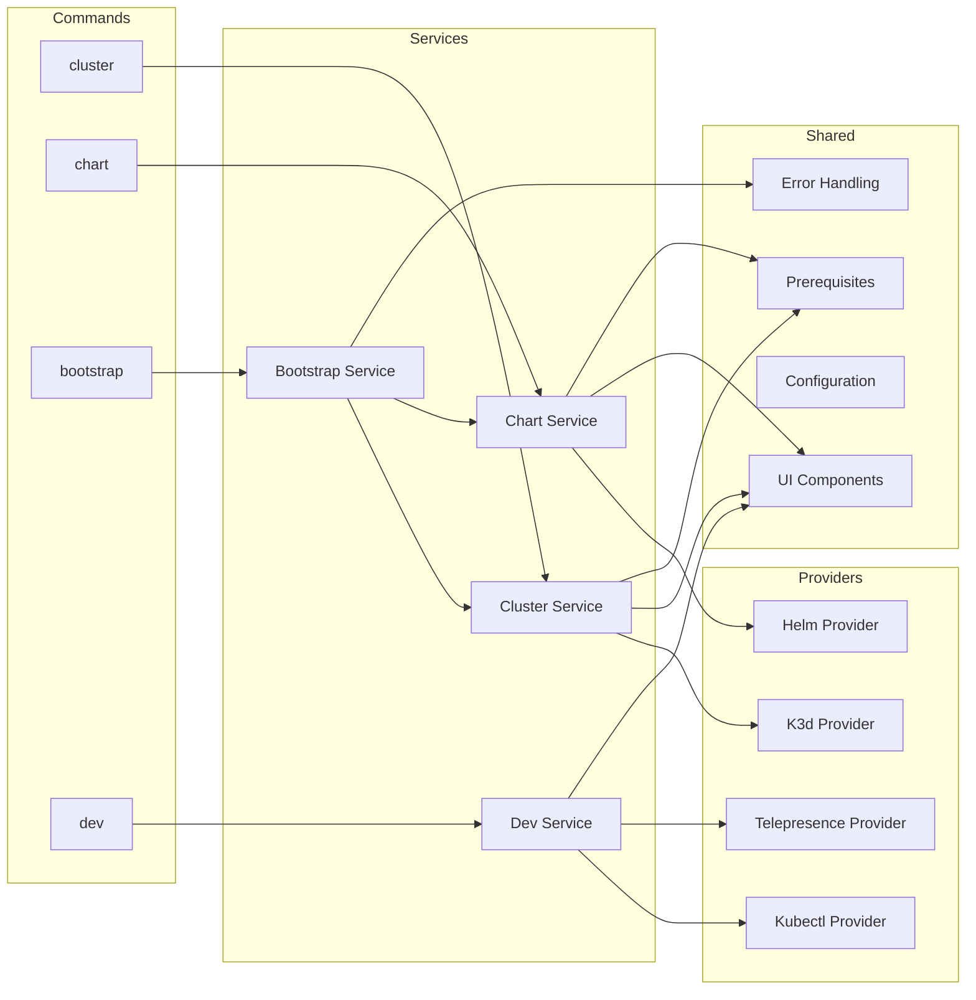
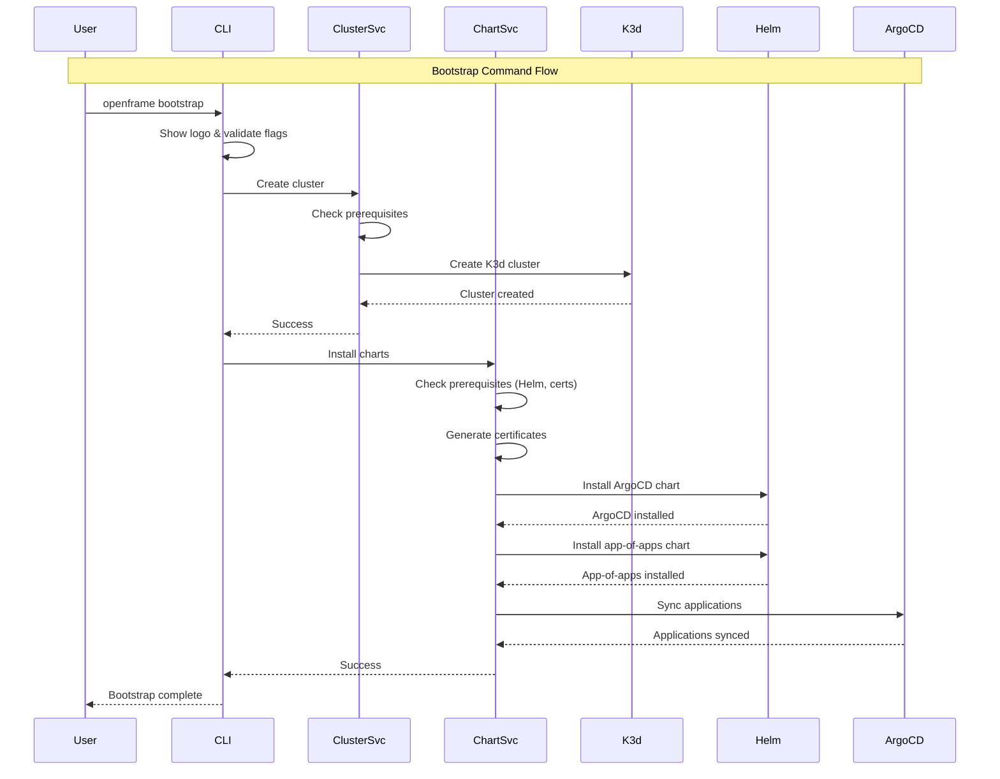

# openframe-cli Module Documentation

# OpenFrame CLI Architecture Documentation

## Overview

OpenFrame CLI is a modern command-line tool for managing OpenFrame Kubernetes clusters and development workflows. It provides interactive wizards for cluster creation, Helm chart management with ArgoCD, and development tools like Telepresence traffic interception and Skaffold scaffolding.

## Architecture

The CLI follows a layered architecture with clear separation of concerns between command handling, business logic, and external integrations.



## Core Components

| Component | Package | Responsibility |
|-----------|---------|---------------|
| Command Layer | `cmd/*` | CLI command definitions, argument parsing, flag validation |
| Cluster Service | `internal/cluster` | K3d cluster lifecycle management, status monitoring |
| Chart Service | `internal/chart` | Helm chart installation, ArgoCD management |
| Bootstrap Service | `internal/bootstrap` | Orchestrates cluster creation + chart installation |
| Dev Tools | `internal/dev` | Telepresence intercepts, Skaffold workflows |
| Prerequisites | `*/prerequisites` | Tool validation and automatic installation |
| UI Layer | `*/ui` | Interactive prompts, progress display, error handling |
| Shared Services | `internal/shared` | Common utilities, configuration, error handling |

## Component Relationships



## Data Flow



## Key Files

| File | Purpose |
|------|---------|
| `cmd/root.go` | Root CLI command with version info and global flags |
| `cmd/bootstrap/bootstrap.go` | Bootstrap command orchestrating cluster + chart setup |
| `internal/bootstrap/service.go` | Bootstrap service coordinating cluster and chart services |
| `internal/cluster/cluster.go` | Main cluster service with K3d management |
| `internal/chart/services/install.go` | Chart installation service with ArgoCD setup |
| `internal/dev/services/intercept/service.go` | Telepresence traffic interception |
| `internal/shared/ui/logo.go` | Consistent UI branding across commands |
| `internal/shared/errors/handler.go` | Centralized error handling and display |

## Dependencies

The project integrates with several external tools through provider abstractions:

- **Kubernetes**: Uses `kubectl` for cluster communication and resource management
- **K3d**: Lightweight Kubernetes distribution for local development clusters  
- **Helm**: Package manager for Kubernetes applications and charts
- **ArgoCD**: GitOps continuous delivery tool for application management
- **Telepresence**: Traffic interception for local development debugging
- **Skaffold**: Development workflow automation with live reloading
- **mkcert**: Local certificate authority for HTTPS development

## CLI Commands

### Cluster Management
```bash
openframe cluster create [name]        # Create new K3d cluster
openframe cluster delete [name]        # Delete cluster and resources
openframe cluster list                 # Show all clusters
openframe cluster status [name]        # Display cluster details
openframe cluster cleanup [name]       # Remove unused resources
```

### Chart Management  
```bash
openframe chart install [cluster]      # Install ArgoCD and app-of-apps
```

### Bootstrap
```bash
openframe bootstrap [cluster]          # Create cluster + install charts
openframe bootstrap --deployment-mode=oss-tenant --non-interactive
```

### Development Tools
```bash
openframe dev intercept [service]      # Intercept service traffic locally
openframe dev skaffold [cluster]       # Run development workflow
```

### Global Flags
- `--verbose, -v`: Enable detailed logging
- `--dry-run`: Show what would be done without executing
- `--non-interactive`: Skip prompts for automation
