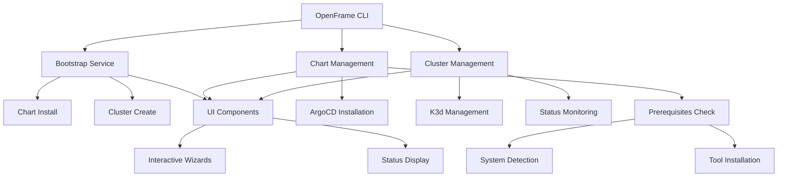
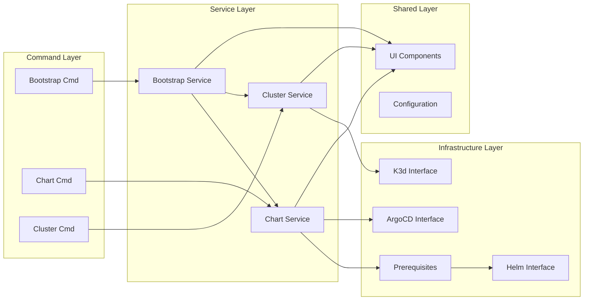
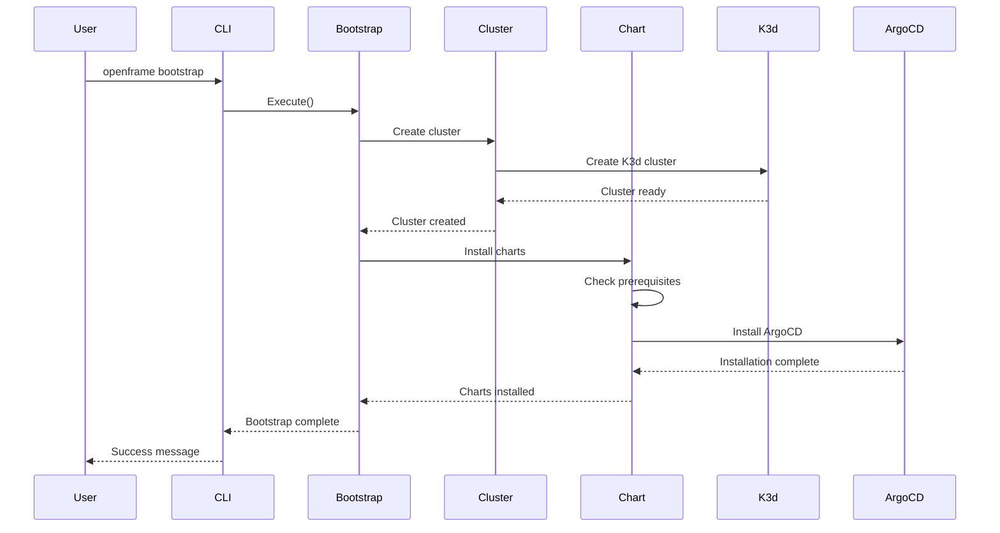

# openframe-cli Module Documentation

# OpenFrame CLI Architecture Documentation

## Overview

OpenFrame CLI is a modern command-line tool for managing OpenFrame Kubernetes clusters and development workflows. It provides an integrated solution for creating K3d clusters, installing ArgoCD and Helm charts, and bootstrapping complete OpenFrame environments with interactive wizards and automated setup processes.

## Architecture

## Core Components

| Component | Package | Responsibilities |
|-----------|---------|------------------|
| Bootstrap Service | `internal/bootstrap` | Orchestrates complete OpenFrame setup (cluster + charts) |
| Chart Management | `cmd/chart` | Manages Helm charts and ArgoCD installation |
| Cluster Management | `cmd/cluster` | K3d cluster lifecycle operations |
| Prerequisites | `internal/chart/prerequisites` | System requirements validation and tool installation |
| UI Components | `internal/shared/ui` | User interface, interactive prompts, and status display |
| Command Router | `cmd/` | Cobra-based CLI command structure and routing |

## Component Relationships

## Data Flow

## Key Files

| File | Purpose |
|------|---------|
| `cmd/bootstrap/bootstrap.go` | Bootstrap command implementation with deployment modes |
| `cmd/chart/chart.go` | Chart management commands with prerequisites integration |
| `internal/bootstrap/` | Core bootstrap service logic and orchestration |
| `internal/chart/prerequisites/` | System validation and tool installation |
| `internal/shared/ui/` | Shared UI components and interactive elements |

## Dependencies

The project leverages several key dependencies for its functionality:

- **Cobra CLI Framework**: Powers the command structure and argument parsing
- **K3d**: Manages local Kubernetes clusters for development
- **Helm**: Handles chart installation and package management  
- **ArgoCD**: Provides GitOps-based continuous deployment
- **Kubernetes Client**: Interfaces with cluster APIs for status and management
- **Interactive Prompts**: Enables guided wizards and user input collection

## CLI Commands

| Command | Description | Example Usage |
|---------|-------------|---------------|
| `openframe bootstrap` | Complete OpenFrame setup (cluster + charts) | `openframe bootstrap --deployment-mode=oss-tenant` |
| `openframe bootstrap [name]` | Bootstrap with custom cluster name | `openframe bootstrap my-cluster` |
| `openframe bootstrap --non-interactive` | CI/CD mode without prompts | `openframe bootstrap --deployment-mode=saas-shared --non-interactive` |
| `openframe bootstrap -v` | Verbose mode with detailed logs | `openframe bootstrap -v --deployment-mode=oss-tenant` |
| `openframe chart install` | Install ArgoCD on existing cluster | `openframe chart install` |
| `openframe chart install [name]` | Install on specific cluster | `openframe chart install my-cluster` |
| `openframe cluster create` | Create new K3d cluster | `openframe cluster create` |
| `openframe cluster list` | List all clusters | `openframe cluster list` |
| `openframe cluster status` | Show cluster details | `openframe cluster status` |

### Command Flags

- `--deployment-mode`: Skip deployment selection (oss-tenant, saas-tenant, saas-shared)
- `--non-interactive`: Skip all prompts, use existing configuration
- `--verbose, -v`: Show detailed logging including sync progress
