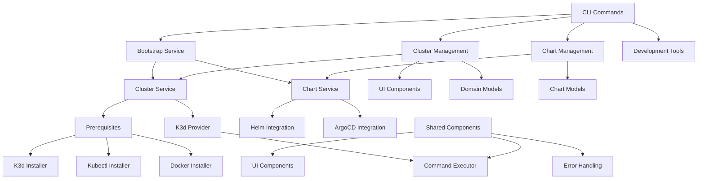
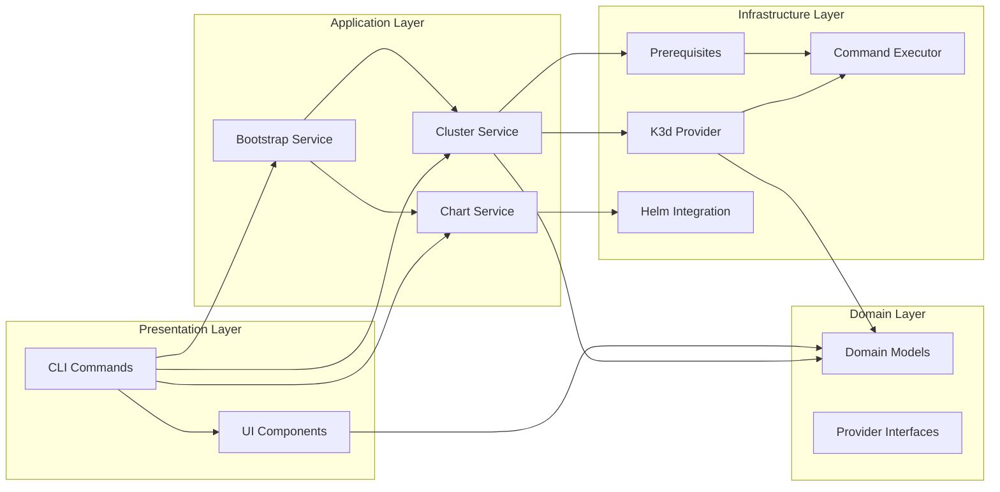
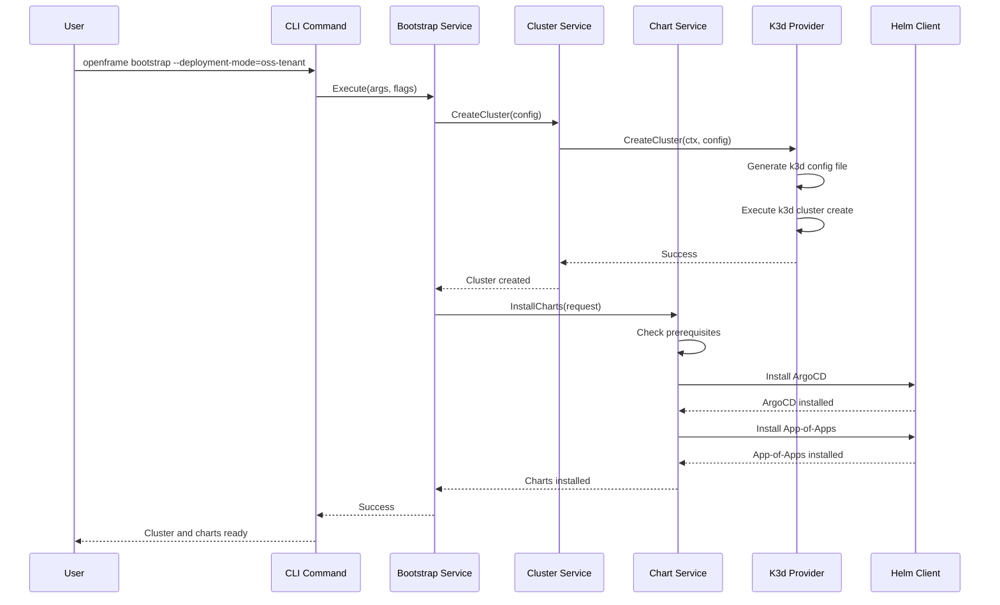

# openframe-cli Module Documentation

# OpenFrame CLI Architecture Documentation

## Overview

OpenFrame CLI is a modern command-line tool for managing OpenFrame Kubernetes clusters and development workflows. It provides a unified interface for creating and managing K3d clusters locally, installing Helm charts, bootstrapping full OpenFrame deployments, and managing development workflows with integrated tools like Skaffold and Telepresence.

## Architecture

The CLI follows a clean architecture pattern with clear separation between presentation, business logic, and infrastructure layers:

## Core Components

| Component | Package | Responsibility |
|-----------|---------|----------------|
| **Bootstrap Service** | `internal/bootstrap` | Orchestrates cluster creation + chart installation |
| **Cluster Management** | `internal/cluster` | K3d cluster lifecycle operations (CRUD) |
| **Chart Management** | `internal/chart` | Helm chart and ArgoCD installation |
| **K3d Provider** | `internal/cluster/providers/k3d` | K3d-specific cluster operations |
| **Prerequisites** | `internal/cluster/prerequisites` | Docker, kubectl, k3d installation |
| **Command Executor** | `internal/shared/executor` | Shell command execution with dry-run support |
| **UI Components** | `internal/cluster/ui`, `internal/shared/ui` | Interactive prompts and display |
| **Domain Models** | `internal/cluster/models` | Business entities and validation |
| **Error Handling** | `internal/shared/errors` | Centralized error management |

## Component Relationships

## Data Flow

## Key Files

| File | Purpose |
|------|---------|
| `internal/bootstrap/service.go` | Main bootstrap orchestrator - coordinates cluster + chart setup |
| `internal/cluster/service.go` | Core cluster management business logic |
| `internal/cluster/providers/k3d/manager.go` | K3d cluster provider implementation |
| `internal/cluster/models/cluster.go` | Domain models for cluster entities |
| `internal/cluster/models/flags.go` | Command flag definitions and validation |
| `internal/cluster/prerequisites/checker.go` | System prerequisite validation |
| `internal/cluster/ui/wizard.go` | Interactive cluster configuration wizard |
| `internal/shared/executor/executor.go` | Command execution abstraction |
| `internal/shared/errors/handler.go` | Centralized error handling |
| `internal/chart/models/appofapps.go` | App-of-Apps configuration model |

## Dependencies

The project leverages several key external libraries:

- **Cobra**: CLI framework for command structure and flag management
- **promptui**: Interactive terminal prompts for user input
- **pterm**: Rich terminal output formatting and colors
- **testify**: Testing framework with assertions and mocks
- **K3d**: Local Kubernetes cluster management via Docker
- **Helm**: Kubernetes package manager integration
- **Docker**: Container runtime for K3d clusters

The architecture abstracts these dependencies through interfaces, allowing for easy testing and potential replacement of underlying implementations.

## CLI Commands

### Core Commands

| Command | Description | Example |
|---------|-------------|---------|
| `openframe bootstrap` | Create cluster + install charts | `openframe bootstrap --deployment-mode=oss-tenant` |
| `openframe cluster create` | Create new K3d cluster | `openframe cluster create my-cluster` |
| `openframe cluster list` | List all clusters | `openframe cluster list` |
| `openframe cluster status` | Show cluster details | `openframe cluster status my-cluster` |
| `openframe cluster delete` | Delete cluster | `openframe cluster delete my-cluster` |
| `openframe cluster start` | Start stopped cluster | `openframe cluster start my-cluster` |
| `openframe cluster cleanup` | Clean up resources | `openframe cluster cleanup my-cluster` |
| `openframe chart install` | Install Helm charts | `openframe chart install --deployment-mode=oss-tenant` |

### Global Flags

- `--verbose, -v`: Enable verbose output
- `--dry-run`: Show what would be done without executing
- `--force, -f`: Skip confirmation prompts
- `--non-interactive`: Run without interactive prompts

### Bootstrap Options

- `--deployment-mode`: Deployment mode (oss-tenant, saas-tenant, saas-shared)
- `--non-interactive`: Skip interactive configuration

The CLI provides both interactive and non-interactive modes, supporting automation while maintaining user-friendly defaults for manual usage.
