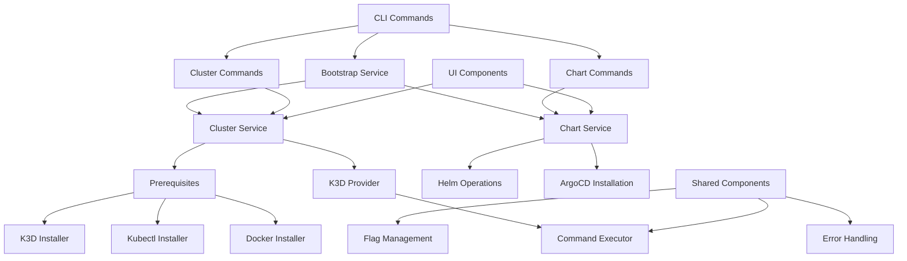
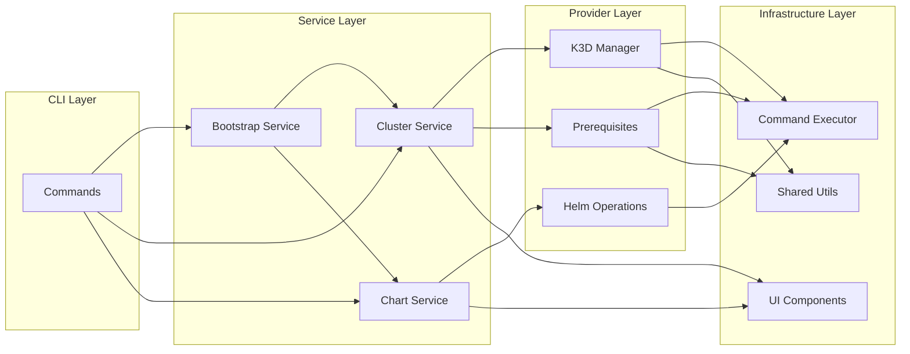
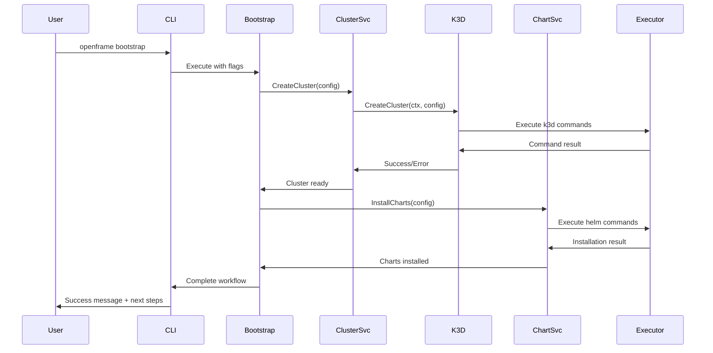

# openframe-cli Module Documentation

# OpenFrame CLI Architecture Documentation

## Overview

OpenFrame CLI is a modern command-line interface tool designed for managing Kubernetes clusters and OpenFrame development workflows. It provides cluster lifecycle management (create, delete, start, status), prerequisite installation (Docker, kubectl, k3d), and chart installation capabilities for bootstrapping OpenFrame environments on local K3D clusters.

## Architecture

## Core Components

| Component | Package | Responsibility |
|-----------|---------|----------------|
| Bootstrap Service | `internal/bootstrap` | Orchestrates cluster creation + chart installation |
| Cluster Service | `internal/cluster` | Manages K3D cluster lifecycle operations |
| Chart Service | `internal/chart` | Handles Helm chart and ArgoCD installations |
| K3D Provider | `internal/cluster/providers/k3d` | K3D-specific cluster operations |
| Prerequisites | `internal/cluster/prerequisites` | System dependency installation |
| Command Executor | `internal/shared/executor` | Abstracted command execution interface |
| UI Components | `internal/cluster/ui`, `internal/shared/ui` | User interface and interaction logic |
| Flag Management | `internal/shared/flags` | Common CLI flag handling |
| Error Handling | `internal/shared/errors` | Centralized error processing |

## Component Relationships

## Data Flow

## Key Files

| File | Purpose |
|------|---------|
| `internal/bootstrap/service.go` | Main bootstrap orchestration logic |
| `internal/cluster/service.go` | Core cluster management business logic |
| `internal/cluster/providers/k3d/manager.go` | K3D cluster provider implementation |
| `internal/cluster/prerequisites/checker.go` | System prerequisite validation |
| `internal/chart/services/install.go` | Chart installation workflow |
| `internal/shared/executor/executor.go` | Command execution abstraction |
| `internal/cluster/models/cluster.go` | Domain models for cluster operations |
| `internal/cluster/ui/wizard.go` | Interactive cluster configuration |

## Dependencies

The project uses several key external dependencies:

- **Cobra**: CLI framework for command structure and flag management
- **pterm**: Terminal UI library for progress indicators, tables, and colored output
- **promptui**: Interactive prompts for user input during wizards
- **testify**: Testing framework with assertions and mocking capabilities

The architecture abstracts external tool dependencies (Docker, kubectl, k3d, helm) through the Command Executor interface, enabling testability and consistent error handling across different operating systems.

## CLI Commands

| Command | Description | Usage |
|---------|-------------|-------|
| `openframe bootstrap` | Complete cluster + chart setup | `openframe bootstrap [cluster-name] --deployment-mode=oss-tenant` |
| `openframe cluster create` | Create new K3D cluster | `openframe cluster create [name] --nodes=3 --version=latest` |
| `openframe cluster list` | List all clusters | `openframe cluster list [--quiet]` |
| `openframe cluster status` | Show cluster details | `openframe cluster status [name] [--detailed]` |
| `openframe cluster delete` | Remove cluster | `openframe cluster delete [name] [--force]` |
| `openframe cluster start` | Start stopped cluster | `openframe cluster start [name]` |
| `openframe cluster cleanup` | Clean up resources | `openframe cluster cleanup [name] [--force]` |
| `openframe chart install` | Install Helm charts | `openframe chart install [cluster] --github-repo=URL --github-branch=main` |

### Global Flags

- `--verbose, -v`: Enable detailed output
- `--dry-run`: Show what would be executed without running commands
- `--force`: Skip confirmation prompts
- `--non-interactive`: Disable interactive prompts for automation
