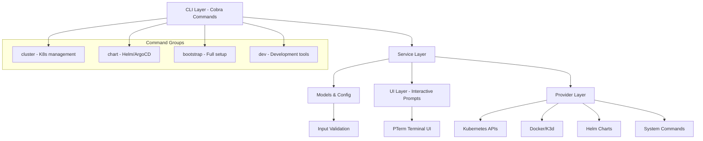
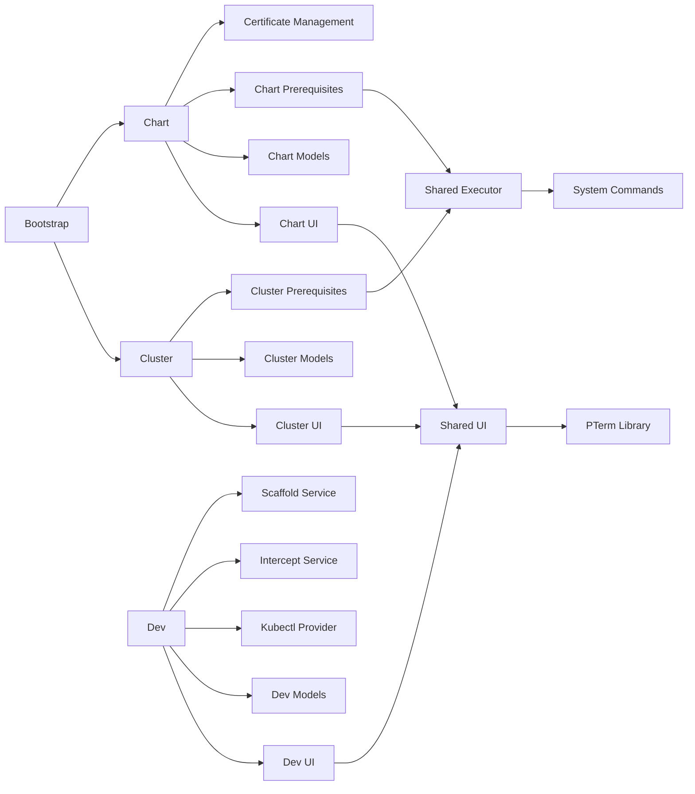
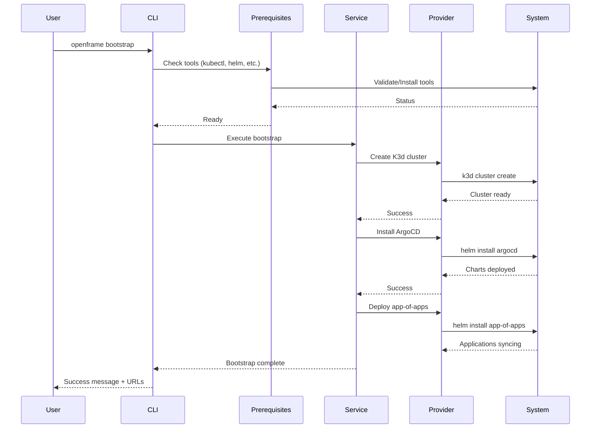

# openframe-cli Module Documentation

# OpenFrame CLI Architecture Documentation

## Overview

OpenFrame CLI is a modern Go-based command-line tool that provides an interactive, wizard-driven interface for managing Kubernetes clusters and OpenFrame deployments. It replaces shell scripts with a structured CLI that handles cluster lifecycle management, Helm chart installations, and development workflows with integrated prerequisite checking and user-friendly prompts.

## Architecture

The CLI follows a layered architecture with clear separation between command handling, business logic, and system interactions:

## Core Components

| Component | Package | Responsibilities |
|-----------|---------|-----------------|
| **Command Layer** | `cmd/*` | Cobra command definitions, flag parsing, command routing |
| **Cluster Service** | `internal/cluster` | K8s cluster lifecycle (create, delete, status, cleanup) |
| **Chart Service** | `internal/chart` | Helm chart management, ArgoCD installation |
| **Bootstrap Service** | `internal/bootstrap` | End-to-end setup orchestration |
| **Dev Tools** | `internal/dev` | Telepresence intercepts, Skaffold workflows |
| **Prerequisites** | `*/prerequisites` | Tool validation and auto-installation |
| **UI Layer** | `*/ui` | Interactive prompts, progress indicators, formatting |
| **Models** | `*/models` | Data structures, validation, configuration |
| **Shared Services** | `internal/shared` | Common utilities, error handling, system interaction |

## Component Relationships

## Data Flow

## Key Files

| File | Purpose |
|------|---------|
| `cmd/root.go` | Root command definition, version info, global configuration |
| `cmd/bootstrap/bootstrap.go` | Bootstrap command - orchestrates full setup |
| `cmd/cluster/cluster.go` | Cluster command group - K8s lifecycle management |
| `cmd/chart/install.go` | Chart installation logic with ArgoCD setup |
| `internal/bootstrap/service.go` | Bootstrap orchestration service |
| `internal/cluster/models/config.go` | Cluster configuration and validation |
| `internal/chart/services/install.go` | Helm chart installation service |
| `internal/chart/prerequisites/certificates/` | TLS certificate generation |
| `internal/shared/executor/executor.go` | Command execution abstraction |
| `internal/shared/ui/logo.go` | Branding and visual elements |

## Dependencies

The project leverages several external libraries for core functionality:

- **Cobra**: Command-line interface framework for command structure and flag parsing
- **PTerm**: Terminal UI library for interactive prompts, progress bars, and formatted output
- **K3d**: Local Kubernetes cluster management (called via system commands)
- **Helm**: Chart installation and management (via system commands and APIs)
- **kubectl**: Kubernetes cluster interaction (system command wrapper)

The CLI acts as an orchestration layer over these tools, providing validation, user experience improvements, and workflow automation.

## CLI Commands

| Command | Description | Key Features |
|---------|-------------|--------------|
| `openframe bootstrap` | Complete environment setup | Cluster creation + chart installation |
| `openframe cluster create` | Create K8s cluster | Interactive wizard, K3d integration |
| `openframe cluster delete` | Remove cluster | Cleanup confirmation, resource removal |
| `openframe cluster list` | Show all clusters | Status display, formatted table |
| `openframe cluster status` | Detailed cluster info | Health checks, application status |
| `openframe chart install` | Install ArgoCD + apps | Certificate generation, app-of-apps pattern |
| `openframe dev intercept` | Traffic interception | Telepresence integration, local development |
| `openframe dev scaffold` | Development environment | Skaffold workflows, live reloading |

All commands support:
- `--verbose` for detailed logging
- `--dry-run` for preview mode
- Interactive selection when names not provided
- Prerequisite validation and auto-installation
