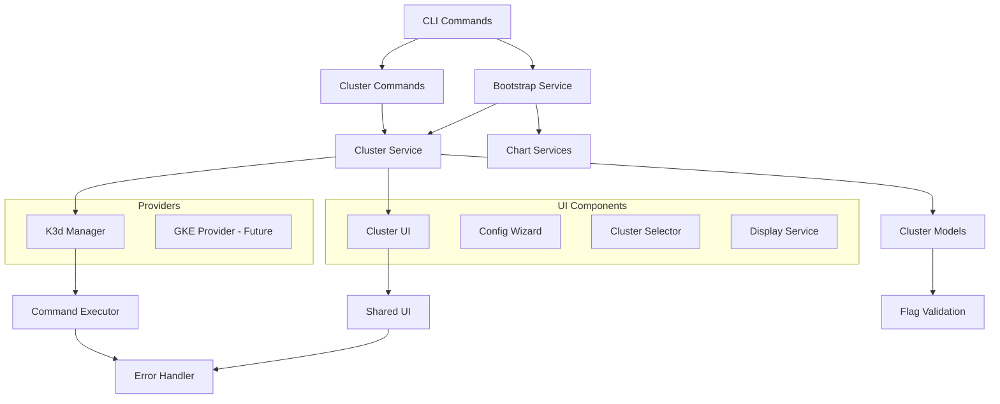
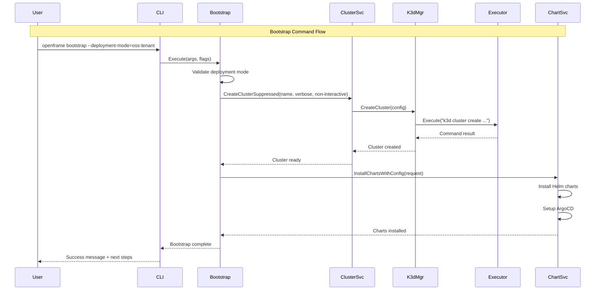

# openframe-cli Module Documentation

# OpenFrame CLI Architecture Documentation

## Overview

OpenFrame CLI is a modern command-line tool for managing OpenFrame Kubernetes clusters and development workflows. It provides automated cluster creation with K3d, chart installation with ArgoCD, and development tools integration for local Kubernetes development environments.

## Architecture

The CLI follows a clean architecture pattern with clear separation of concerns:

- **Command Layer**: Cobra-based CLI commands with flag parsing and validation
- **Service Layer**: Business logic for cluster management and bootstrap operations
- **Provider Layer**: Abstracted cluster providers (K3d, GKE) implementing common interfaces
- **UI Layer**: User interaction components including wizards, selectors, and display services
- **Infrastructure Layer**: Command execution, error handling, and shared utilities

The architecture emphasizes testability, modularity, and extensibility for supporting multiple cluster providers and deployment modes.

## Core Components

### Bootstrap Package (`internal/bootstrap/`)
- **Service**: Orchestrates cluster creation and chart installation workflows
- Supports multiple deployment modes (oss-tenant, saas-tenant, saas-shared)
- Handles both interactive and non-interactive execution flows

### Cluster Package (`internal/cluster/`)
- **Service**: Core cluster lifecycle management (create, delete, start, status)
- **Models**: Domain entities, configuration, and error types
- **Providers**: Abstracted cluster provider implementations
- **UI Components**: User interaction for cluster operations

### Cluster Providers (`internal/cluster/providers/`)
- **K3d Manager**: Local Kubernetes cluster management using K3d
- **Provider Interface**: Contract for implementing new cluster providers

### UI Components (`internal/cluster/ui/`)
- **Wizard**: Interactive cluster configuration flows
- **Selector**: Cluster selection logic for operations
- **Display Service**: Formatted output and status display
- **Operations UI**: User-friendly operation interfaces

### Shared Infrastructure (`internal/shared/`)
- **Executor**: Command execution abstraction for testing
- **Errors**: Centralized error handling and user-friendly messages
- **UI**: Common UI components and utilities
- **Flags**: Shared flag definitions and validation

## Component Relationships



## Data Flow



## Key Files

### Core Service Files
- **`internal/bootstrap/service.go`**: Main bootstrap orchestration logic combining cluster creation and chart installation
- **`internal/cluster/service.go`**: Core cluster management service with lifecycle operations
- **`internal/cluster/providers/k3d/manager.go`**: K3d-specific cluster provider implementation

### Model & Configuration Files
- **`internal/cluster/models/cluster.go`**: Core domain models for clusters, nodes, and configuration
- **`internal/cluster/models/flags.go`**: Command flag definitions and validation logic
- **`internal/cluster/models/provider.go`**: Provider interfaces and service contracts

### UI & User Experience Files
- **`internal/cluster/ui/wizard.go`**: Interactive cluster configuration wizard
- **`internal/cluster/ui/service.go`**: Display services for formatted output
- **`internal/cluster/ui/operations.go`**: User-friendly operation interfaces

### Infrastructure Files
- **`internal/cluster/utils/cmd_helpers.go`**: Command setup, flag management, and error handling
- **`internal/shared/executor/executor.go`**: Command execution abstraction layer

## CLI Commands

### Bootstrap Commands
```bash
# Full OpenFrame bootstrap with interactive mode selection
openframe bootstrap

# Bootstrap with specific deployment mode
openframe bootstrap --deployment-mode=oss-tenant

# Non-interactive bootstrap
openframe bootstrap --deployment-mode=oss-tenant --non-interactive
```

### Cluster Management Commands
```bash
# Create cluster with interactive wizard
openframe cluster create

# Create cluster with specific configuration
openframe cluster create my-cluster --type=k3d --nodes=3

# List all clusters
openframe cluster list

# Check cluster status
openframe cluster status [cluster-name]

# Delete cluster
openframe cluster delete [cluster-name]

# Start stopped cluster  
openframe cluster start [cluster-name]

# Clean up cluster resources
openframe cluster cleanup [cluster-name]
```

### Chart Management Commands
```bash
# Install Helm charts and ArgoCD
openframe chart install [cluster-name]

# Install with specific deployment mode
openframe chart install --deployment-mode=oss-tenant
```

### Development Commands
```bash
# Run Skaffold for service development
openframe dev scaffold

# Intercept service traffic with Telepresence
openframe dev intercept
```
