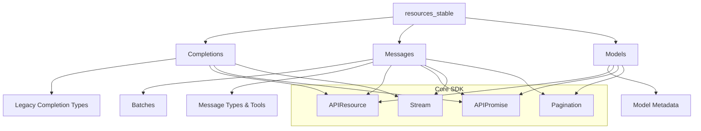
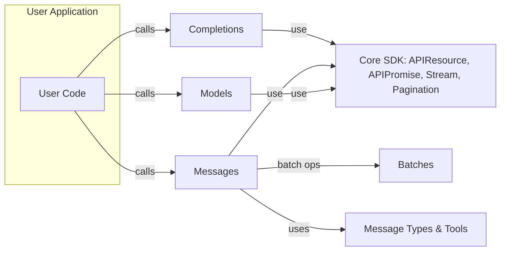

# resources_stable Module Documentation

## Introduction and Purpose

The `resources_stable` module provides the stable, production-ready API resources for interacting with Anthropic's Claude platform. It exposes endpoints for text completions, message-based interactions (including batch processing), and model discovery. This module is intended for developers building robust, maintainable integrations with Claude's core capabilities, and is recommended for all non-experimental use cases.

## Architecture Overview

The module is organized into three primary sub-modules:

- **Completions**: Legacy text completion API (for backward compatibility)
- **Messages**: Modern, structured message-based API (recommended for new development)
- **Models**: Model discovery and metadata

These sub-modules are implemented as classes that extend a common `APIResource` base, ensuring consistent request handling, error management, and extensibility. The module also leverages shared pagination, streaming, and utility components from the core SDK.

### High-Level Architecture

## Sub-Modules and High-Level Functionality

### 1. [Completions](completions.md)
- **Purpose**: Provides the legacy text completion API. Supports both streaming and non-streaming completions. Deprecated in favor of the Messages API.
- **Core Class**: `Completions`
- **Key Features**:
  - Create text completions
  - Streaming and non-streaming support
  - Model selection and prompt formatting

### 2. [Messages](messages.md)
- **Purpose**: The primary, modern API for conversational and structured interactions with Claude. Supports multi-turn conversations, tool use, and batch processing.
- **Core Class**: `Messages`
- **Key Features**:
  - Create messages (single or multi-turn)
  - Streaming and non-streaming support
  - Tool use and tool result integration
  - Batch processing via the `Batches` sub-module
  - Token counting and usage reporting

### 3. [Models](models.md)
- **Purpose**: Discover available models and retrieve model metadata.
- **Core Class**: `Models`
- **Key Features**:
  - List available models
  - Retrieve model details
  - Support for beta model versions

## Component Relationships and Data Flow

## Integration with the Overall System

- The `resources_stable` module is the main entry point for stable Claude API resources.
- It depends on the `core` module for shared infrastructure (request handling, streaming, pagination, etc.).
- For experimental or beta features, see the [resources_beta](resources_beta.md) module.
- For lower-level utilities and shared types, see the [core](core.md) module.

## Sub-Module Documentation

- [completions.md](completions.md): Detailed documentation for the Completions sub-module
- [messages.md](messages.md): Detailed documentation for the Messages sub-module (including Batches and message types)
- [models.md](models.md): Detailed documentation for the Models sub-module

---

*For details on each sub-module, see the linked documentation files above.*
