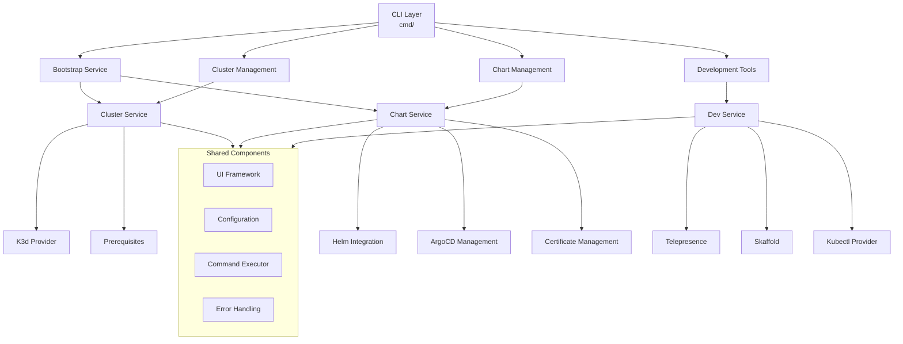
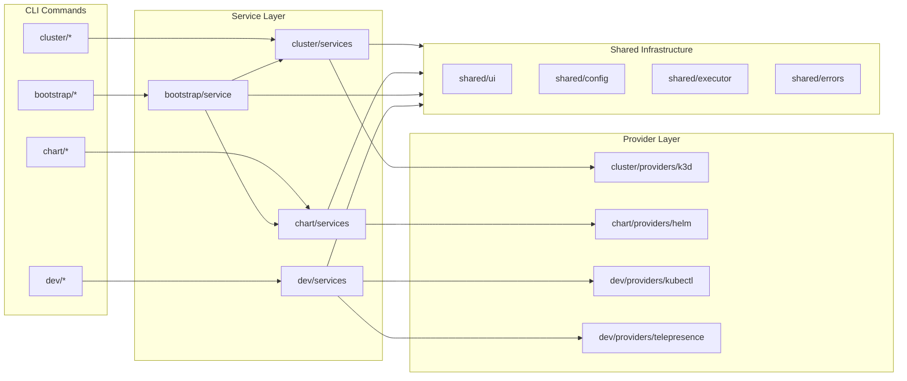
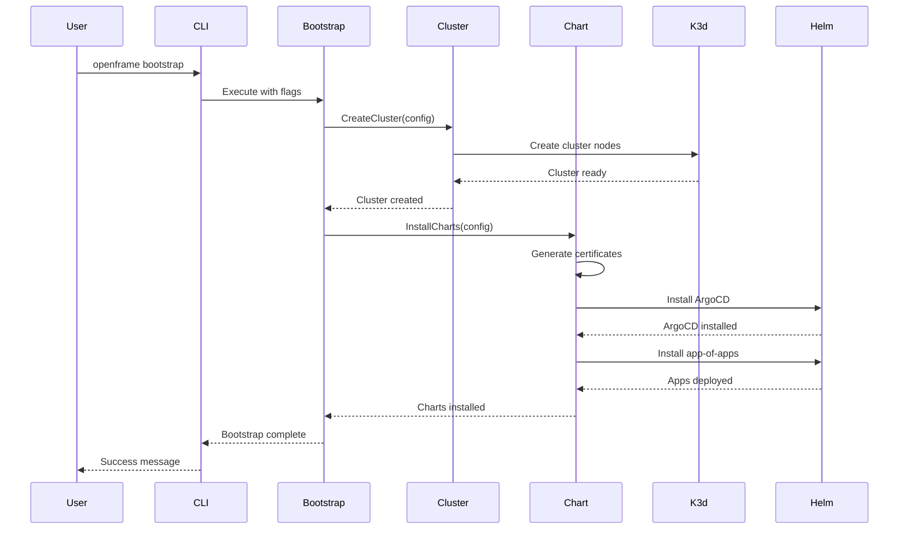

# openframe-cli Module Documentation

# OpenFrame CLI Architecture Documentation

## Overview

OpenFrame CLI is a modern command-line tool for managing Kubernetes clusters and development workflows. It provides an interactive interface for creating K3d clusters, installing ArgoCD and Helm charts, and managing local development environments with features like traffic interception and live reloading.

## Architecture

## Core Components

| Component | Package | Responsibility |
|-----------|---------|---------------|
| **CLI Commands** | `cmd/` | Command definitions and flag parsing for cluster, chart, bootstrap, and dev operations |
| **Bootstrap Service** | `internal/bootstrap/` | Orchestrates complete OpenFrame setup by combining cluster creation and chart installation |
| **Cluster Management** | `internal/cluster/` | Creates, manages, and monitors K3d Kubernetes clusters with interactive configuration |
| **Chart Management** | `internal/chart/` | Installs ArgoCD and app-of-apps patterns using Helm with certificate generation |
| **Development Tools** | `internal/dev/` | Provides Telepresence traffic interception and Skaffold scaffolding for local development |
| **Prerequisites** | `*/prerequisites/` | Validates and installs required tools (git, helm, mkcert, kubectl, telepresence, skaffold) |
| **UI Framework** | `internal/shared/ui/` | Consistent terminal UI with logos, prompts, and interactive wizards |
| **Configuration** | `internal/shared/config/` | System configuration and settings management |
| **Command Executor** | `internal/shared/executor/` | Abstracted command execution with dry-run and verbose support |
| **Error Handling** | `internal/shared/errors/` | Centralized error management and user-friendly error messages |

## Component Relationships

## Data Flow

## Key Files

| File | Purpose |
|------|---------|
| `cmd/root.go` | Root command definition with global flags and subcommand registration |
| `cmd/bootstrap/bootstrap.go` | Bootstrap command that orchestrates cluster creation + chart installation |
| `internal/bootstrap/service.go` | Bootstrap service implementation that coordinates cluster and chart services |
| `internal/cluster/services/service.go` | Main cluster management service with K3d integration |
| `internal/chart/services/install.go` | Chart installation service with ArgoCD and app-of-apps deployment |
| `internal/dev/services/intercept/service.go` | Telepresence traffic interception service |
| `internal/shared/ui/interactive.go` | Interactive UI components for wizards and prompts |
| `internal/shared/executor/executor.go` | Command execution abstraction with dry-run support |

## Dependencies

The project uses several key Go dependencies:

- **Cobra** (`spf13/cobra`): CLI framework for command structure and flag parsing
- **PTerm** (`pterm/pterm`): Terminal UI library for interactive prompts, progress bars, and styling
- **Viper** (`spf13/viper`): Configuration management for settings and preferences

The CLI integrates with external tools through command execution:
- **K3d**: Container-based Kubernetes clusters for local development
- **Helm**: Package manager for Kubernetes applications and charts
- **kubectl**: Kubernetes cluster communication and management
- **Telepresence**: Development-time traffic interception and local service routing
- **Skaffold**: Continuous development workflow for Kubernetes applications
- **mkcert**: Local certificate authority for HTTPS development

## CLI Commands

| Command | Description | Example |
|---------|-------------|---------|
| `openframe bootstrap` | Complete OpenFrame setup (cluster + charts) | `openframe bootstrap --deployment-mode=oss-tenant` |
| `openframe cluster create` | Create new K3d cluster with interactive configuration | `openframe cluster create my-cluster --nodes 3` |
| `openframe cluster list` | List all managed clusters | `openframe cluster list` |
| `openframe cluster delete` | Delete cluster and cleanup resources | `openframe cluster delete my-cluster` |
| `openframe cluster status` | Show detailed cluster information | `openframe cluster status my-cluster` |
| `openframe cluster cleanup` | Clean up unused cluster resources | `openframe cluster cleanup --force` |
| `openframe chart install` | Install ArgoCD and app-of-apps | `openframe chart install --github-branch develop` |
| `openframe dev intercept` | Intercept service traffic to local environment | `openframe dev intercept my-service --port 8080` |
| `openframe dev skaffold` | Deploy services with live reloading | `openframe dev skaffold my-cluster` |

Each command supports both interactive mode (with wizards and prompts) and non-interactive mode (with flags) for automation and CI/CD integration.
