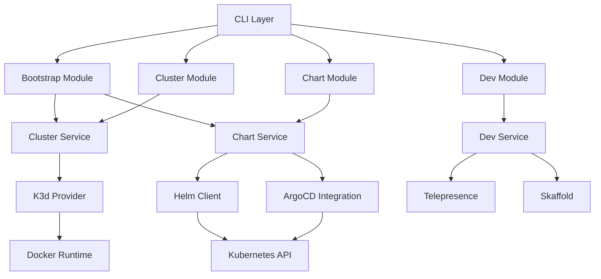
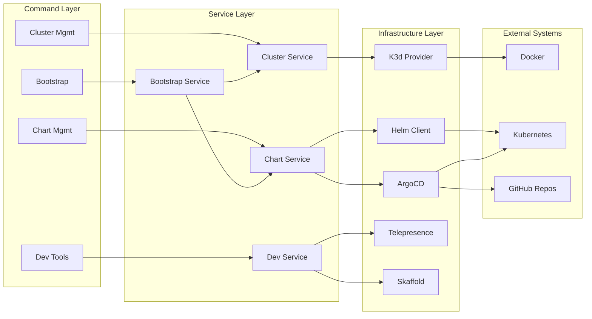
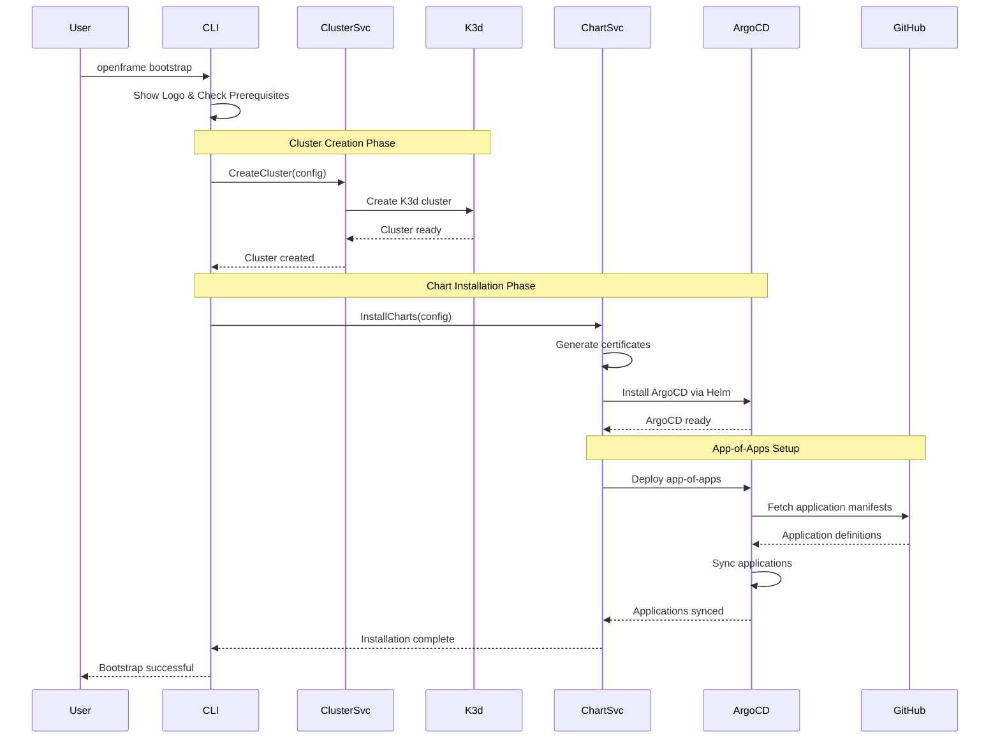

# openframe-cli Module Documentation

# OpenFrame CLI Architecture Documentation

## Overview

OpenFrame CLI is a modern Kubernetes cluster management tool written in Go that provides developers with a streamlined workflow for creating, managing, and deploying applications to local K3d clusters. It integrates with ArgoCD for GitOps deployments and supports development workflows through Telepresence and Skaffold integration.

## Architecture

The CLI follows a layered architecture pattern with clear separation between command handling, business logic, and infrastructure concerns:

## Core Components

| Component | Package | Responsibility |
|-----------|---------|----------------|
| **Bootstrap** | `cmd/bootstrap` | Orchestrates complete OpenFrame environment setup |
| **Cluster Management** | `cmd/cluster` | K3d cluster lifecycle operations (create, delete, list, status, cleanup) |
| **Chart Management** | `cmd/chart` | Helm chart and ArgoCD installation/configuration |
| **Development Tools** | `cmd/dev` | Telepresence intercepts and Skaffold workflows |
| **Shared Services** | `internal/shared` | Common utilities, error handling, and UI components |
| **Prerequisites** | `internal/*/prerequisites` | System dependency validation and installation |

## Component Relationships

## Data Flow

## Key Files

| File | Purpose |
|------|---------|
| `cmd/bootstrap/bootstrap.go` | Main bootstrap command orchestrating cluster + chart installation |
| `cmd/cluster/cluster.go` | Cluster management command group with subcommands |
| `cmd/cluster/create.go` | Interactive cluster creation with configuration wizard |
| `cmd/chart/install.go` | ArgoCD and app-of-apps installation logic |
| `internal/cluster/services/` | Core cluster management business logic |
| `internal/chart/services/` | Helm and ArgoCD integration services |
| `internal/shared/ui/` | Common UI components and user interaction patterns |
| `internal/shared/errors/` | Centralized error handling and formatting |

## Dependencies

The project leverages several key Go libraries for its functionality:

| Dependency | Usage | Integration Point |
|------------|-------|-------------------|
| **Cobra** | CLI framework and command structure | All `cmd/` packages use Cobra for command definition |
| **Viper** | Configuration management | Used in services for reading config files and environment variables |
| **Survey** | Interactive prompts and wizards | Cluster creation wizard and user input collection |
| **Lipgloss** | Terminal UI styling and formatting | UI components in `internal/shared/ui/` for consistent styling |
| **Kubernetes Client** | K8s API interactions | Chart services for cluster validation and resource management |
| **Docker SDK** | Container runtime operations | Cluster services for K3d cluster management |

## CLI Commands

| Command | Description | Key Features |
|---------|-------------|--------------|
| `openframe bootstrap` | Complete environment setup | Combines cluster creation + chart installation |
| `openframe cluster create` | Create K3d cluster | Interactive wizard with configuration options |
| `openframe cluster list` | Show all clusters | Formatted table with status information |
| `openframe cluster status` | Detailed cluster info | Health checks, node status, resource usage |
| `openframe cluster delete` | Remove cluster | Cleanup with confirmation prompts |
| `openframe cluster cleanup` | Clean unused resources | Docker image and resource cleanup |
| `openframe chart install` | Install ArgoCD + apps | Helm chart deployment with app-of-apps pattern |
| `openframe dev intercept` | Traffic interception | Telepresence integration for local development |
| `openframe dev scaffold` | Live development | Skaffold integration for rapid iteration |

### Command Patterns

All commands follow consistent patterns:
- **Prerequisites**: Automatic tool detection and installation prompts
- **Interactive Mode**: Guided wizards with sensible defaults
- **Non-Interactive Mode**: Full CLI flag support for automation
- **Verbose Output**: Detailed logging with `--verbose` flag
- **Error Handling**: Contextual error messages with suggested actions
