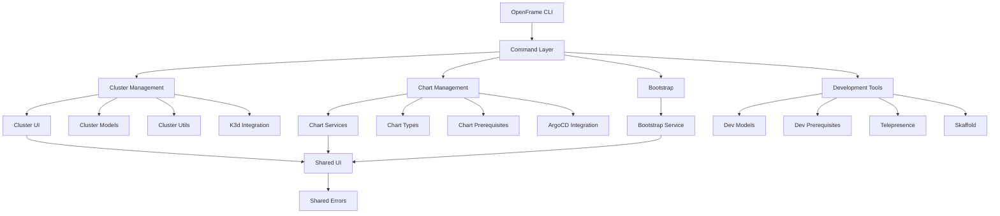
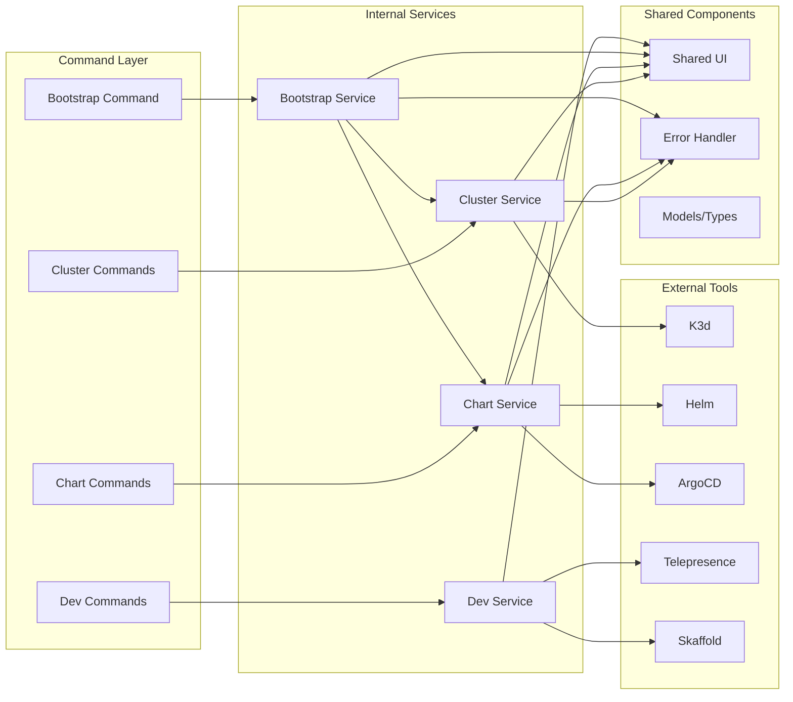
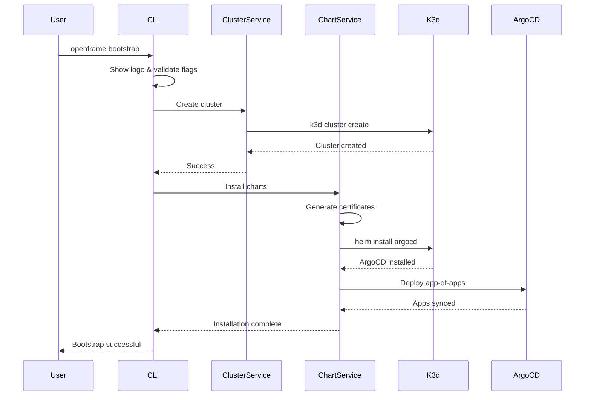

# openframe-cli Module Documentation

# OpenFrame CLI Architecture Documentation

## Overview

OpenFrame CLI is a modern command-line tool for managing OpenFrame Kubernetes clusters and development workflows. It provides a unified interface for cluster lifecycle management (creation, deletion, monitoring), chart installation with ArgoCD, and development tools like Telepresence and Skaffold integration for local Kubernetes development.

## Architecture



## Core Components

| Component | Package Path | Responsibility |
|-----------|-------------|----------------|
| **Command Layer** | `cmd/` | CLI command definitions and flag handling using Cobra |
| **Cluster Management** | `internal/cluster/` | K3d cluster lifecycle, status monitoring, operations |
| **Chart Management** | `internal/chart/` | Helm chart and ArgoCD installation and management |
| **Bootstrap Service** | `internal/bootstrap/` | Orchestrates full OpenFrame environment setup |
| **Development Tools** | `internal/dev/` | Telepresence intercepts and Skaffold integration |
| **Shared UI** | `internal/shared/ui/` | Common UI components, logo display, user interactions |
| **Shared Errors** | `internal/shared/errors/` | Centralized error handling and display |
| **Prerequisites** | `*/prerequisites/` | Tool validation and installation across modules |

## Component Relationships



## Data Flow



## Key Files

| File | Purpose |
|------|---------|
| `cmd/bootstrap/bootstrap.go` | Main bootstrap command orchestrating cluster + chart installation |
| `cmd/cluster/cluster.go` | Cluster management command group with subcommands |
| `cmd/chart/install.go` | ArgoCD and chart installation command with flag handling |
| `internal/cluster/utils/utils.go` | Global flag management and command service initialization |
| `internal/cluster/ui/operations.go` | User interface for cluster operations and selections |
| `internal/chart/services/install.go` | Core chart installation logic and ArgoCD management |
| `internal/shared/ui/logo.go` | Consistent branding and UI presentation |
| `internal/shared/errors/handler.go` | Centralized error handling with verbose logging |

## Dependencies

The OpenFrame CLI integrates with several external tools and libraries:

- **Cobra Framework**: Command-line interface structure and flag management
- **K3d**: Lightweight Kubernetes distribution for local development clusters
- **Helm**: Package manager for Kubernetes applications and chart installation
- **ArgoCD**: GitOps continuous delivery tool for Kubernetes
- **Telepresence**: Local development tool for intercepting cluster traffic  
- **Skaffold**: Continuous development tool for Kubernetes applications
- **Docker**: Container runtime required by K3d for cluster nodes

## CLI Commands

### Cluster Management
```bash
openframe cluster create [name]     # Create new K3d cluster
openframe cluster delete [name]     # Delete cluster and cleanup
openframe cluster list              # Show all clusters
openframe cluster status [name]     # Detailed cluster information
openframe cluster cleanup [name]    # Clean unused resources
```

### Chart Management
```bash
openframe chart install [cluster]   # Install ArgoCD and charts
```

### Bootstrap (Combined Operations)
```bash
openframe bootstrap [cluster]       # Create cluster + install charts
  --deployment-mode=oss-tenant      # Specify deployment type
  --non-interactive                 # Skip prompts
  --verbose                         # Detailed logging
```

### Development Tools
```bash
openframe dev intercept [service]   # Intercept service traffic
openframe dev skaffold [cluster]    # Development deployment
```

Each command group supports interactive mode by default with options for non-interactive automation, making it suitable for both developer workflows and CI/CD pipelines.
