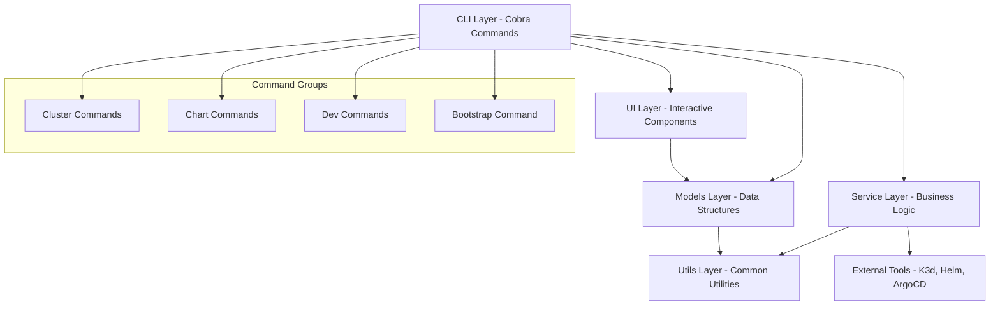
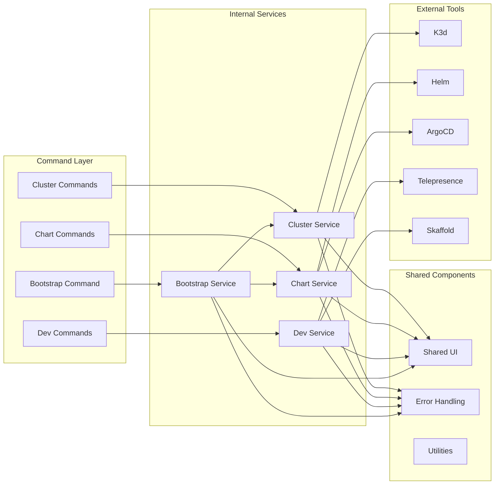
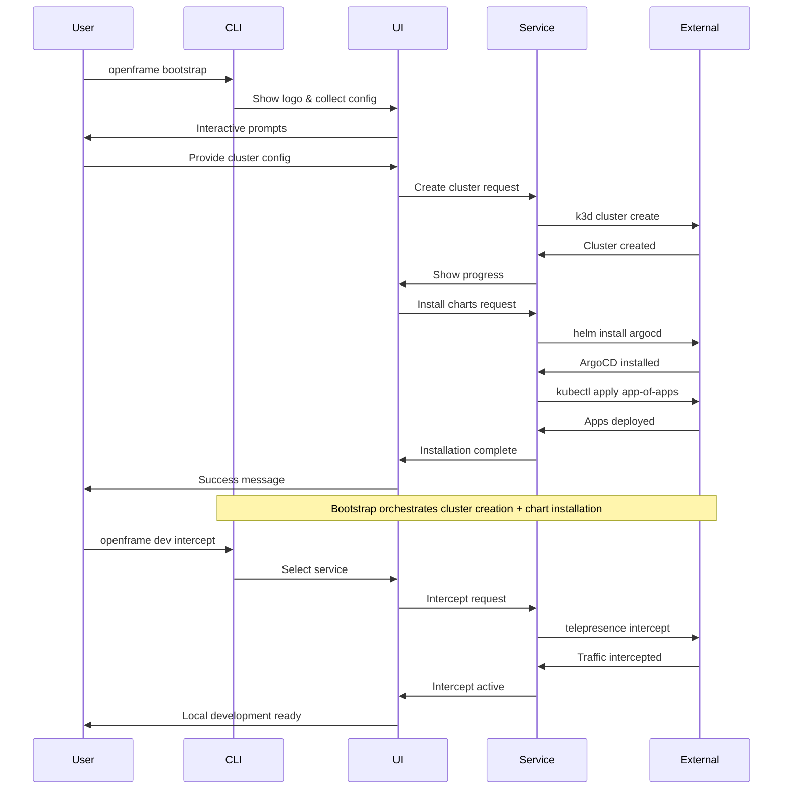

# openframe-cli Module Documentation

# OpenFrame CLI Architecture

## Overview

OpenFrame CLI is a modern command-line tool for managing OpenFrame Kubernetes clusters and development workflows. It provides comprehensive cluster lifecycle management (create, delete, list, status, cleanup), ArgoCD chart installation, and development tools for service traffic interception and live reloading with Telepresence and Skaffold.

## Architecture

The CLI follows a layered architecture with clear separation of concerns, built around the Cobra command framework with modular service layers.



## Core Components

| Component | Package | Responsibilities |
|-----------|---------|------------------|
| **Cluster Management** | `cmd/cluster/`, `internal/cluster/` | K3d cluster lifecycle (create, delete, list, status, cleanup) |
| **Chart Management** | `cmd/chart/`, `internal/chart/` | ArgoCD installation and Helm chart management |
| **Development Tools** | `cmd/dev/`, `internal/dev/` | Telepresence intercepts and Skaffold workflows |
| **Bootstrap Orchestration** | `cmd/bootstrap/`, `internal/bootstrap/` | End-to-end environment setup combining cluster + charts |
| **UI Components** | `internal/*/ui/` | Interactive prompts, configuration wizards, progress displays |
| **Service Layer** | `internal/*/services/` | Business logic and external tool integration |
| **Models & Types** | `internal/*/models/`, `internal/*/types/` | Data structures, configuration, and validation |
| **Prerequisites** | `internal/*/prerequisites/` | Tool availability checks and installation |
| **Shared Utilities** | `internal/shared/` | Common error handling, UI components, utilities |

## Component Relationships



## Data Flow



## Key Files

| File | Purpose |
|------|---------|
| `cmd/bootstrap/bootstrap.go` | Main bootstrap command orchestrating full environment setup |
| `cmd/cluster/create.go` | Cluster creation with interactive configuration wizard |
| `cmd/cluster/delete.go` | Cluster deletion with confirmation and cleanup |
| `cmd/chart/install.go` | ArgoCD installation and app-of-apps deployment |
| `cmd/dev/intercept.go` | Telepresence traffic interception for local development |
| `internal/cluster/services/` | Core cluster management business logic |
| `internal/chart/services/` | Chart installation and ArgoCD management |
| `internal/shared/ui/` | Common UI components and interactive elements |
| `internal/shared/errors/` | Centralized error handling and user-friendly messages |

## Dependencies

The CLI integrates with several external Kubernetes tools and libraries:

- **K3d**: Lightweight Kubernetes distribution for local development clusters
- **Helm**: Package manager for installing ArgoCD and other Kubernetes applications  
- **ArgoCD**: GitOps continuous delivery tool for application deployment
- **Telepresence**: Traffic interception for local service development
- **Skaffold**: Local development workflow with live code reloading
- **Cobra**: CLI framework providing command structure and flag parsing
- **Kubernetes Client**: Direct cluster API interaction for status and management

## CLI Commands

### Cluster Management
```bash
openframe cluster create [name]          # Create new K3d cluster with wizard
openframe cluster delete [name]          # Delete cluster with confirmation
openframe cluster list                   # Show all managed clusters
openframe cluster status [name]          # Display detailed cluster info
openframe cluster cleanup [name]         # Clean up unused resources
```

### Chart Management  
```bash
openframe chart install [cluster]        # Install ArgoCD and app-of-apps
```

### Development Tools
```bash
openframe dev intercept [service]        # Intercept service traffic locally
openframe dev skaffold [cluster]         # Deploy with live reloading
```

### Bootstrap (End-to-End)
```bash
openframe bootstrap [cluster]            # Create cluster + install charts
openframe bootstrap --deployment-mode=oss-tenant --non-interactive
```

### Common Flags
- `--verbose, -v`: Detailed logging and progress information
- `--non-interactive`: Skip prompts for CI/CD environments  
- `--deployment-mode`: Pre-select deployment type (oss-tenant, saas-tenant, saas-shared)
- `--force`: Skip confirmations and force operations
- `--dry-run`: Show what would happen without executing
