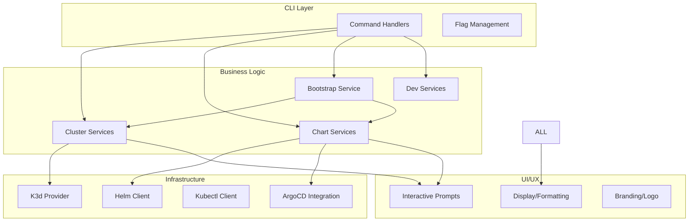
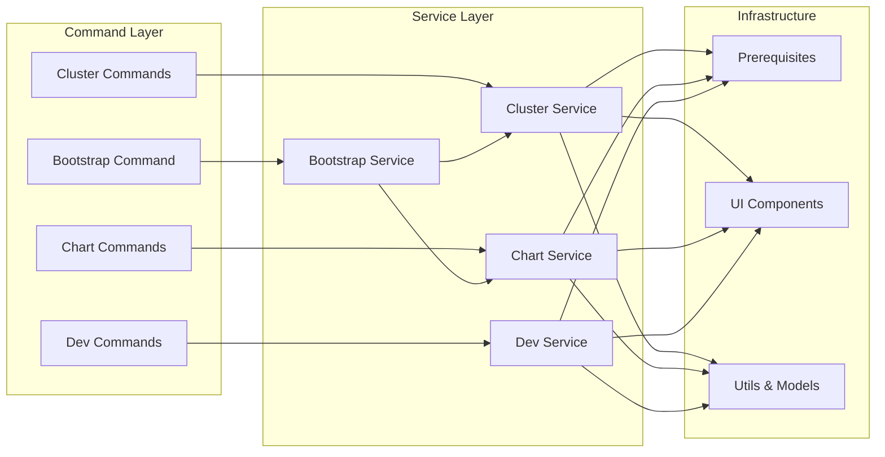
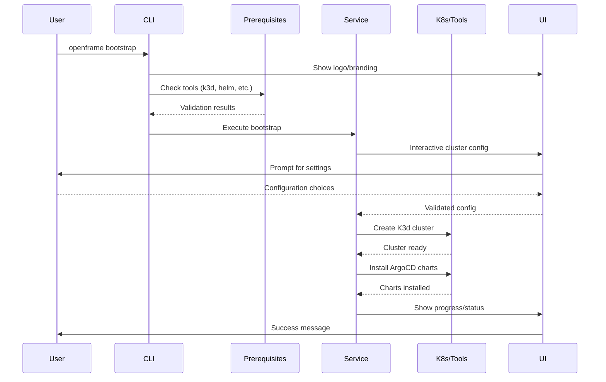

# openframe-cli Module Documentation

# OpenFrame CLI Architecture Documentation

## Overview

OpenFrame CLI is a modern command-line tool for managing OpenFrame Kubernetes clusters and development workflows. It provides streamlined cluster lifecycle management, chart installation with ArgoCD, and developer-friendly tools for local development including traffic interception and live reloading.

## Architecture

The CLI follows a modular architecture with clear separation between command handling, business logic, and infrastructure concerns:

## Core Components

| Component | Package | Responsibility |
|-----------|---------|----------------|
| **Cluster Management** | `cmd/cluster/` | K3d cluster lifecycle (create, delete, list, status, cleanup) |
| **Chart Management** | `cmd/chart/` | ArgoCD and Helm chart installation and management |
| **Bootstrap Service** | `cmd/bootstrap/` | Complete environment setup combining cluster + chart operations |
| **Development Tools** | `cmd/dev/` | Telepresence intercepts and Skaffold workflows |
| **Interactive UI** | `internal/*/ui/` | User interaction, prompts, and display formatting |
| **Prerequisites** | `internal/*/prerequisites/` | Tool validation and installation checks |
| **Service Layer** | `internal/*/services/` | Business logic and orchestration |
| **Models** | `internal/*/models/` | Data structures, validation, and configuration |

## Component Relationships

## Data Flow

## Key Files

| File | Purpose |
|------|---------|
| `cmd/bootstrap/bootstrap.go` | Main bootstrap command - orchestrates complete OpenFrame setup |
| `cmd/cluster/cluster.go` | Cluster command group entry point with subcommand organization |
| `cmd/cluster/create.go` | Interactive cluster creation with configuration wizard |
| `cmd/chart/install.go` | ArgoCD and app-of-apps installation with deployment modes |
| `cmd/dev/dev.go` | Development tools command group for local workflows |

## Dependencies

Based on the import patterns, this project depends on:

- **Cobra CLI Framework**: Command structure, flag handling, and subcommand organization
- **Internal Modules**: 
  - `internal/bootstrap` - Complete environment setup logic
  - `internal/cluster` - K3d cluster management services
  - `internal/chart` - ArgoCD/Helm chart operations
  - `internal/dev` - Development workflow tools
  - `internal/shared` - Common utilities (UI, errors, etc.)

The project follows Go's standard library patterns with external dependencies likely including:
- Kubernetes client libraries for cluster interaction
- Helm SDK for chart management
- K3d Go SDK for local cluster management

## CLI Commands

### Cluster Management
- `openframe cluster create [name]` - Create K3d cluster with interactive configuration
- `openframe cluster delete [name]` - Delete cluster and cleanup resources
- `openframe cluster list` - Show all managed clusters
- `openframe cluster status [name]` - Display detailed cluster information
- `openframe cluster cleanup [name]` - Clean up unused Docker resources

### Chart Management
- `openframe chart install [cluster-name]` - Install ArgoCD with deployment mode selection

### Bootstrap
- `openframe bootstrap [cluster-name]` - Complete setup (cluster + charts) with guided workflow

### Development Tools
- `openframe dev intercept [service-name]` - Telepresence traffic interception
- `openframe dev skaffold [cluster-name]` - Live development with Skaffold

### Key Features
- **Interactive Mode**: Default guided experience with sensible prompts
- **Non-Interactive Mode**: CI/CD friendly with `--non-interactive` flag
- **Deployment Modes**: Support for `oss-tenant`, `saas-tenant`, `saas-shared`
- **Verbose Logging**: Detailed operation visibility with `-v/--verbose`
- **Dry Run**: Preview operations without execution using `--dry-run`
