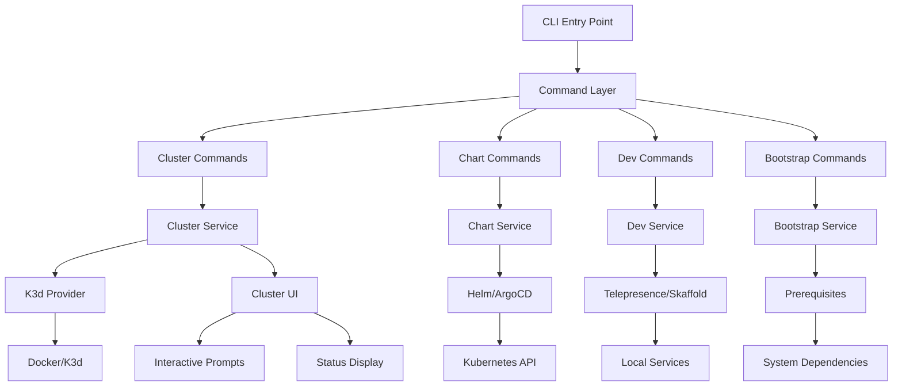
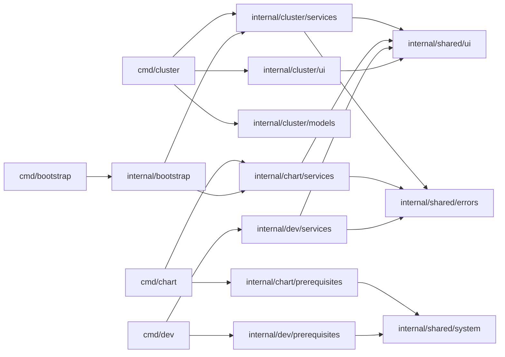
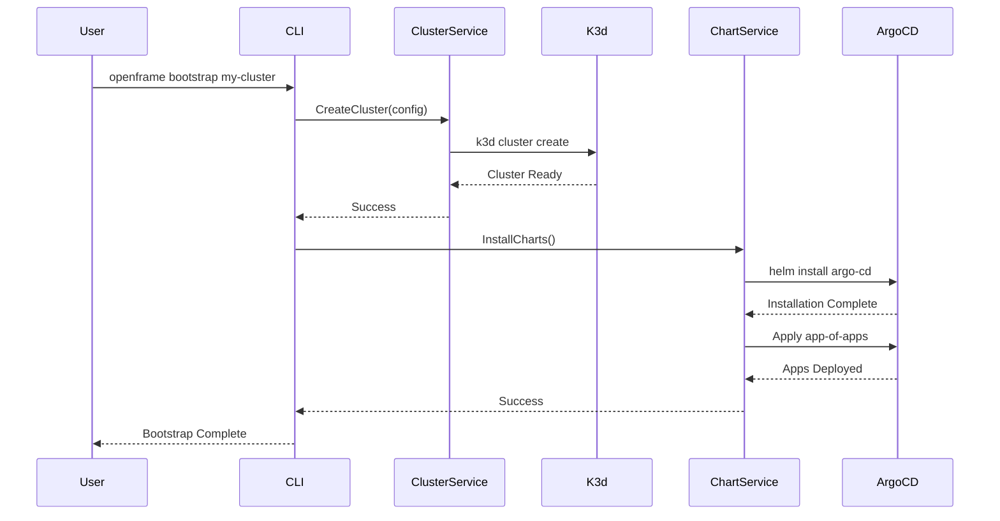

# openframe-cli Module Documentation

# OpenFrame CLI Architecture Documentation

## Overview

OpenFrame CLI is a modern command-line tool for managing Kubernetes clusters and development workflows, specifically designed for the OpenFrame ecosystem. It provides cluster lifecycle management (create, delete, status), ArgoCD chart installation, and developer productivity tools like Telepresence intercepts and Skaffold integration for local development workflows.

## Architecture

## Core Components

| Component | Package | Responsibility |
|-----------|---------|----------------|
| **Command Layer** | `cmd/*` | CLI command definitions and argument parsing |
| **Cluster Management** | `internal/cluster` | K3d cluster lifecycle operations |
| **Chart Installation** | `internal/chart` | ArgoCD and Helm chart deployment |
| **Development Tools** | `internal/dev` | Telepresence intercepts and Skaffold workflows |
| **Bootstrap Service** | `internal/bootstrap` | Complete environment setup orchestration |
| **UI Components** | `internal/*/ui` | Interactive prompts and status displays |
| **Prerequisites** | `internal/*/prerequisites` | System dependency validation |
| **Shared Utilities** | `internal/shared` | Common utilities, error handling, UI components |

## Component Relationships

## Data Flow

## Key Files

| File | Purpose |
|------|---------|
| `cmd/bootstrap/bootstrap.go` | Main bootstrap command orchestrating full environment setup |
| `cmd/cluster/cluster.go` | Cluster command group with subcommands (create, delete, list, status) |
| `cmd/chart/install.go` | ArgoCD and Helm chart installation logic |
| `internal/cluster/services/` | Core cluster management business logic |
| `internal/chart/services/` | Chart installation and ArgoCD management |
| `internal/shared/ui/` | Reusable UI components for consistent user experience |
| `internal/shared/errors/` | Centralized error handling and display |

## Dependencies

The OpenFrame CLI integrates with several external systems and tools:

- **K3d**: Local Kubernetes cluster creation and management
- **Helm**: Chart installation and templating
- **ArgoCD**: GitOps application deployment and management
- **Telepresence**: Traffic intercepts for local development
- **Skaffold**: Continuous development workflow automation
- **Docker**: Container runtime for K3d clusters
- **Kubectl**: Kubernetes API interactions

The CLI abstracts these dependencies through service layers, providing a unified interface for complex multi-tool workflows.

## CLI Commands

| Command | Description | Example |
|---------|-------------|---------|
| `openframe bootstrap` | Complete environment setup (cluster + charts) | `openframe bootstrap --deployment-mode=oss-tenant` |
| `openframe cluster create` | Create new K3d cluster with interactive config | `openframe cluster create my-cluster` |
| `openframe cluster delete` | Remove cluster and cleanup resources | `openframe cluster delete my-cluster --force` |
| `openframe cluster list` | Show all managed clusters | `openframe cluster list` |
| `openframe cluster status` | Detailed cluster health and info | `openframe cluster status my-cluster` |
| `openframe cluster cleanup` | Clean unused images and resources | `openframe cluster cleanup my-cluster` |
| `openframe chart install` | Install ArgoCD and app-of-apps | `openframe chart install --github-branch=develop` |
| `openframe dev intercept` | Telepresence traffic interception | `openframe dev intercept my-service` |
| `openframe dev scaffold` | Skaffold development workflow | `openframe dev scaffold my-cluster` |

### Command Flags

- `--verbose, -v`: Detailed logging and progress information
- `--dry-run`: Show what would be done without executing
- `--force`: Skip confirmations and force operations
- `--non-interactive`: Use existing configurations without prompts
- `--deployment-mode`: Pre-select deployment type (oss-tenant, saas-tenant, saas-shared)
