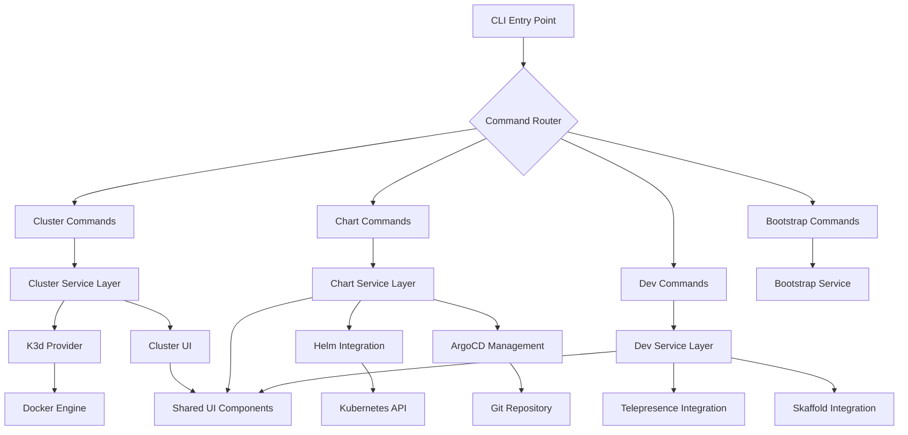
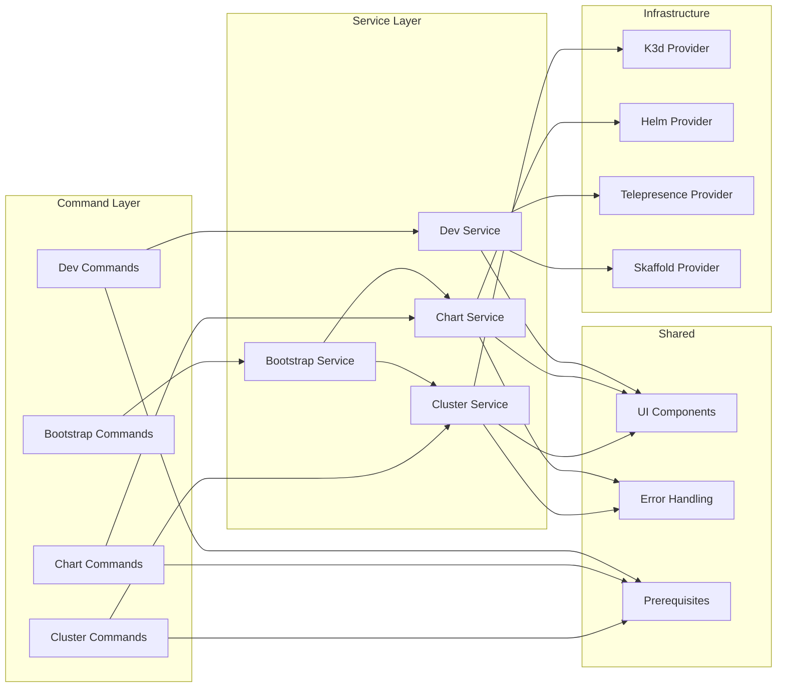
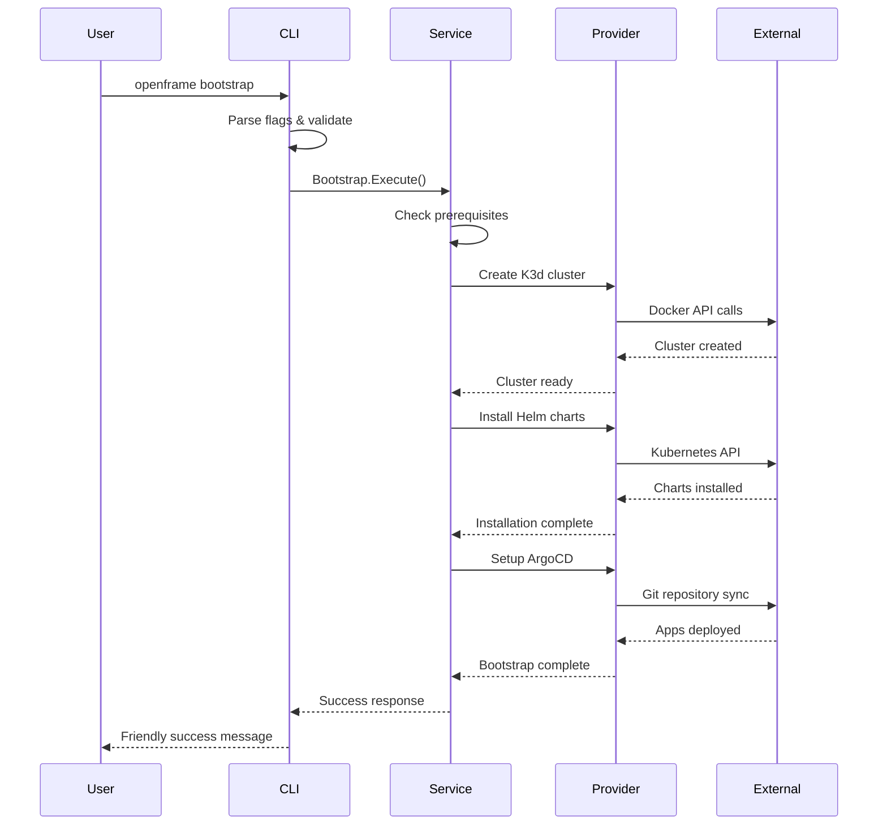

# openframe-cli Module Documentation

# OpenFrame CLI Architecture Documentation

## Overview

OpenFrame CLI is a modern command-line tool for managing OpenFrame Kubernetes clusters and development workflows. It provides comprehensive cluster lifecycle management, Helm chart installation with ArgoCD, and development tools including Telepresence traffic interception and Skaffold workflows.

## Architecture

The CLI follows a modular, layered architecture with clear separation between commands, business logic, and external integrations.



## Core Components

| Component | Package | Responsibility |
|-----------|---------|----------------|
| **Command Layer** | `cmd/*` | CLI command definitions, argument parsing, and flag handling |
| **Cluster Management** | `internal/cluster` | K3d cluster lifecycle, status monitoring, resource cleanup |
| **Chart Management** | `internal/chart` | Helm chart installation, ArgoCD setup, app-of-apps deployment |
| **Bootstrap Service** | `internal/bootstrap` | Orchestrates complete OpenFrame environment setup |
| **Dev Tools** | `internal/dev` | Telepresence intercepts, Skaffold workflows |
| **Shared Services** | `internal/shared` | Common utilities, error handling, UI components |
| **Prerequisites** | `*/prerequisites` | Tool validation and installation for each command group |

## Component Relationships



## Data Flow



## Key Files

| File | Purpose |
|------|---------|
| `cmd/cluster/cluster.go` | Main cluster command entry point with subcommand routing |
| `cmd/bootstrap/bootstrap.go` | Bootstrap command orchestrating complete setup |
| `internal/cluster/services/` | Core cluster management business logic |
| `internal/chart/services/` | Helm chart and ArgoCD installation logic |
| `internal/shared/ui/` | Reusable UI components for consistent user experience |
| `internal/shared/errors/` | Global error handling and user-friendly error messages |
| `internal/cluster/models/` | Data structures and validation for cluster operations |
| `internal/cluster/ui/` | Cluster-specific UI components and interactive wizards |

## Dependencies

The project leverages several key dependencies for its functionality:

| Dependency | Usage | Integration Point |
|------------|-------|-------------------|
| **Cobra** | CLI framework for command structure and flag parsing | `cmd/*` packages |
| **Docker SDK** | Container management for K3d clusters | Cluster providers |
| **Kubernetes Client** | K8s API interactions for status and management | Chart and cluster services |
| **Helm SDK** | Chart installation and repository management | Chart service layer |
| **Survey/Promptui** | Interactive CLI prompts and wizards | UI components |
| **Yaml/JSON** | Configuration file parsing and generation | Model validation |

## CLI Commands

### Cluster Management
```bash
openframe cluster create [name]      # Create new K3d cluster with wizard
openframe cluster delete [name]      # Delete cluster and cleanup resources  
openframe cluster list               # Show all managed clusters
openframe cluster status [name]      # Detailed cluster health information
openframe cluster cleanup [name]     # Remove unused Docker images/resources
```

### Chart Management  
```bash
openframe chart install [cluster]    # Install ArgoCD and app-of-apps
```

### Bootstrap (Complete Setup)
```bash
openframe bootstrap [cluster]        # Create cluster + install charts
openframe bootstrap --deployment-mode=oss-tenant  # Skip deployment selection
openframe bootstrap --non-interactive # CI/CD mode with existing config
```

### Development Tools
```bash
openframe dev intercept [service]    # Telepresence traffic interception
openframe dev skaffold [cluster]     # Live development with Skaffold
```

### Global Flags
- `--verbose, -v` - Detailed logging and operation visibility
- `--force` - Skip confirmations (where applicable)
- `--dry-run` - Preview operations without execution
- `--non-interactive` - Automated mode for CI/CD pipelines
