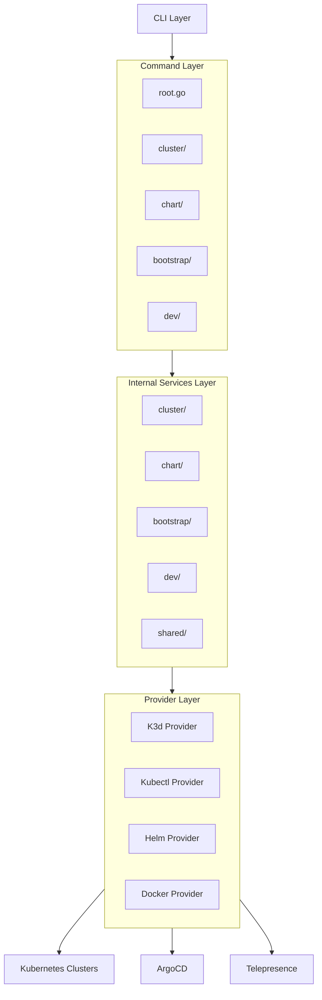
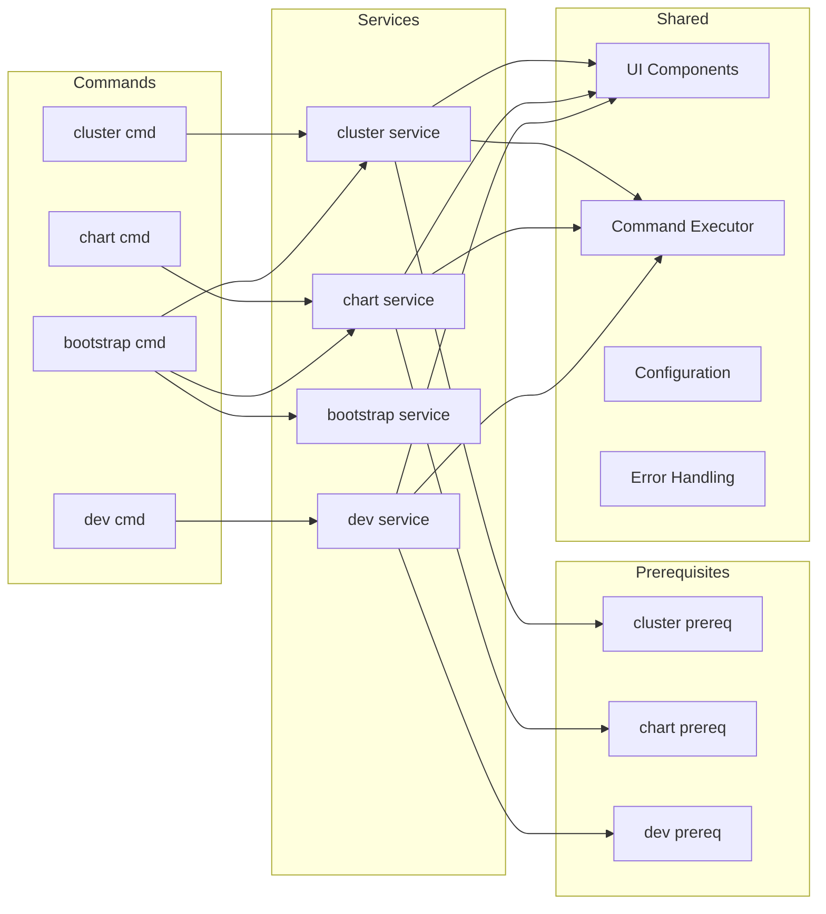
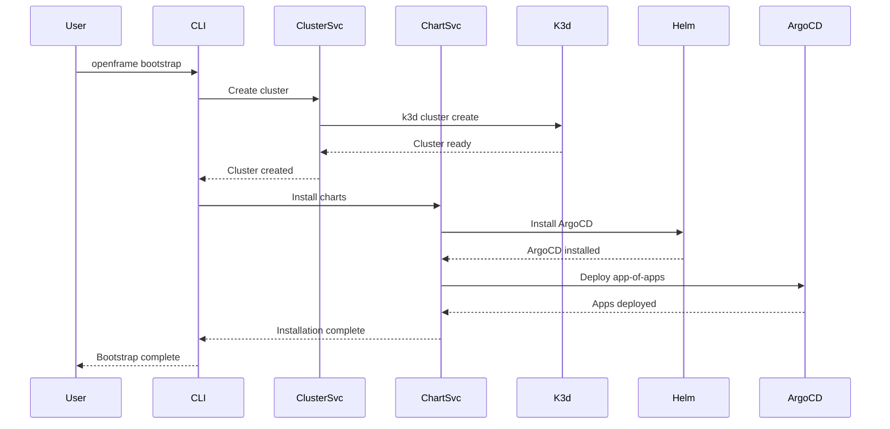

# openframe-cli Module Documentation

# OpenFrame CLI Architecture Documentation

## Overview

OpenFrame CLI is a modern command-line tool for managing Kubernetes clusters and development workflows, specifically designed for OpenFrame platform deployments. It provides interactive wizards for cluster creation, ArgoCD-based chart management, and development tools like Telepresence integration for local development workflows.

## Architecture

The CLI follows a clean architecture pattern with clear separation between command handling, business logic, and infrastructure concerns:

## Core Components

| Component | Package | Responsibility |
|-----------|---------|----------------|
| **Command Router** | `cmd/` | CLI command definitions and flag parsing |
| **Cluster Management** | `internal/cluster/` | K3d cluster lifecycle management |
| **Chart Management** | `internal/chart/` | Helm and ArgoCD installation |
| **Bootstrap Service** | `internal/bootstrap/` | End-to-end cluster setup |
| **Development Tools** | `internal/dev/` | Telepresence and Skaffold integration |
| **Shared Services** | `internal/shared/` | Common utilities, UI, and configuration |
| **Prerequisites** | `*/prerequisites/` | Tool validation and installation |

## Component Relationships

## Data Flow

## Key Files

| File | Purpose |
|------|---------|
| `cmd/root.go` | Main CLI entry point and command tree setup |
| `cmd/bootstrap/bootstrap.go` | End-to-end setup command combining cluster + chart |
| `internal/cluster/service.go` | Core cluster management business logic |
| `internal/chart/services/install.go` | ArgoCD and app-of-apps installation |
| `internal/shared/ui/logo.go` | Interactive UI components and branding |
| `internal/shared/executor/executor.go` | Command execution abstraction |
| `internal/dev/services/intercept/service.go` | Telepresence traffic interception |

## Dependencies

The CLI integrates with several external tools and systems:

- **Kubernetes**: Uses kubectl for cluster communication and resource management
- **K3d**: Lightweight Kubernetes distribution for local development clusters
- **Helm**: Package manager for installing ArgoCD and managing charts
- **ArgoCD**: GitOps continuous delivery tool for application deployment
- **Telepresence**: Development tool for intercepting cluster traffic locally
- **Skaffold**: Development workflow automation for Kubernetes
- **Docker**: Container runtime and image management
- **Git**: Source control integration for GitOps workflows

## CLI Commands

### Cluster Management
- `openframe cluster create [NAME]` - Create a new K3d cluster with interactive configuration
- `openframe cluster delete [NAME]` - Delete cluster and clean up resources
- `openframe cluster list` - Show all managed clusters with status
- `openframe cluster status [NAME]` - Display detailed cluster information
- `openframe cluster cleanup [NAME]` - Remove unused images and resources

### Chart Management
- `openframe chart install [CLUSTER]` - Install ArgoCD and app-of-apps pattern

### Bootstrap
- `openframe bootstrap [CLUSTER]` - Complete end-to-end setup (cluster + charts)
- Flags: `--deployment-mode`, `--non-interactive`, `--verbose`

### Development Tools
- `openframe dev intercept [SERVICE]` - Intercept cluster traffic with Telepresence
- `openframe dev skaffold [CLUSTER]` - Deploy services with live reloading

### Global Flags
- `--verbose, -v` - Enable detailed logging
- `--dry-run` - Show what would be executed without running
- `--force` - Skip confirmations and force operations
