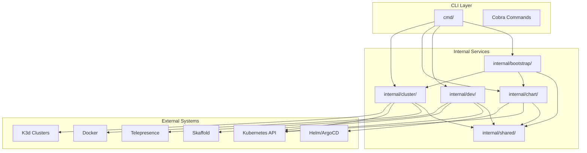
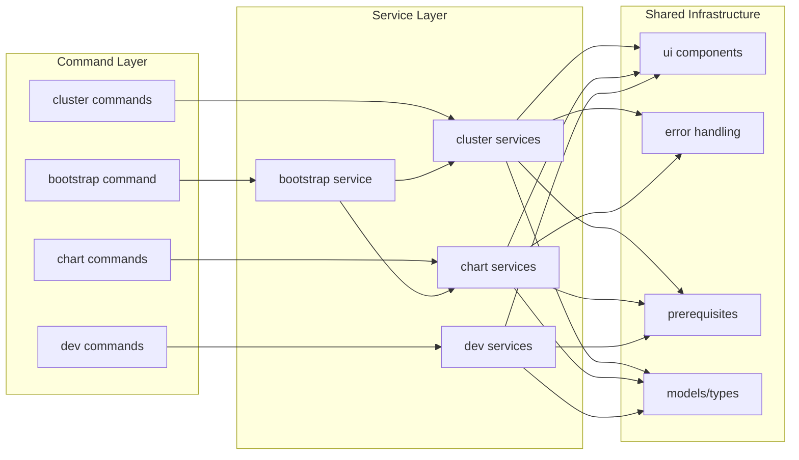
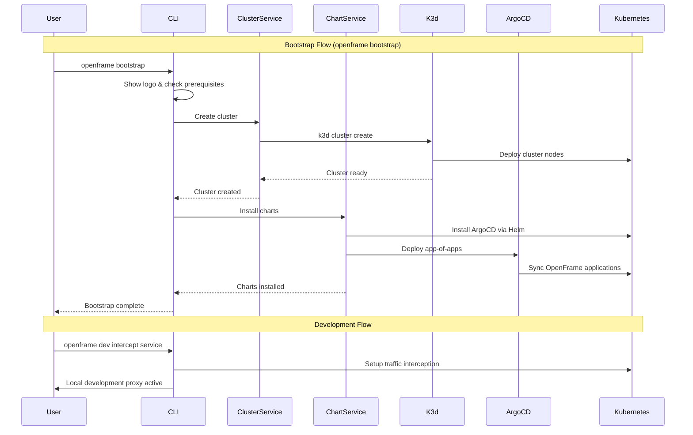

# openframe-cli Module Documentation

# OpenFrame CLI Architecture Documentation

## Overview

OpenFrame CLI is a modern command-line tool for managing OpenFrame Kubernetes clusters and development workflows. It provides cluster lifecycle management (create, delete, status), chart installation with ArgoCD, and developer-focused tools for local Kubernetes development including traffic interception and live reloading.

## Architecture

## Core Components

| Component | Purpose | Key Responsibilities |
|-----------|---------|---------------------|
| `cmd/` | CLI Command Layer | Command definitions, flag parsing, argument validation |
| `internal/cluster/` | Cluster Management | K3d cluster CRUD, status monitoring, resource cleanup |
| `internal/chart/` | Chart Installation | ArgoCD deployment, Helm chart management, app-of-apps setup |
| `internal/dev/` | Development Tools | Traffic interception, Skaffold workflows, local development |
| `internal/bootstrap/` | Full Setup Orchestration | End-to-end environment provisioning combining cluster + charts |
| `internal/shared/` | Common Utilities | UI components, error handling, configuration management |

## Component Relationships

## Data Flow

## Key Files

| File | Purpose |
|------|---------|
| `cmd/cluster/cluster.go` | Main cluster command with subcommands (create, delete, list, status, cleanup) |
| `cmd/chart/chart.go` | Chart management commands for ArgoCD installation |
| `cmd/bootstrap/bootstrap.go` | End-to-end setup command combining cluster creation and chart installation |
| `cmd/dev/dev.go` | Development tools for traffic interception and live reloading |
| `internal/cluster/models/` | Cluster configuration models and validation |
| `internal/cluster/services/` | Core cluster operations (create, delete, status) |
| `internal/chart/services/` | ArgoCD and Helm chart installation logic |
| `internal/shared/ui/` | Common UI components for consistent user experience |
| `internal/shared/errors/` | Centralized error handling and user-friendly error messages |

## Dependencies

The project uses several key external dependencies:

- **Cobra**: CLI framework for command structure and flag management
- **K3d**: Lightweight Kubernetes distribution for local development clusters
- **Helm**: Package manager for Kubernetes applications
- **Docker**: Container runtime for cluster nodes and application deployment
- **Telepresence**: Traffic interception for local development workflows
- **Skaffold**: Continuous development workflow for Kubernetes applications
- **ArgoCD**: GitOps continuous delivery tool for application management

## CLI Commands

| Command | Purpose | Example |
|---------|---------|---------|
| `cluster create` | Create new K3d cluster with interactive or default configuration | `openframe cluster create my-cluster` |
| `cluster delete` | Remove cluster and clean up all resources | `openframe cluster delete my-cluster --force` |
| `cluster list` | Display all managed clusters in table format | `openframe cluster list` |
| `cluster status` | Show detailed cluster health and application status | `openframe cluster status my-cluster --detailed` |
| `cluster cleanup` | Clean up unused Docker images and resources | `openframe cluster cleanup my-cluster` |
| `chart install` | Install ArgoCD and OpenFrame applications | `openframe chart install --deployment-mode=oss-tenant` |
| `bootstrap` | Complete setup: create cluster + install charts | `openframe bootstrap --deployment-mode=oss-tenant` |
| `dev intercept` | Intercept cluster traffic for local development | `openframe dev intercept my-service` |
| `dev skaffold` | Run Skaffold for continuous development | `openframe dev skaffold my-cluster` |

### Common Flags

- `--verbose, -v`: Show detailed logging and progress information
- `--deployment-mode`: Specify deployment type (oss-tenant, saas-tenant, saas-shared)
- `--non-interactive`: Skip prompts for CI/CD environments
- `--force`: Skip confirmations for destructive operations
- `--dry-run`: Show what would be done without executing
