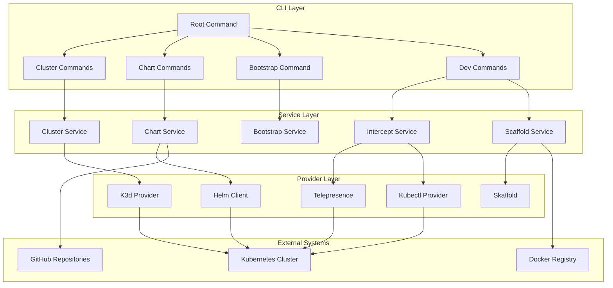
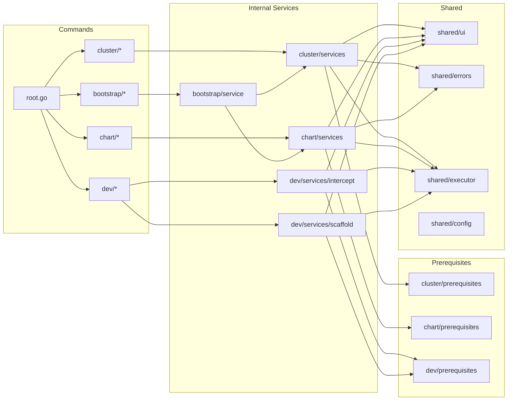
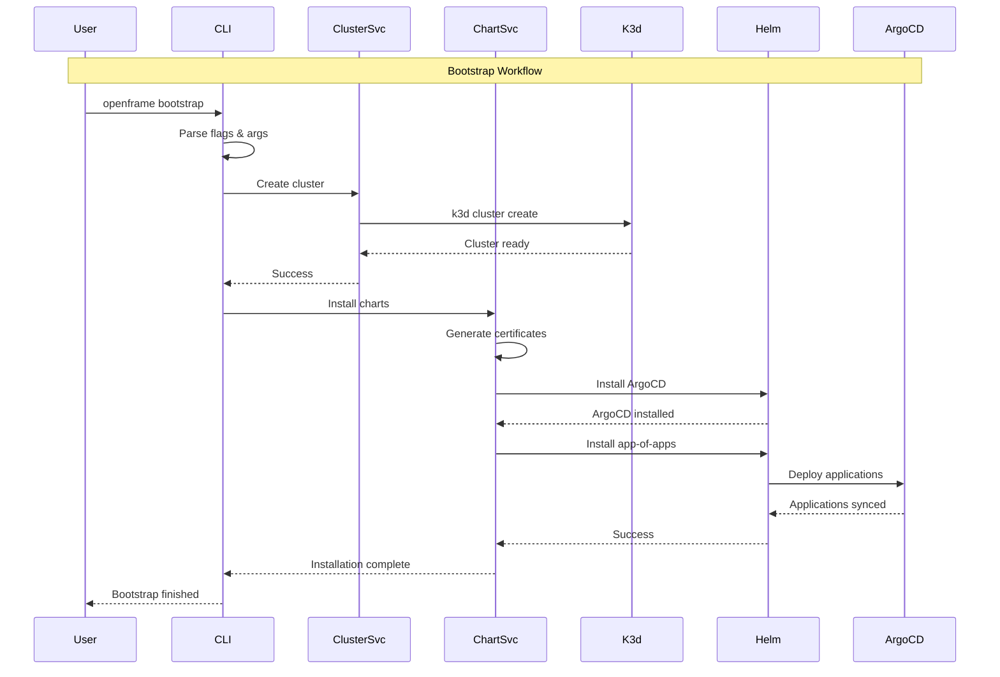

# openframe-cli Module Documentation

# OpenFrame CLI Architecture Documentation

## Overview

OpenFrame CLI is a modern command-line tool for managing Kubernetes clusters and development workflows, specifically designed for the OpenFrame platform. It provides interactive cluster management, Helm chart installation with ArgoCD, and developer tools like Telepresence intercepts and Skaffold workflows, replacing shell scripts with a wizard-style interface.

## Architecture

The CLI follows a layered architecture with clear separation of concerns between command handling, business logic, and external integrations.



## Core Components

| Component | Package | Responsibilities |
|-----------|---------|------------------|
| **Root Command** | `cmd/root.go` | CLI entry point, global flags, version management |
| **Cluster Management** | `cmd/cluster/` | K3d cluster lifecycle (create, delete, list, status, cleanup) |
| **Chart Management** | `cmd/chart/` | Helm/ArgoCD installation and management |
| **Bootstrap** | `cmd/bootstrap/` | Orchestrates cluster creation + chart installation |
| **Dev Tools** | `cmd/dev/` | Telepresence intercepts and Skaffold workflows |
| **Cluster Service** | `internal/cluster/` | Business logic for cluster operations |
| **Chart Service** | `internal/chart/` | Helm chart installation and ArgoCD setup |
| **Prerequisites** | `internal/*/prerequisites/` | Tool validation and installation |
| **UI Components** | `internal/*/ui/` | Interactive prompts and output formatting |
| **Models** | `internal/*/models/` | Data structures and configuration |

## Component Relationships



## Data Flow



## Key Files

| File | Purpose |
|------|---------|
| `cmd/root.go` | Main CLI entry point, command registration, version handling |
| `internal/bootstrap/service.go` | Orchestrates cluster + chart installation workflow |
| `internal/cluster/utils/service.go` | Core cluster management business logic |
| `internal/chart/services/install.go` | Helm chart installation and ArgoCD setup |
| `internal/cluster/providers/k3d/k3d.go` | K3d cluster provider implementation |
| `internal/chart/prerequisites/checker.go` | Tool validation (git, helm, memory, certificates) |
| `internal/dev/services/intercept/service.go` | Telepresence traffic interception |
| `internal/shared/executor/executor.go` | Command execution abstraction |
| `internal/shared/ui/logo.go` | Consistent UI branding across commands |

## Dependencies

The CLI integrates with several external tools and systems:

- **K3d**: Local Kubernetes cluster creation and management
- **Helm**: Chart installation and package management  
- **kubectl**: Kubernetes cluster interaction
- **Telepresence**: Service traffic interception for development
- **Skaffold**: Live code reloading and development workflows
- **ArgoCD**: GitOps continuous deployment
- **mkcert**: Local certificate generation for HTTPS
- **Docker**: Container runtime for K3d clusters

## CLI Commands

### Cluster Management
```bash
openframe cluster create [name]     # Create new K3d cluster
openframe cluster delete [name]     # Delete cluster and cleanup
openframe cluster list             # Show all managed clusters  
openframe cluster status [name]    # Display cluster details
openframe cluster cleanup [name]   # Remove unused resources
```

### Chart Management
```bash
openframe chart install [cluster]  # Install ArgoCD and app-of-apps
```

### Bootstrap
```bash
openframe bootstrap [cluster]      # Complete setup (cluster + charts)
  --deployment-mode=oss-tenant     # Specify deployment type
  --non-interactive               # Skip prompts
```

### Development Tools
```bash
openframe dev intercept [service]  # Telepresence traffic interception
openframe dev skaffold [cluster]   # Skaffold development workflow
```

### Global Flags
- `--verbose, -v`: Enable detailed logging
- `--dry-run`: Preview actions without execution
- `--help, -h`: Show command help
